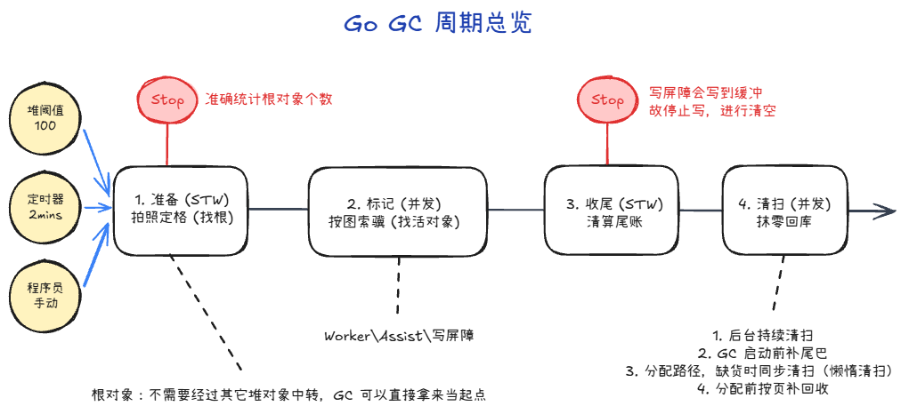
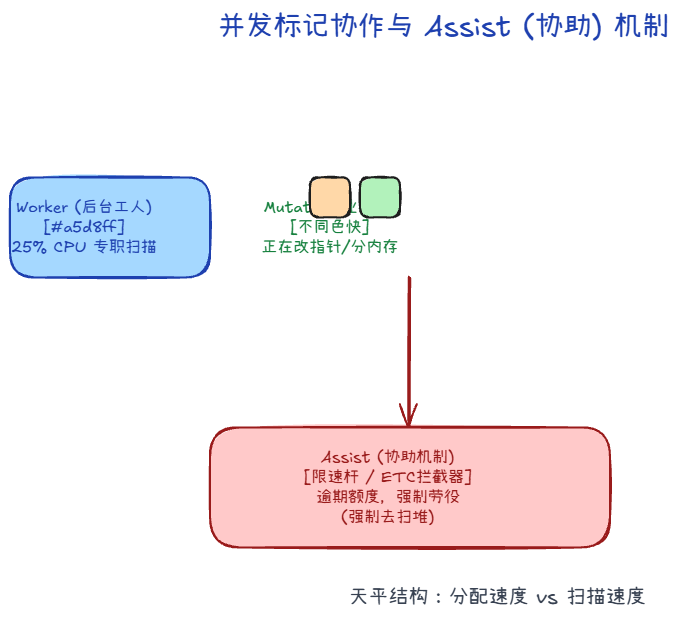
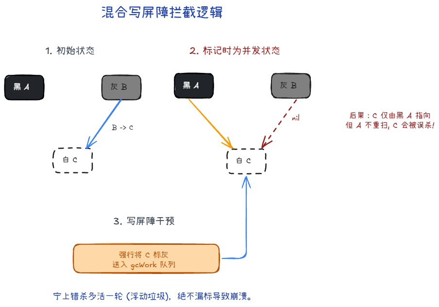

# Go 内存回收

> 系列阅读：`内存分配` → `内存回收`（本篇）→ `内存回收源码(1)` → `内存回收源码(2)` → `内存回收源码(3)` → `内存回收源码(4)`  
> 术语口径：**标记**≈弄清堆里哪些对象还算「活着」；**清扫**≈把死对象占的槽位还回去、必要时整段页还给堆；**Assist**≈业务分配太快时，强制让分配者「帮忙做标记活」；**写屏障**≈并发时给指针改动打补丁，避免漏标。

## 这篇写给谁

- 已经翻过 [内存分配]里「堆上怎么要一块地」，想接着理解「那块地怎么被判定可以收回」。
- 想先建立**一轮 GC 在干什么**的整体图景，再进四篇源码笔记抠细节。

## 概述

**内存分配** 讲的是：程序不停地向堆要对象，分配器用 mcache / mcentral / mheap 分层供货。

**内存回收**讲的是另一半：堆里哪些对象已经没人引用、占着的地方什么时候能空出来再给分配器用。

可以粗想成三步：**先决定谁还算活着（标记）→ 再把这些决定写进位图、清掉死对象占的格子（清扫）→ 空位才能被下一次 `new` 再用**。中间为了**少停世界、又让标记跟得上分配**，又叠了后台 Worker、Assist、写屏障这一套。

## 何时触发

Go 运行时中判断是否需要启动 GC（`gcStart`）分为三种情况：
1. **堆大小触发（最常见）**：在分配内存（`mallocgc`）时，如果当前堆上存活对象的占用量达到了本次目标阈值，便会启动 GC。这个阈值主要受环境变量 `GOGC` 控制（默认 100，即通常堆存活对象体积翻倍时触发）。
2. **时间触发（保底）**：如果距离上一次 GC 已经过了很久（默认配置约 2 分钟 `forcegcperiod`），但一直没有分配足够多的新内存引发“堆大小触发”，那么系统的守护线程 `sysmon` 也会强制开启一轮 GC。
3. **手动触发**：用户在业务代码里主动调用 `runtime.GC()`。

## 一轮 GC 的阶段

1. **阶段 I：准备（STW）**
   - **状态**：极其短暂地“停世界”（暂停所有业务代码）。
   - **在干什么**：像是在比赛前拉起警戒线。Go 会在这个瞬间大喊一声“所有人收手”，切换一下系统内部的状态机，并赶紧把“必定存活”的东西（比如全局变量、各个协程当前栈上的变量）也就是“根”找出来入队，作为稍后顺藤摸瓜的起点。另外还会把处理器的本地缓存（mcache）刷洗干净。

2. **阶段 II：并发标记（并发）**
   - **状态**：和你的业务代码一起跑，不停世界。
   - **在干什么**：最耗时但也最核心的一步。各种标记工人（后台 Worker 或被抓壮丁的 Assist）从刚才找出来的“根”出发，顺着指针的网一点点把所有或者的对象找出来并做上标记。因为中途业务代码还在瞎跑修改指针，会有“写屏障”在一旁盯着帮忙捕获可能漏掉的新变化。

3. **阶段 III：标记收尾（STW）**
   - **状态**：再一次也是本轮最后一次短暂地“停世界”。
   - **在干什么**：主要是收摊检查。大家把刚才并发标记时手里还没处理完的一点小账本（即写屏障的局部缓存记录）赶紧全部提交，系统最后跑一遍确认：“是不是真的全扫完了？”，确认无误后宣布标记彻底结束，并关闭写屏障。

4. **阶段 IV：并发清扫（并发）**
   - **状态**：和你的业务代码一起跑，不停世界。
   - **在干什么**：既然活对象刚才全被作好标记了，剩下那些没做上标记的坑位自然全都是死对象了。后台会在不耽误业务的情况下，慢慢把死对象占的铺位抹平回收等待下一次使用；遇到一整条货架（span）全空了的，就干脆把整块长条内存还给总库房去别处参军。

简单来说，只有做第1和第3步的阶段切换工作时，才需要极其短暂的“停世界”（STW），而真正最耗时的大头——**标记**和**清扫**，全都是和你的业务代码**并发**一起跑的。

### 为什么要停世界

- **第一次停顿（开启标记前）**：是为了拍照存证。如果不把大家定住，协程们还在活蹦乱跳地改变量、换地址，GC 根本没法准确地统计出到底有多少“根”对象。必须要在大家都不动的一瞬间，把这一刻所有协程手里的、全局变量里的“第一手线索”全部记下来。
- **第二次停顿（结束标记前）**：是为了最后清账。并发标记期间，写屏障把新变化先记在各处缓冲里（wbBuf 一类）。到了最后，必须让大家都停下来，把各自手里最后那点还没上交的缓冲区彻底清空，系统做最后的总账核对，确认标记工作已经一个不漏地干完了。

这两次停顿在现代 Go 版本里已经被优化到了微秒级别（通常小于 1 毫秒），对绝大多数业务来说几乎是感知不到的。

### 根对象有哪些

根对象就是「不需要经过其它堆对象中转，GC 可以直接拿来当起点」的那批指针来源：主要是全局区（`.data/.bss`）里的指针、各 goroutine 栈上的指针，以及 runtime 自己维护的 finalizer/cleanup/span specials 等固定根。

## Worker和Assist 
### 并发标记时谁在干活

既然是“并发”，就意味着一边在跑你的业务代码（产生对象/改写引用），一边在做垃圾标记。主要有这几路在干活：
1. **Mutator（业务协程）**：也就是你写的跑业务逻辑的 goroutine，不断向堆要内存、修改对象的属性。
2. **Worker（后台工人）**：调度器会在各个处理器（P）上唤醒名为 `gcBgMarkWorker` 的专职工。规则上，Go 会严格拿出大概 25% 的 CPU 算力给这些专职工。例如 8 核机器大概会有 2 个核心一刻不停地做后台标记，它们负责去工作队列里拿对象的地址，翻开它的肚子去找引用的子对象。

### Assist 是什么

如果业务协程产生垃圾太快了，而后台只有 25% 算力的 Worker 根本扫不过来怎么办？堆不能无限大爆炸，这就需要 **Assist（辅助回收）**。
Assist 是一种强制的基于额度的“谁污染、谁治理”机制：如果一个 Goroutine 分配内存过猛，Go 就会在账本上给它记一笔“标记债”。当它下一次申请新内存时，分配器会先把它拦住，强迫它在这条申请逻辑的执行栈上**亲自去客串一会儿回收工人**，帮着扫够一定量的堆对象内存以后，才把新对象交给它。这就相当于**强行对跑得太快的业务踩了一脚刹车**，把它抢走的 CPU 分了一点去拯救 GC 进度。

## 三色

经常听到的“白、灰、黑”三色标记法，在 Go 的真正实现里并没有三条什么所谓的“颜色链表”，而是由**内存里的一个位图标记（Bitmap/markBits）** 加上 **工作缓冲队列（gcWork）** 拼出来的理论感知：
- **白**：位图没标 1（且不在工作队列里）。等一轮标完还白着的对象就是垃圾。
    - 拿到根集合后，把第一批对象作为种子
    - 白变灰：对象被发现可达
- **灰**：位图**已经标上 1**，也就是证明它在这轮算存活，但它的地址还被丢在**工作队列（gcWork）**里排队。工人还没来得及去扒开它的肚皮翻找它的子指针，等待被消费。
    - 将灰的子对象继续做“白→灰”入队
    - 灰变黑：当前对象扫描完成后，它不再留在队列里
- **黑**：位图**已经标上 1**，而且它的地址**已经出了队列**。
    - 还有种情况：这玩意儿天生是个不用扫的 `noscan` 数据，那它被探到时便会瞬间变黑不再排队。

## 写屏障

在并发阶段，最大的深坑是：业务代码一边瞎跑，一边随时在覆盖对象里的指针引用的值。

| 角色 | 含义 |
|------|------|
| A | 黑色：已扫完，collector 不会再扫 A 的槽。 |
| B | 灰色：尚未扫完，当前 `B.next → C`。 |
| C | 白色：教学场景下假定只有经 B 可达。 |

序列与后果（无屏障时）：

1. `B.next = nil`：从 B 到 C 的边没了，C 又未进队，frontier 可能永远碰不到 C。  
2. `A.next = C`：边进了「已黑」的 A，collector 同样不会为这次写回头扫 A。  
3. 结果：C 可能被错收，而 A 仍指着 C → 野指针。

Go 使出了一种巧妙的**混合写屏障**把坑堵住。

你可以把写屏障想象成针对每次“修改堆对象指针”执行时的一个拦截预处理：当发生像 `A.next = C` 的修改动作时，预埋的屏障逻辑立刻触发，往往不论三七二十一，将被覆盖的旧对象指针和新指派的那个对象指针，**一并全部强制标灰**。

宁可说这一轮让它成了漏网浮游多活一轮（变成浮动垃圾），也绝不允许发生错误吃掉活人的漏标。由于写屏障是带着局部缓冲区分批给主队伍上缴活儿的（wbBufFlush），这也就最大程度减少了锁冲突和性能的摩擦。

## 并发清扫

当一轮标记盖棺定论（写屏障关闭，状态切成 `_GCoff`）后，清扫阶段便粉墨登场。所有的白位都成了死对象槽。

清扫时机：
1. 后台持续清扫
2. GC 启动前补尾巴
3. 分配路径，缺货时同步清扫（懒惰清扫）
4. 分配前按页补回收

