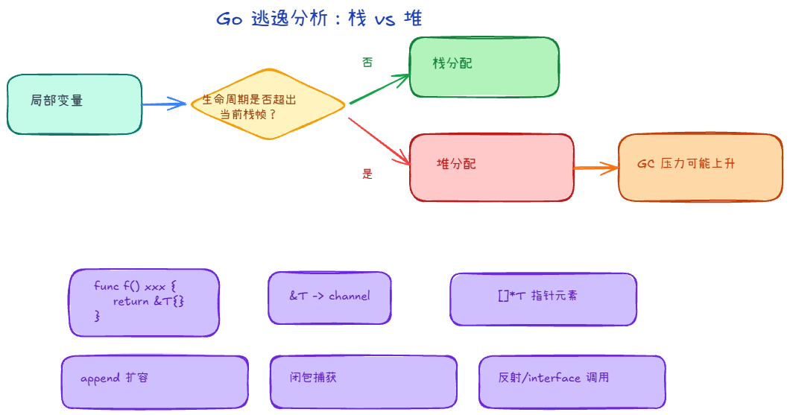
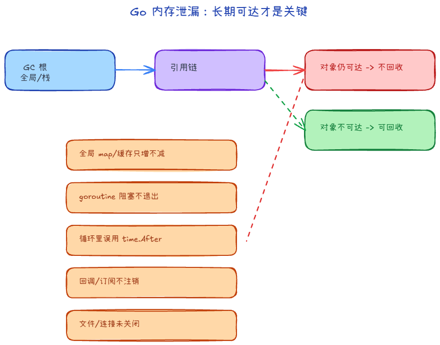

# Go 内存泄漏与逃逸

> 系列阅读：`内存分配` → `内存回收`（可选）→ **本篇**；逃逸决定「多少东西落在堆上」，泄漏决定「堆上的东西何时能变成垃圾」。  

## 这篇写给谁

- 已经知道堆对象主要由 **GC** 回收，想分清 **逃逸**（编译期决策）和 **泄漏**（逻辑上一直可达）不是一回事。
- 会用 **`go build -gcflags=-m`** 看逃逸报告，用 **`pprof`** 看堆是不是异常涨，并知道该从哪些代码习惯下手。

---

## 逃逸（escape）是什么



**逃逸**是**编译器**在编译阶段做的决定：某个值的存储，能不能只放在**当前调用栈**里随函数返回一起消失；如果不能，就要**分配到堆**上，寿命由 **GC** 管。

也就是：当一个变量的生命周期超出了栈的范围，导致它被分配到堆上，而不是栈上

### 为什么要关心逃逸

1. 优化内存使用：
    - 栈由编译器自动管理，分配和释放速度非常快
    - 堆内存由垃圾回收器管理，过程复杂，管理开销大
2. 减少内存泄漏风险：更好了解程序内存使用情况
3. 性能优化：某些性能要求高的场景中，内存逃逸可能成为性能瓶颈

### 怎么自己看：`-gcflags=-m`

对包或 main 编译时加 `-m`，编译器会打印逃逸决策（多写几个 `-m` 可以更啰嗦）：

```bash
go build -gcflags="-m -m" ./...
```

输出里常见字样大致含义：

- **`moved to heap: ...`**：编译器说明它为何认为该值不能留在栈上。
- **`escapes to heap`**：典型逃逸结论。

### 常见「会逃逸」的模式

| 模式 | 为什么容易逃逸 |
|------|------------------|
| 在方法内返回局部变量的**指针**（如 `return &T{}`） | 局部变量原本可随栈帧结束而回收；一旦返回后仍被外部引用，生命周期超出当前栈帧，通常转到堆。 |
| 发送**指针**或带指针的值到 `channel` | 编译期无法确定具体由哪个 goroutine、在何时接收并结束使用，生命周期边界不清晰，编译器会更保守。 |
| 在切片里存储指针或带指针的值（如 `[]*string`） | 切片元素里的引用可能跨作用域长期存活；即使切片底层数组有时可在栈上，所引用对象也常需要放到堆上。 |
| `append` 导致切片底层数组扩容 | 初始小切片可能先落在栈上；一旦容量不足并在运行期扩容，新底层数组通常在堆上分配。 |
| 在 `interface` 上进行动态调用（如 `io.Reader` 的 `Read`） | 动态派发发生在运行期，具体实现与对象形态在编译期不完全可知，参数与接收者更容易触发保守逃逸。 |
| **闭包**捕获外部变量，且闭包寿命超过当前栈帧 | 被捕获变量需要活到闭包执行结束；当闭包在函数返回后仍可能执行时，相关变量常转到堆上。 |
| 使用 **反射**（如 `reflect.ValueOf`、`Interface`） | 反射路径依赖运行时类型信息，编译期优化空间更小，常触发额外分配或保守逃逸决策。 |

---

## 内存泄漏（memory leak）在 Go 里通常指什么



内存泄漏（Memory Leak）是指在程序运行过程中，已经分配的内存没有被正确释放，导致程序使用的内存不断增加，最终可能导致系统资源枯竭、程序性能下降甚至崩溃

### 常见「逻辑泄漏」模式

| 模式 | 典型症状 |
|------|-----------|
| **全局 map / 缓存只加不减** | `inuse_space` 单调涨，业务流量平峰也涨。 |
| **goroutine 泄漏**（阻塞在 chan、锁、网络读等，且仍有引用） | goroutine 数持续上涨；相关栈、闭包捕获对象可能一直可达。 |
| **`time.After` 等在循环里误用** | 旧 timer 未释放类问题（依版本与写法而异，属于「要记得用 `NewTimer`/`Reset` 模式」那一类坑）。 |
| **注册了回调 / 订阅却从不注销** | 观察者列表越长越大，对象被间接引用。 |
| **打开的文件、数据库连接或网络连接等没有被关闭** | 这些资源一直占用内存 |

### 怎么查：pprof 与指标

1. 开启 pprof（在 HTTP 服务里注册）：

```go
import _ "net/http/pprof"

go func() {
    _ = http.ListenAndServe("0.0.0.0:6060", nil)
}()
```

2. 跑压测或复现场景，让进程稳定运行一段时间后抓堆快照：

```bash
# 直接进入交互分析
go tool pprof http://127.0.0.1:6060/debug/pprof/heap

# 或先保存快照，再做对比
curl http://127.0.0.1:6060/debug/pprof/heap -o heap1.pb.gz
# 过几分钟再抓一次
curl http://127.0.0.1:6060/debug/pprof/heap -o heap2.pb.gz
go tool pprof -base heap1.pb.gz heap2.pb.gz
```

3. 在 pprof 里看热点函数与累计路径：

```text
top
top -cum
list 函数名
web    # 本机装了 graphviz 时可用
```

4. 同时观察 GC 趋势，快速判断是否真泄漏：

```bash
GODEBUG=gctrace=1 ./your_binary
```

如果多轮 GC 后堆基线持续上升且不回落，更像是泄漏或长期持有，而不是短时内存抖动。

---

## 小结

| 概念 | 谁决定 | 你最该用的工具 | 优化/排查目标 |
|------|--------|----------------|---------------|
| 逃逸 | 编译器 | `go build -gcflags=-m` | 少做无谓堆分配、降 GC 压力（在正确性允许范围内） |
| 泄漏 | 你的引用关系与生命周期 | `pprof`（heap / goroutine） | 找「永远可达」的持有与阻塞，改数据结构与生命周期 |
