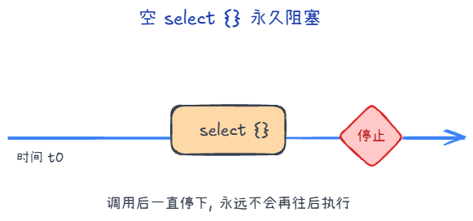
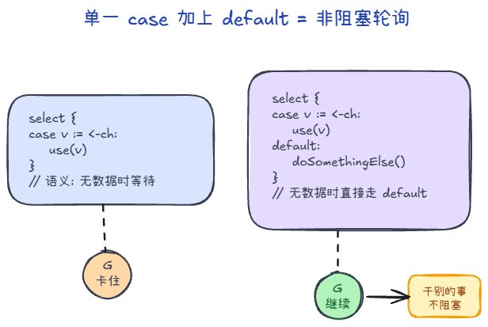

# select

## 前言

`select` 是 Go 里专门配合 channel 做「多路等待」的语句：语法上容易和 `switch` 混淆，语义上却完全围绕收发与阻塞展开。本文从**能写什么、常见坑（空 `select`、死锁提示）、`default` 的非阻塞用法**讲起，再收束到运行时如何实现多路匹配——快路径扫描、`pollorder` 与 `lockorder`、挂起与唤醒时的 `sudog`——并辅以示意图，适合作为阅读 [`select` 源码笔记]之前的导读。

## select 是什么

`select` 和 `switch` 语法长得有点像，但它**只**能用在 `channel` 的收发操作上，可以在多个 channel 间做“同时监听”：

```go
select {
case v := <-ch1:
    // 从 ch1 收到数据
case ch2 <- x:
    // 向 ch2 发送数据
default:
    // 所有 case 都不准备好时的兜底分支（非阻塞）
}
```

### 空 select 与死锁

对于空的 select {}（没有任何 case），当前 goroutine 会一直阻塞，没有可等待的 channel、定时器等。

Go 运行时有死锁检测：当所有 goroutine 都无法再取得进展（例如全部阻塞且没有任何东西能唤醒它们）时，会 runtime.throw 报致命错误，典型输出是：

fatal error: all goroutines are asleep - deadlock!



### 配合 `default` 可以实现非阻塞收发

  ```go
  select {
  case v := <-ch:
      fmt.Println("got", v)
  default:
      fmt.Println("no data, do something else")
  }
  ```


---

## 实现要点


### 如何匹配 channel case

编译器把各 case 编成 scase 数组并调用 selectgo。匹配分两类：

- 快路径：在已持有各 channel 锁的前提下，按随机打乱后的 pollorder 依次尝试。谁能立刻收发（对端在等待、缓冲区可读写、或读到关闭）就选中谁并做完，返回该 case 下标。
- 阻塞路径：无 default 且快路径都失败时，当前 G 在每个 case 对应的 channel 上各挂一个 sudog，再 gopark。将来任一路被唤醒时，把 gp.param 置为中奖的 sudog，唤醒后沿 lockorder 摘掉其余队列上的 sudog，返回对应下标。

因此「匹配」要么是第一轮扫描到的第一个可执行 case，要么是多路等待里先被唤醒的那一路。

> 每个 sudog 里有一个 g 指针，指向正在阻塞在这条路上的那个 G（goroutine）

### 饿死与公平性

若总是按固定顺序检查 case，长期可能让排在后面的 case 很少被轮到。runtime 用 pollorder 随机插入打乱本轮检查顺序，使各 case 在「先被尝试」上更均匀，减轻饥饿。

