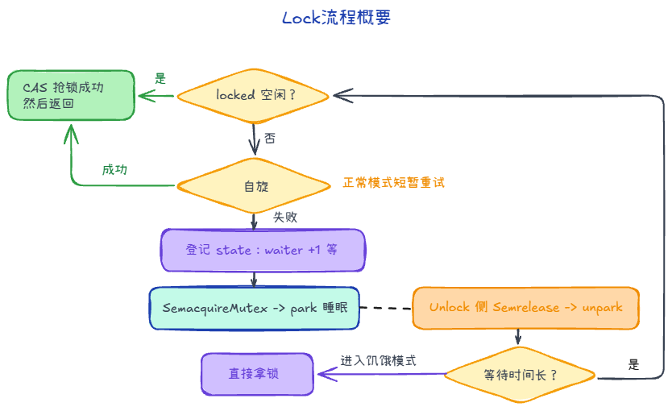
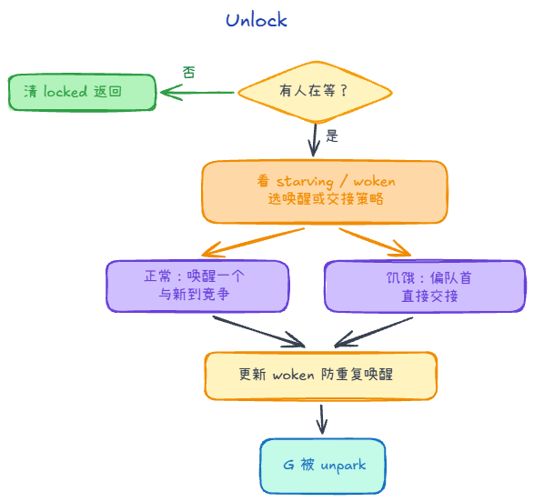
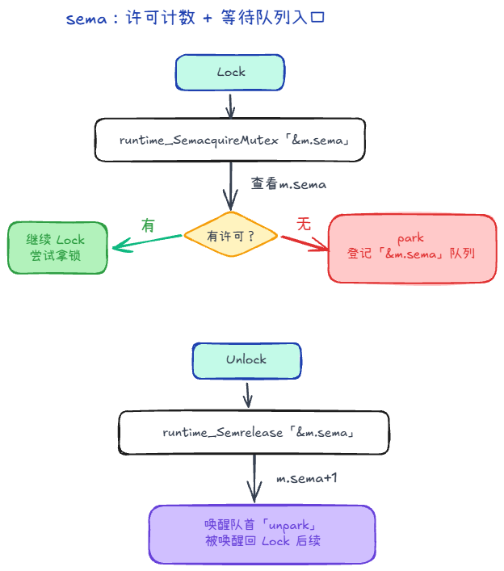

## sync.Mutex

`Mutex` 是「互斥锁」，用来保护一段代码或一块数据：**同一时刻只有一个 goroutine 能持有这把锁**，其他人想进这段临界区，就得等。

### 你会用到的 API

- **`Lock()`**：加锁，否则阻塞，直到轮到它。
- **`Unlock()`**：解锁，且**不要重复 `Unlock` 未加锁的 mutex，否则会 fatal**。
- **`TryLock()`**：试着拿锁，拿不到就立刻返回 `false`，不会排队等。

### 简单示例
```go
var mu sync.Mutex
var counter int

func AddOne() {
    mu.Lock()
    defer mu.Unlock()
    counter++
}

func TryAdd() bool {
    if !mu.TryLock() {
        return false // 拿不到锁，直接放弃
    }
    defer mu.Unlock()
    counter++
    return true
}
```

### 内部结构

`sync.Mutex` 主要由两块组成——

1. `state`：一个32位整数，里头同时塞了几种信息  
   - **`locked`（锁位）**：最低位，表示“这把锁现在有没有人占着”。  
     - `Lock()` 快路径看它：`state==0` 就能直接 CAS 抢走；拿不到就走慢路径。
   - **`woken`（被唤醒位）**：用来标记“已经有 goroutine 被叫醒/正处在交接链上”。  
     - 这样 `Unlock()` 在慢路径里就知道：有些人可能已经在路上了，不必重复唤醒更多人（避免无谓唤醒导致的抖动和尾延迟）。
   - **`starving`（饥饿位）**：表示 mutex 进入“饥饿模式”。  
   - **等待者计数（waiter count）**：其余高位存“当前大概有多少人在等这把锁”。  
     - `Unlock()` 用它判断：到底需不需要走唤醒逻辑，以及在某些慢路径里如何更新等待队列状态。
2. `sema`：运行时用的 **信号量**（让拿不到锁的 goroutine 能“睡眠/被唤醒”），避免一直空转。


### Lock()



1. **快路径：直接 CAS 抢锁**
   - 通常 mutex 为空闲时，`Lock()` 会很快把 `state` 从“未上锁”改成“上锁”，抢成功就直接返回。
   - 这里的 `CAS`（Compare-And-Swap）是一个原子操作：先比较内存里的旧值是否等于你期望的旧值；相等就把它替换成新值；不相等就失败，从而走慢路径（比如自旋或睡眠）。
2. **慢路径：抢不到就处理竞争**
  1. **不是饥饿模式，短暂再试一下（自旋）**
    - 降低调度成本：从运行队列摘下、进等待队列，再被 `Unlock` 唤醒、重新调度，有时比**多空转几轮**还贵。
    - 如果 mutex 还处在“正常模式”（没开 `starving`），runtime 可能让你先空转几轮，看看持锁的 goroutine 会不会马上 `Unlock()`。
  2. **登记自己：把“我在等”写进 state**
    - 自旋失败，或者本来就不允许自旋时，runtime 会把你的这次“抢锁失败”记下来：  
      - `state` 里会体现“锁目前仍被占用/需要等待”
      - 同时把等待者数量加上去，让 `Unlock()` 有正确的判断依据。
    - 还有一个细节：如果你并不是第一次睡/醒，而是已经经历过一次被叫醒又没抢到，那么你再排队时，可能会被放到更靠前的位置（用来减少来回睡眠的尾延迟）。
  3. **睡下去：用 sema 等通知**
    - 这时 `Lock()` 不会再空转，而是调用运行时的 `sema` 获取：**拿不到就睡，等 `Unlock()` 把你叫醒**。
    - 你可以理解为：`sema` 把“等锁”这件事变成了“阻塞等待”。
  4. **醒了再继续抢（回到循环开头）**
    - 被 `Unlock()` 叫醒后，你醒来并不会立刻“保证拿到锁”，而是继续回到状态检查/尝试抢锁的逻辑里。
    - 如果你等的时间足够久，runtime 可能把 mutex 切到 `starving` 模式：后续 `Unlock()` 会更偏向把锁直接交给队首等待者，避免一直被新来的插队拖长尾延迟。

#### 正常模式与饥饿模式

- **正常模式**：等待者按队列排，但被 `Unlock()` 唤醒的不一定马上拿到锁，还要和**新来的 goroutine** 抢；若有人等太久（1ms），runtime 可能切入饥饿模式。
- **饥饿模式**：更偏向把锁**交给队首等待者**；新来的不占便宜（通常不自旋，排到队尾）；队列只有自己、队首等待时间回落后，会再切回正常模式。

#### 为什么不一直自旋

一直自旋等于占着执行资源**干等**，问题包括：

1. **浪费 CPU**：持锁方在别的 P、或持锁很久才 `Unlock` 时，这边会**空烧算力**，吞吐下降。
2. **饿死同 P 上的其他 G**：占着 P 自旋，同 P 上就绪的 G 拿不到时间；多核上也会整体拉高负载。
3. **公平与尾延迟**：饥饿模式等机制依赖「该睡就睡」；若可无限自旋，**队尾**可能长期抢不过新来的。


### Unlock()


1. **快路径：没人在等就直接解锁**
   - `Unlock()` 会把 `state` 里的“锁占用”那一位清掉，让大家看到：这把锁空了。
   - 如果 `state` 表示“当前没有等待者”，那就结束了，这就是 `Unlock()` 变轻的原因。
2. **慢路径：有人在等，就做“唤醒 / 交接”**
   - runtime 会先判断：这次怎么处理更合适（是否饥饿模式、以及有没有人已经被叫醒但还没拿到）。
   - **正常模式**：一般会唤醒一个等待者（通过 `sema`）。它醒来后要和“新来的 goroutine”一起竞争，所以可能出现尾延迟。
   - **饥饿模式**：更偏向“直接交接”：锁从解锁者手里更明确地交给队首等待者，新来的 goroutine 不再占便宜（通常不自旋，乖乖排队）。
3. **被叫醒的人接下来干什么**
   - 通过 `sema` 被叫醒后，等待者并不是“立刻拥有锁”，而是回到 `Lock()` 的慢路径循环里，继续尝试抢锁。
   - 这也是为什么 `Lock()` 和 `Unlock()` 配合时仍可能有竞争。

### sema到底是什么

学习的时候，我会有疑问：sema到底是什么？有什么用？为啥 sema 只是个数字，还能让 goroutine “睡着”？

 `sema uint32` 更像是一个“许可计数器 + 等待入口”。  

当我们拿不到锁的时候，会去看这个sema：
- 计数允许：当前 goroutine 直接继续执行加锁尝试；
- 计数为 0：当前 goroutine park 到等待队列；`Unlock()` 才会把它 unpark；并且它被唤醒后仍要回到 `Lock()` 的尝试流程（不等于立刻拿到锁）

所以：**睡不是靠 uint32 的数值本身实现的**，而是靠 runtime 在对这个 `&sema` 做 `acquire/release` 时维护等待队列并 park/unpark goroutine 来实现的。

一个时间线例子（假设 `m.sema == 0`）：
1. goroutine A 调用 `Lock()`：抢不到。
2. 进入 `runtime_SemacquireMutex(&m.sema, ...)`。
3. 发现 `m.sema` 没许可：A `park`，并登记到“这个 `sema` 地址的等待队列”。
4. goroutine B 调用 `Unlock()`：进入 `runtime_Semrelease(&m.sema, handoff, ...)`。
5. runtime 给 `m.sema` 加计数，并从等待队列里唤醒一个等待者：A `unpark`，继续走 `Lock()` 的后续逻辑。

sema初始化的值是多少？

依赖 Go 的零值规则为0。也就是：一开始没有“许可”（permit），竞争时第一个拿不到锁的 goroutine 会进入睡眠

