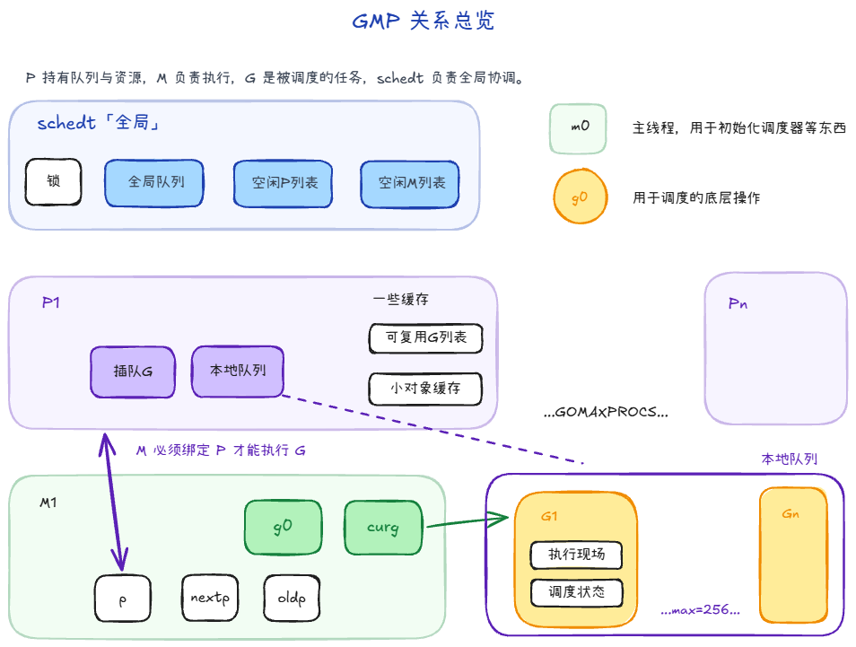
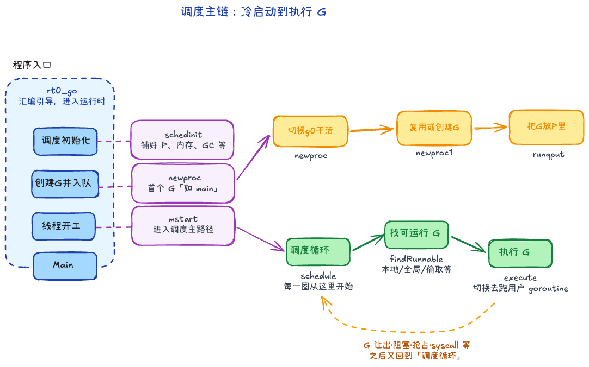
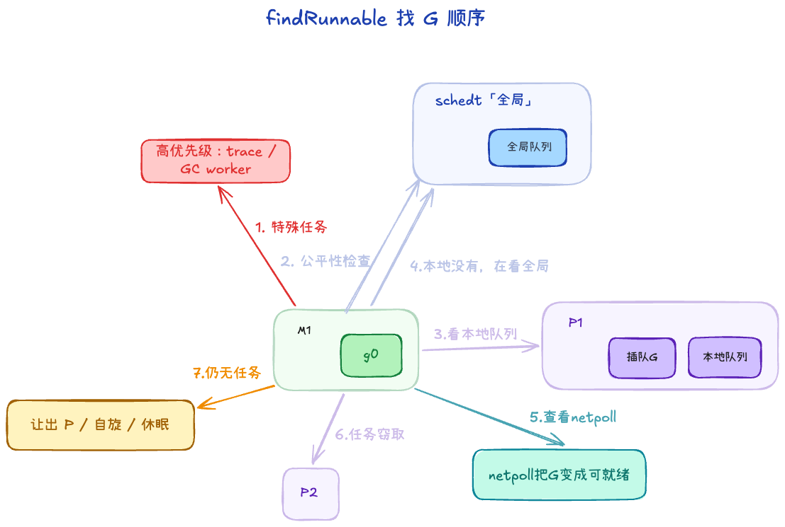
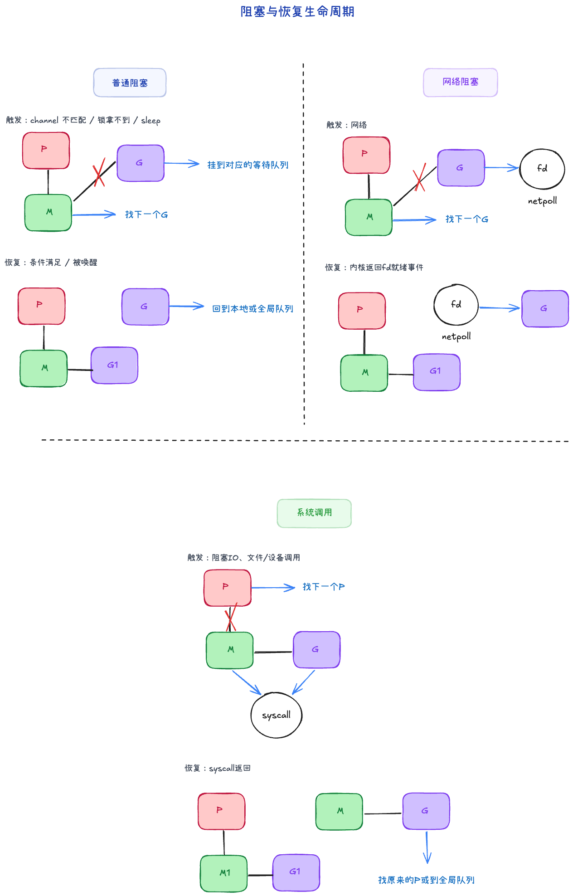
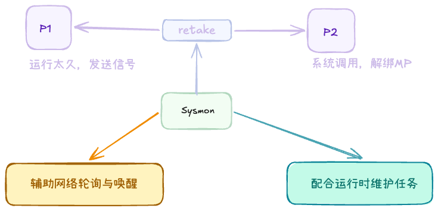

# GMP 机制：G、M、P 到底怎么配合

> 系列阅读：`GMP由来` -> `GMP机制` -> `GMP源码1`（上）-> `GMP源码2`（下）  
> 术语口径沿用上一篇：`G`=任务、`M`=线程、`P`=运行资源与本地队列、`schedt`=全局调度中心

## 这篇写给谁

- 已经知道 GMP 是为了解决什么问题。
- 想搞清楚 G/M/P/schedt 的职责分工，但不想一上来就被源码细节淹没。

## 结构
GMP 可以先理解成一句话：**M 是工人，G 是任务，P 是工位与资源包，schedt 是全局调度中心。**

### 1. G：真正要跑的任务

`G`（goroutine）本质是“可调度的执行单元”，它同时带着两类信息：

1. **执行现场**：栈、PC、SP、上下文等（切回来能接着跑）。
2. **调度状态**：它现在是可运行、运行中、等待中，还是在系统调用中。

从写业务的角度，G 就是你 `go func(){...}` 出来的那个任务。
从 runtime 角度，G 是一份“可挂起、可恢复、可迁移”的执行快照。

### 2. M：真正干活的内核线程

`M`（machine）就是操作系统线程，它负责把 G 真正跑在 CPU 上：

1. 每个 M 有 `g0`（调度专用栈）和 `curg`（当前业务 G）。
2. M还存有P的指针，表示当前M绑定的P，`nextp`表示即将绑定的P，`oldp`表示进系统调用前绑定的P。

可以把 `g0` 理解成“后台工作台”：调度、切换、运行时内部操作尽量在这里做，避免污染业务 G 的执行栈。

### 3. P：最容易被低估的角色

`P`（processor）是资源管理器，而是运行 goroutine 需要的一组逻辑资源。

最关键的是它管理了本地运行队列：

- `runnext`：下一跳优先执行位（“插队位”）。
- `runq`：本地普通队列。（固定长度 256，多数访问无锁）

还有一些缓存，比如：
- `gFree`：可复用的 G 缓存池。
- `mcache`：小对象缓存。
- `pcache`：页级缓存。

**为什么 P 重要？**

1. 把“队列和资源”从 M 身上分离出来，M 可以换，P 的本地上下文还在。
2. 本地优先，降低全局锁竞争。
3. 更容易做工作窃取和负载均衡。

### 4. schedt：全局调度中心

可以把 `schedt` 看成“总控室”，它主要存全局共享资源：

- 全局可运行 G 队列
- 空闲 M、P 列表

当本地队列不够用，或者需要全局协调（比如唤醒更多工作线程），都会走到这个层面。

### 5. 其它

**全局私有变量**

1. `m0`：
   - 程序启动时的**初始 M**（主线程对应的 runtime 线程）。
   - 在调度冷启动链路中承担引导角色，很多最早期初始化都依赖它。
   - 它不是“唯一的 M”，只是第一个 M；后续 runtime 会按需创建更多 M。

2. `g0`：
   - 调度切换、系统栈上的 runtime 操作（如 `mcall` 进入调度路径）通常在 `g0` 上完成。
   - 常说的“`m0.g0`”是启动阶段最先出现的那对；后续新建的 M 也各自有自己的 `g0`。

**GMP 关系**

1. M 必须先拿到一个 P，才有资格执行 G。
2. 拿到 P 后，优先从 P 的本地队列找 G。
3. 本地没有，再看全局队列，或者去别的 P 那里偷任务。
4. G 阻塞时会让出执行机会，等待被唤醒后重新入队。

如果只记一句：**“M-P 绑定后跑 G，本地优先，全球兜底，窃取均衡。”**

**P、M的数量**
P的数量通常是机器CPU核数，可以通过环境变量`GOMAXPROCS`设置。

go 程序启动时，会设置 M 的最大数量，默认 10000. 但是内核很难支持这么多的线程数，所以这个限制可以忽略。
M 的数量不固定，runtime 会按需创建/回收：
1. **并行度上限主要看 P（`GOMAXPROCS`）**。  
2. **M 可以多于 P，但跑用户 G 时 M 必须先绑定 P**。

---

## 机制

### 1. GMP 调度流程（主循环在干什么）

主流程可以先记这条链：

`rt0_go -> schedinit -> newproc -> mstart -> schedule -> findRunnable -> execute`

用大白话按顺序过一遍：

1. **程序刚起来**先进 `rt0_go`（入口汇编/引导）。
2. 接着 **`schedinit` 把调度器、P 的数量、内存/GC 等「场子」铺好**。
3. 再用 **`newproc` 捏出第一个要跑的 goroutine（比如 main）并塞进队列**。
4. 当前线程 **`mstart`，相当于「我开始上班」**：此后长期在调度逻辑里转。
5. 进入 **`schedule` 这个无限循环**：每一圈先 **`findRunnable` 找一个能干活的 G**，找到了就 **`execute` 真正去跑它**。跑不下去（让出、阻塞、被抢占、syscall 等）又会回到 **`schedule`**，周而复始。

### 2. 创建G的流程

当你写下 `go f()`，大致会走这条路：

1. `newproc` 在用户 G 上用 `systemstack` 切到 **g0 栈**，避免在用户栈上做复杂调度逻辑。
2. `newproc1` 里通过 `gfget` **优先复用** P 本地 / 全局 `gFree` 中的 G，不够再新建；把状态设为 `_Grunnable`（少数 parked 路径为 `_Gwaiting`）。
3. `runqput` 把新 G 放进当前 P 的队列（常优先 `runnext`）

### 3. 查找G的流程

这段如果对齐源码里的 `findRunnable`，顺序是“先处理必须优先的，再就近找活，最后兜底”：

1. 先看**特殊任务**：比如 trace reader、GC worker（这些是运行时的高优先级内部活）。
2. 然后做一次**公平性检查**：不是每次都看全局队列，但会按节拍（如每隔一段 tick）看一眼，避免本地队列长期“自嗨”把全局任务饿死。
3. 接着看本地队列：`runqget` 内部先看 `runnext`，再看普通 `runq`。
4. 本地没有，再看全局 runq。
5. 再看 netpoll：有没有网络事件刚好把某些 G 变成可运行。
6. 还没有，就进入 stealWork，去别的 P 试着“借/偷”任务（通常是忙闲不均时触发）。
7. 仍然没活：让出 P，M 进入自旋或休眠，等后续 `wakep`/事件唤醒。

**为何「全局队列」会在叙述里出现两次？** 
前者是 **公平性**：避免某个 P 本地一直有活、全局里的 G 长期饿死；后者是 **前面几步都落空后的兜底**：集中从全局再取一轮。

### 4. 阻塞

1. **普通阻塞（G 级别）**
   - **触发情况**：`channel` 收发对不上、锁拿不到、`time.Sleep` 等待计时器到期等。
   - **GMP 变化**：
     - `G`：`_Grunning -> _Gwaiting`，挂到对应等待队列；
     - `M`：与该 `G` 解绑后继续 `schedule` 找其他活；
     - `P`：通常仍由当前 `M` 持有并继续参与调度（不必让出）。
   - **阻塞后怎么办**：
     - 条件满足后（如配对收发成功、锁释放、定时器到期），等待队列会把该 `G` 唤醒；
     - `G`：`_Gwaiting -> _Grunnable`，通过 `ready/runqput` 回到可运行队列；不是固定回原来的 M，通常是谁先拿到它就谁跑。
     - 调度器后续在 `findRunnable` 取到它并继续执行。
   

2. **网络阻塞**
   - **触发情况**：net.Conn 去 Read/Write 时，如果内核判断“现在还不能读/写”，G进入 netpoll 等待。
   - **GMP 变化**：
     - `G`：进入 `_Gwaiting`，关联到 fd 的 pollDesc/netpoll 等待结构；
     - `M`：不在该 I/O 上忙等，回到调度循环继续跑别的 `G`；
     - `P`：继续服务其他可运行 `G`；I/O 就绪后由 netpoll 把 `G` 重新变 runnable 并注入队列。
   - **阻塞后怎么办**：
     - 内核返回 fd 就绪事件（可读/可写）后，netpoll 取出对应等待 `G`；
     - `G` 被标记回 `_Grunnable` 并注入 run queue（本地或全局）；
     - 被调度执行后，从上次 I/O 调用点继续往下跑。

**补充知识**
- fd: file descriptor，文件描述符，是操作系统用来标识一个文件的抽象概念。在网络里，一个 socket 就对应一个 fd。
- netpoll：Go runtime 的网络事件轮询层（统一抽象）
- pollDesc：Go runtime 里“某个 fd 的等待说明书/挂钩对象”

G 在 net.Conn 上阻塞时，不是卡线程，而是把“G <-> fd”的等待关系挂到 pollDesc，由 netpoll 盯内核事件；fd 一就绪，runtime 就把对应 G 变回 runnable。

3. **系统调用阻塞（syscall 级别）**
   - **触发情况**：`G` 进入可能长时间阻塞的系统调用（如阻塞 I/O、文件/设备调用等）。
   - **GMP 变化**：
     - `G`：进入 syscall 相关状态（常见是 `_Gsyscall`）；
     - `M`：该线程可能被内核阻塞在 syscall 上；
     - `P`：为避免拖住并行度，runtime 会尽量让出/转移 `P` 给其他 `M` 接管，保持调度吞吐。
   - **阻塞后怎么办**：
     - syscall 返回后，`G` 先尝试“快速路径”拿回可用 `P` 并继续执行；
     - 若暂时拿不到 `P`，则把自己转为 `_Grunnable` 放入全局队列等待调度；
     - 目标是把“一个 syscall 的慢”隔离开，不拖垮整体并行度。

## sysmon

`sysmon` 可以理解成 runtime 的**后台巡检线程**（monitor）：

- 它跑在独立线程上，**不绑定 P**，所以不会直接占用业务并行度。
- 它周期性醒来，检查调度与系统状态，属于“守夜人”角色。

它主要做几件事：

1. **抢占长时间占用 CPU 的 G**
   - 发现某个 G 跑太久，会触发预抢占流程，避免其他 G 长时间饿死。

2. **处理 syscall 导致的资源失衡**
   - 某些 M 卡在 syscall 时，`sysmon` 会推动 P 的回收/接管，减少并行度损失。

3. **辅助网络轮询与唤醒**
   - 在合适时机参与 netpoll 结果处理，把就绪 G 注入可运行队列。

4. **配合运行时维护任务**
   - 包括定时器、GC 相关节拍等需要后台巡视的工作。

### retake

`retake` 是 `sysmon` 周期巡检里很关键的一步，核心目标是：**把被长时间占住的执行资源重新拿回来**，避免整体调度被拖慢。

可以按这条流程记：

1. **触发时机**
   - `sysmon` 醒来后会遍历所有 `P` 的状态与时间片使用情况；
   - 重点看两类异常：  
     1）某个 `P` 长时间被同一条执行路径占着（需要推动抢占）；  
     2）某个 `P` 因 `syscall` 被“挂空”太久（需要回收给其他 `M` 用）。

2. **它具体做什么**
   - **对长跑 G**：触发预抢占信号/标记，推动该 `G` 尽快让出 CPU；
   - **对 syscall 场景**：尝试把被占着不用的 `P` 重新置为可调度资源，交给其他可运行 `M`；
   - 必要时配合唤醒机制，让新的 `M-P` 组合尽快接手可运行队列。

3. **结果是什么**
   - 防止“一个 G 或一个 syscall 把整条调度链拖住”；
   - 保持 `GOMAXPROCS` 对应并行度尽量被利用；
   - 提升公平性（别的 runnable G 不会长期饿死）和整体吞吐。

