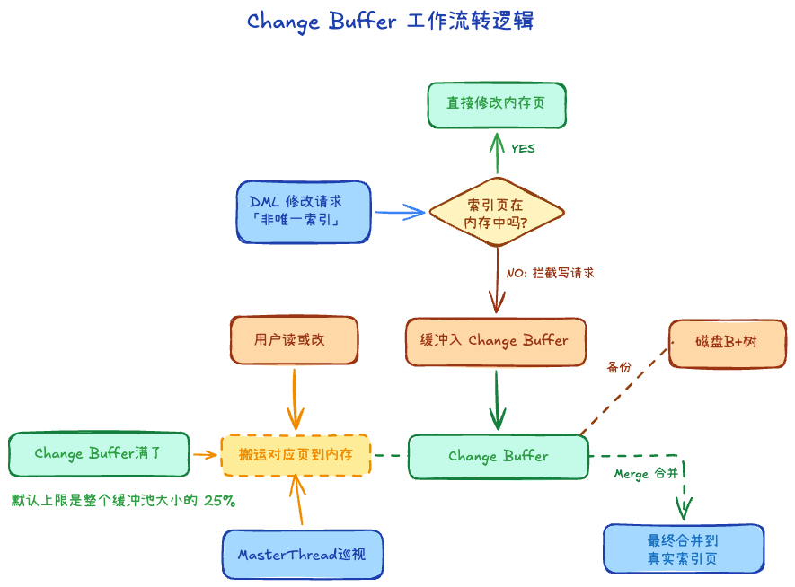
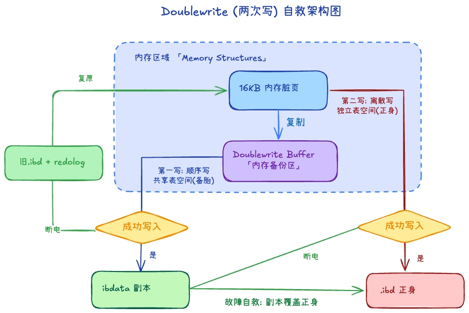
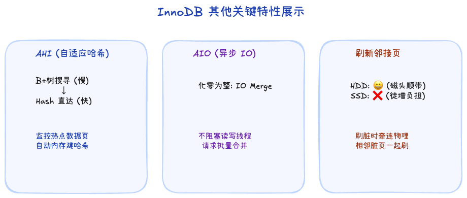

# 1.3 InnoDB 关键特性原理解析

在缓冲池和后台线程搭建起的通用骨架之上，InnoDB 设计了一系列非常精巧的“特性插件”来对抗磁盘物理特性所带来的短板。这些也是 InnoDB 性能远超普通数据库的核心秘诀。

## 一、 插入缓冲 / Change Buffer

### 1. 为什么需要它？
在 InnoDB 中，自增**主键**是顺序写入磁盘的，效率很高。但是**二级索引**的值往往是极其离散的。如果每次有数据插入，都要去磁盘上的随机位置寻找二级索引页进行更新，这种**随机 I/O** 会造成性能急剧下降。

### 2. 工作原理
- **拦截**：如果要更新操作针对的是**非唯一**的二级索引，且相关的索引页当前**不在**内存里，此时不去强行读磁盘。
- **缓冲**：把这次修改记录保存在内存的 `Change Buffer`（物理存在于共享表空间的 B+ 树上）。
- **合并 (Merge)**：等以后相关的索引页由于别的查询被正常读进内存，或者后台 Master Thread 苏醒时，再将 `Change Buffer` 中的修改一次性合并（Merge）到该索引页中。将多次离散操作整合为一次统一操作。

> **思考：为什么必须是非唯一索引？**
> 因为如果是唯一索引，每次插入时都必须强行去磁盘原处进行“唯一性约束检查”(Unique Check)，既然磁盘位置都读出来了，那就不得不发生随机 I/O，缓冲层也就失去了用武之地。

*注：早期版本只支持 `INSERT` 所以叫 Insert Buffer，后来扩展支持了删除标记等操作，更名为 Change Buffer。*

## 二、 两次写 (Doublewrite)

如果说 Change Buffer 带来了速度，那么 Doublewrite 带来的就是极端条件下的**存活保障**。

### 1. 核心危机：页断裂 (Partial Page Write)
InnoDB 默认管理的页大小是 **16KB**。然而，操作系统/文件系统层面的默认写入单位（或者说是原子写入单位）通常是 **4KB**。
假设在将一个 16KB 脏页刷盘时，才写了 4KB 断电了，这也就意味着磁盘上的这个页：又有新数据，又有旧数据。这个页的物理结构**损坏**了。

此时，**Redo Log 救不了！** 因为重做日志记录的是逻辑物理日志（例如“在 xx 页的 yy 偏移处写入数据 ZZ”），如果被修改的页本身的基础物理结构已经毁容（CRC 校验失败），重做日志根本无从下手。

### 2. 工作机制：先留底，再干活
InnoDB 引入了一个额外的存储层：
1. **留底（快写）**：在脏页真正写入 `.ibd` 数据文件前，先将其复制到内存的 `Doublewrite Buffer`。然后它会被**顺序写入**到共享表空间的连续块中（因为是顺序写，开销非常极小）。
2. **干活（慢写）**：确认“备胎”写完毕后，再将脏页按本来的方式离散地写入真正的表数据 `.ibd` 文件中。

### 3. 自救表现
- **情况 A：** 如果在写“共享表空间”时断电，数据页还没动，直接用该页+redolog重做。
- **情况 B：** 如果在写“正式数据文件”时断电，导致页损坏。会去 **Doublewrite Buffer 的共享表空间**里找到那个完整的副本。

## 三、 自适应哈希索引 (AHI)

虽然 B+ 树搜寻很快，但对于高并发的“爆款热点数据”，即使索引页全在 Buffer Pool 里，顺着一棵 4 层高的树进行 4 次跨页逻辑读取和比较，依然会引发巨大的 CPU 和 Latch 锁开销。

### 工作逻辑 (“自适应”的精髓)
这不需要人类 DBA 通过 `CREATE INDEX` 去干预：
1. **监控**：InnoDB 会自己像老大哥一样盯着内存。如果它发现某个索引页的**某个访问模式**被极为频繁地复用。
2. **自动建表**：它会把这些被高频访问的热点数据键值抽取出来，在内存中构建一个**哈希表**。
3. **一步直达**：下次再查找同样的键值时，不走 B+ 树逻辑，通过哈希表直接拿到数据页内位置，时间复杂度变为 O(1)。

*注意：这极度耗费内存，且只支持等值查询（`WHERE ID = 100`），不支持范围扫描。因此它必须是动态生成、动态销毁的“自适应”机制。*

## 四、 异步IO (AIO) 与 刷新邻接页

### 异步 IO (AIO)
这是为了不让 CPU 的高性能被磁盘慢速拖垮的机制。发出 I/O 请求后，线程不阻塞等待结果，直接回头干别的事。
- 最核心的威力不仅是“不阻塞”，更在于 **I/O 合并 (IO Merge)**。底层 AIO 判断如果你需要读写的文件偏移量是连续的，它会把多个小的随机 I/O 请求，合并成一个巨大的批处理请求交给磁盘。

### 刷新邻接页
当需要把内存脏页刷到磁盘时，如果顺便发现物理上跟它挨着（同一个区内）的隔壁老王页也是脏的，就**顺便牵连它一起刷掉**。
- **机械硬盘时代 (HDD)**：神技。因为磁头转到那个磁道很慢，既然到了就多写一点。
- **固态硬盘时代 (SSD)**：略显尴尬。SSD 的磁头寻道时间为 0，并且随机写性能极高。开启这个功能反而可能无辜连累还没熟透的邻接脏页，增加没有必要的整体写压力。所以在纯 SSD 环境下通常建议关闭此特性。

