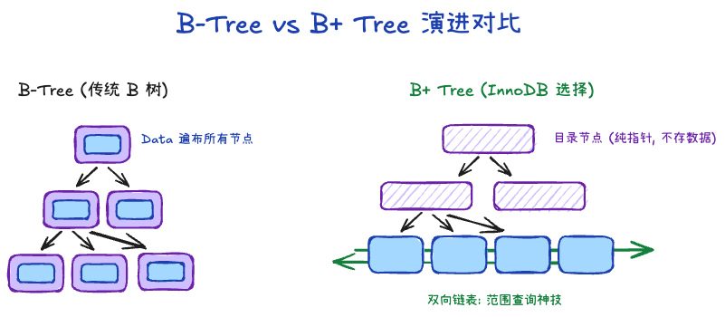
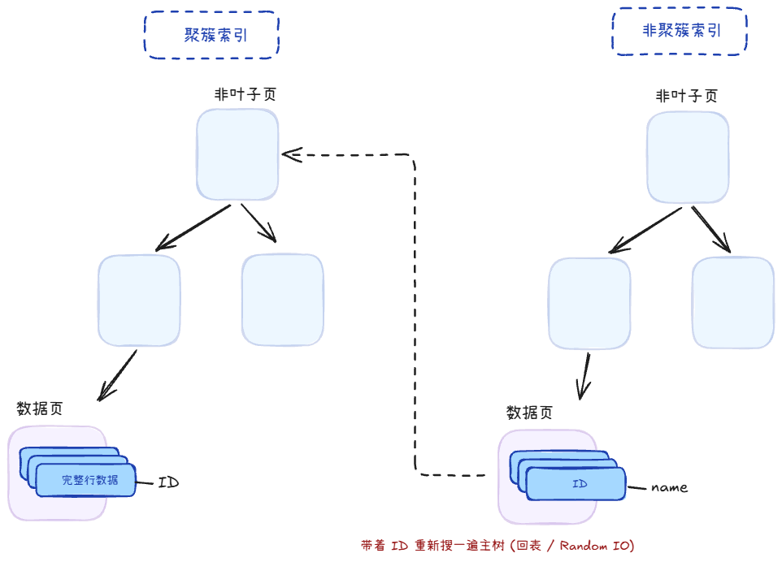
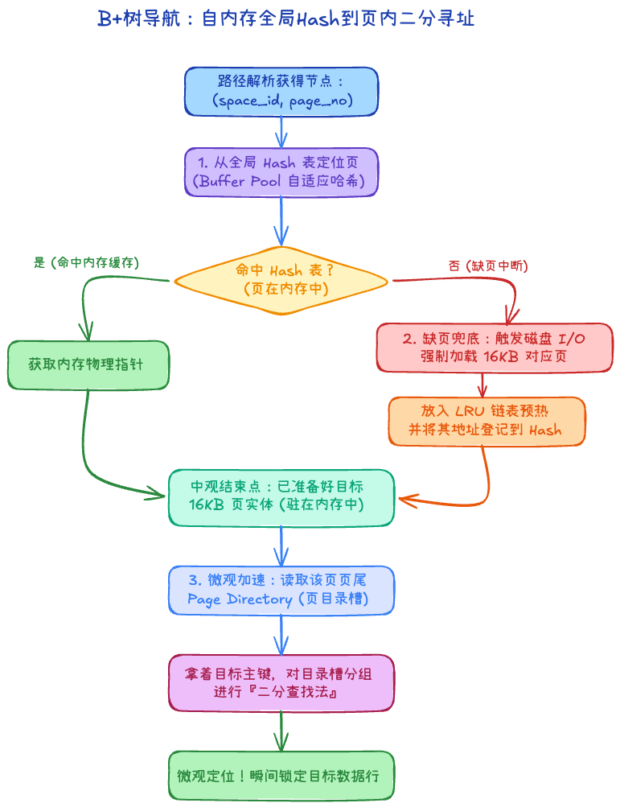

# 3.1 B+ 树索引原理

索引的本质就是“目录”。而在关系型数据库中，这个目录的数据不仅极其庞大，而且需要持久化躺在磁盘上。如何让这个大体积目录能够在查询时占用最少的时间和系统开销？答案就是 B+ 树。

## 一、 为什么最终是 B+ 树？

在面试或架构决策中，这是一个最经典的比较问题。数据库查找要兼顾**等值、范围、排序**，同时最重要的是**控制磁盘 I/O 的次数（树越矮越好）**。

我们来看看其他数据结构为何落选：
1. **Hash 表**：O(1) 碾压级别的查询速度。但致命弱点是元素无序！**不支持范围查询**（`WHERE ID > 10`）和**排序**（`ORDER BY`），因此不能作为主力索引。
2. **二叉查找树**：最坏情况下容易全部挂在右边，退化成了链表（O(n)），直接报废。
3. **平衡二叉树 / 红黑树**：虽然能维持平衡，但在海量数据下，一个节点只有两个分叉，会导致这棵“树”长得极高。树高代表着磁盘寻道的次数，查找一次数据可能要跨越十几层经历十几次 I/O，太慢；此外，频繁的树旋转代价极高。
4. **B 树**：开始接近标准答案了！B 树允许一个节点有非常多分叉，成功把树压矮。但是，B 树的“非叶子节点”（枝干）不仅存目录，还直接存**数据行**。这导致每个 16KB 页里能放下的目录变少了，这就逼着树不得不长高。

**结论先行，终极变体 B+ 树的碾压优势：**
- **更矮更胖**：B+ 树的“非叶子节点”（纯目录）**绝对不存放数据**。这样 16KB 的一页里全是指针，一个节点轻松容纳千把个分叉。三层树高就能撑起千万级乃至上亿级别的数据量，意味着最多只要 3 次 I/O 就能找到目标页。
- **范围查询无敌**：B+ 树所有的数据全部在最底端（叶子节点）排得整整齐齐，并且互相之间用**双向链表**串联了起来！当你查找 `ID > 100` 时，只要定位到 100，直接顺着链表一趟横向拉取即可，极其残暴。

### 核心面试灵魂拷问：B 树和 B+ 树的本质区别到底是什么？

这里做一个最直观的对比，这也是面试中最常被问到的核心：

| 维度 | B 树 (B-Tree) | B+ 树 (B+ Tree) | InnoDB 最终选择 B+ 的原因 |
| --- | --- | --- | --- |
| **数据存放位置** | 所有节点（包括非叶子枝干）都存放真实数据行 | **只有叶子节点存放数据**，非叶子节点纯作索引目录 | 换取极高的“页内容量”，使得 B+ 树的层级比 B 树更矮，极大减少磁盘 I/O。 |
| **叶子节点是否有序** | 无特殊连接，独立的 | 叶子节点之间有一条**双向链表**互相串联 | B+ 树顺着链表一拉就能完成范围查询（`>`,`<`），而 B 树做范围查询必须反复进行耗时的中序遍历查树。 |
| **查询稳定性** | 不稳定。运气好在根节点找到；运气不好到底层才找到。 | **极度稳定**。无论找什么数据，都必须一路查到底层的叶子节点。 | 数据库高并发场景下，稳定的查询耗时有利于执行器评估执行计划。 |
| **全表扫描开销** | 必须对整棵树进行遍历，到处跳跃去读各个节点的数据。 | 只需要找到最左的第一个叶子节点，顺着底下链表一路走到头即可。 | 针对聚合函数、全表范围拉取的场景，B+ 树底部的链表具有绝对优势。 |

## 二、 B+ 树的具体分类

虽然数据结构都是 B+ 树，但是从应用形态上，InnoDB 的表索引分为主要的两派：

### 1. 聚簇索引 (Clustered Index)
- **定义**：这棵树的叶子节点里，存放的是**完整的一整行记录数据**。
- **特征**：在 InnoDB 中，**只允许有一棵聚簇索引树**（就是依靠主键构建的那棵树）。前面讲到，表本身就是按照这个顺序物理存放的。这就是所谓的“索引即数据，数据即索引”。

### 2. 二级索引 (Secondary Index / 非聚簇索引)
- **定义**：这棵树的叶子节点里，不再存放整行记录（如果每个索引都存一份完整数据，磁盘早就撑爆了）。它里面存放的，是你**专门建索引的那个字段值 + 对应行的主键值**。
- **回表机制**：当你在给 `name` 字段建的二级索引树里，通过二分查找找到了名叫 `Tom` 的记录，你发现这底下只写着“Tom 的主键是 9527”。这时候，如果你还需要 `Tom` 的 `age` 字段，你不得不带着主键 `9527` 返回到聚簇索引（主键树）再从头往底搜一遍，这个过程叫**回表 (Look Up)**。

## 三、 B+ 树的动态维护：分裂与合并

B+ 树之所以能始终保持“矮胖”的平衡身材，得益于它极高的自我修复能力。

### 1. 页分裂 (Page Split) —— 插入太猛的副作用
当一个 16KB 的页已经塞满，此时若要插入一条处于中间主键位置的新行：
- **暴力拆分**：InnoDB 会申请一个新页，将原页中约 50% 的数据迁移到新页，并修改父节点的指针。
- **性能代价**：分裂是极其昂贵的。它不仅涉及磁盘 I/O，还会导致 B+ 树层级可能瞬间增加。
- **优化之道**：这就是为什么建议使用 **自增主键**。顺序插入意味着永远在页尾追加，页满后直接新开一页即可，极大减少了由于频繁“插队”引起的数据挪动和页分裂。

### 2. 页合并 (Page Merge) —— 删除后的留白
当你执行大量 `DELETE` 或 `UPDATE` 导致一个页的空间利用率低于 **50%** 时：
- **邻居吞并**：InnoDB 会尝试寻找逻辑上相邻的页，看看能不能把干瘪的页合并掉以节省空间。
- **碎片问题**：为了性能，InnoDB 不会实时进行完美的压缩。所以删除数据后，你会发现磁盘文件大小并不会立刻缩水，这些留下的空洞被称为“碎片”，等待未来被新数据填入。

## 四、 从页内部到全局的哈希查找融合

当我们要在一棵 3 层的 B+ 树找东西时，这看似简单的 3 次 I/O 是如何加速完成的？

1. **从内存定位页（全局级加速）**：
   InnoDB 为了避免每次都在树枝上反复确认某一页在不在 Buffer Pool 中，它在全局维护了一个庞大的哈希表（自适应哈希的基础体系就是基于它构建的）。
   如果你提供 `表空间号 (space_id) + 页号 (page_no)`，通过这个全局 Hash（加上链表法解决冲突），可以直接拿到这页在内存中的物理地址指针。
2. **缺页时的磁盘加载（宏观兜底）**：
   如果在上述的 Hash 表中没有命中，说明这页根本不在内存里。此时才是 B+ 树发挥的时候——引发一次真实的磁盘 I/O，把那 16KB 的页读取到内存的 Buffer Pool 中，并立刻将其物理地址登记进 Hash 表备用。当你从根节点层层往下遍历树干目录寻找叶子节点时，实际上每摸到一个新页都会经历这个“先查内存，没有再捞磁盘”的过程。
3. **进入页以后找行（微观级加速）**：
   现在这 16KB 进了内存了。页内可能有两三百行数据排成链表，你要顺着链表一个个翻吗？不用。
   正如在文件结构里提到的，页尾有一个专门记录分组阵列的 **Page Directory（页目录槽）**。拿着你的目标值，直接在这个数组里跑一次**二分查找法**，瞬间锁定那行记录的所在位置。

B+ 树、全局 Hash、局内目录二分，它们共同构成了一个极度精密宏大的性能怪兽。
