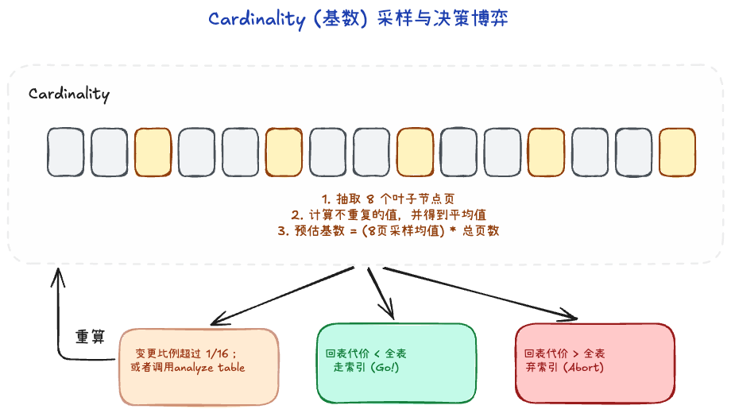
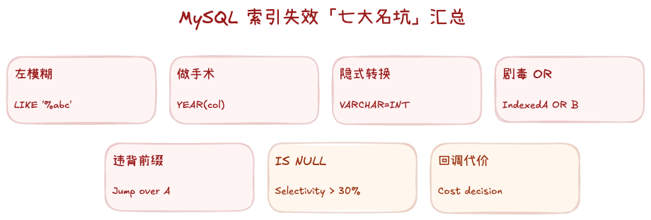

# 3.2 索引应用与优化

理解了 B+ 树的物理基础，接下来探讨上层逻辑。索引建得好是一把屠龙刀，建不好就是拖累数据库的沉重包袱。

## 一、 为什么有索引比没索引快？

建立从算法算力到磁盘物理 I/O 两方面的认知：

1. **算法优越性**：没索引就是“全表扫描”（逐行瞎找）。1000 万数据的线性查找即使是在内存也是极高的计算轮次。而 B+ 树通过多路平衡树机制，用极少的路径折叠（时间复杂度约等于 O(log N)），瞬间锁定目标。
2. **免除毁灭级磁盘 I/O**：如果没有索引，你要找一个人，不得不把磁盘上这 1000 万条数据涉及的**成千上万个数据页**统统拉入内存慢慢筛，可能把数据库整个缓存挤爆。若有索引，只需要把相关的 3 层拉进内存即可。对于极其漫长的磁盘寻道动作，这是降维打击。

## 二、 索引类型盘点与应用技巧

在二级索引（非聚簇索引）的形态上，又延伸出了许多应用变种，我们在使用中通常将其分为以下几类：

1. **唯一索引**：给列强制加上 Unique 约束建树。它除了加速查找，还保证了这一列绝不重复。
2. **普通索引**：仅用于加速查询，也就是最常见的形式。
3. **联合索引 (复合索引)**：对多个列组合建立的索引结构（例如 `age, name` 构成一个总键建立一棵树）。
4. **覆盖索引 (Covering Index)**：这不是一种单独的结构，而是一种**顶级优化境界**。当你的 SQL 里 `SELECT` 返回的所有列，正好都包含在这棵二级索引树内，那么就完全不用触发耗时的“回表”动作。不需要去查主树了，“索引叶子盖住了你需要的所有数据”。

### 最左前缀原则
当我们建立了一个复合索引 `(A, B, C)` 时，B+ 树内部的排序逻辑是：**严格先按照 A 排序存放；如果 A 相同，再按照 B 排序；如果 A, B 都相同，再按 C 排序。**

这意味着：
- 查询 `WHERE A = x AND B = y`，能完美利用索引这棵树进行二叉对比。
- 查询 `WHERE B = y AND C = z`，完蛋了！因为跳过了 A，在没有 A 约束的前提下，B 和 C 的摆放是**乱序**的。所以这时索引会彻底失效（变成了二级树全表遍历）。
这就是为什么在使用联合索引时，条件必须从左边开始命中，不能跳过前面的列。

### 如何看是否用到索引

最直接、最权威的手段是使用 **`EXPLAIN`** 命令。将它加在 SQL 语句最前面执行，重点观察以下四个字段：

1. **`type` (访问类型)**：这是性能的“心电图”。
   - **`system / const`**：极优。通过主键或唯一索引直接定位，通常只有一行。
   - **`eq_ref / ref`**：良。非唯一索引匹配，或多表关联中的主键匹配。
   - **`range`**：中。索引范围扫描（如 `>`, `<`, `BETWEEN`, `IN`）。
   - **`index`**：差。**全索引扫描**。虽然比全表扫块，但它遍历了索引树的所有叶子，性能堪忧。
   - **`ALL`**：极差。**全表扫描**。完全没用到索引，数据量大时是灾难。

2. **`key` (实际用到的索引)**：
   - 如果该值为 `NULL`，说明索引失效或没建索引。

3. **`key_len` (索引长度)**：
   - 极其关键！它能精准告诉你**联合索引被用到了什么程度**。比如索引 `(a, b)` 总长 10 字节，如果 `key_len` 是 5，则说明只有 `a` 列生效，`b` 列由于之前的范围查询或断链失效了。

4. **`Extra` (关键辅助标志)**：
   - **`Using index`**：性能巅峰。说明命中了**覆盖索引**，数据直接在二级索引树拿到，完全没有回表成本。
   - **`Using index condition`**：触发了 **ICP（索引下推）**。在索引遍历阶段就顺便把 `WHERE` 条件过滤了，极大减少了回表次数。
   - **`Using filesort / Using temporary`**：危险信号。说明索引无法支撑排序或去重，MySQL 只能在内存或磁盘进行“二次加工”，通常需要优化。

### 进阶监测与诊断工具箱

除了 `EXPLAIN` 这一“瞬时检查”工具，在生产排查和深度优化时还需要：

1. **慢查询日志 (Slow Query Log)**：
   - **价值**：生产环境的“监控雷达”。通过 `long_query_time` 过滤慢 SQL。
   - **小技巧**：开启 `log_queries_not_using_indexes = ON`，可以将所有没用索引、不论执行多快的 SQL 统统记录，是查漏补缺的利器。

2. **Optimizer Trace (优化器跟踪)**：
   - **价值**：如果 `EXPLAIN` 的结果让你费解（比如建了索引却没选），开启 Trace 可以看到优化器内部的 **CBO 成本计算过程**。它详尽地展示了每种路径的 Cost 估算。
   - **使用**：`SET optimizer_trace="enabled=on";` 运行 SQL 后查看 `information_schema.optimizer_trace` 表。

3. **SHOW STATUS (Handler 计数器)**：
   - **价值**：查看“底层动作”。执行 SQL 后观察 `SHOW STATUS LIKE 'Handler_%';`。
   - **Handler_read_key**：通过索引定点读的次数。
   - **Handler_read_next**：按索引顺序读取下一行的次数。
   - **Handler_read_rnd_next**：读入正文下一行的次数（该值高说明发生了大量全表或回表扫描）。

## 三、 Cardinality 值：索引是否值得信赖

有一个问题：即使建了索引，也遵守了最左前缀，MySQL 却依然选择了死笨的全表扫描，为什么？这取决于 `Cardinality`（基数值）。

利用命令 `SHOW INDEX FROM table_name;` 可以看到这一列预估值。
- **高 Cardinality**：列中的值百花齐放极少重复（如手机号、ID）。这非常棒，查询走这棵树极快。
- **低 Cardinality**：这个列里就几个穷酸选项大量重复（比如性别“男/女”，审批状态“0/1”）。如果在这种列上建索引就是灾难。

因为低基数的列，会查出来一大堆相同的二级索引叶子，然后带着一大堆结果跑去执行**海量的、随机的“回表行动”**。优化器（Optimizer）比我们聪明：若它发现跑去回表的代价还不如直接在主链上顺手刷一边全表扫描，它就会**抛弃索引**。

### 关于基数的生成
它不是全表老老实实扫的（那太慢），是利用**采样统计**。
1. 随机去索引树里面抽取 8 个叶子节点页。
2. 统计这些页中不同记录的数量，得到平均值，然后乘以全部的页数当作全局。
3. 当数据变更比例超过 `1/16` 时，内部会自动重新采样刷新。
如果发现优化器变蠢了没选索引，往往是采样有了偏差卡住了。手动执行 `ANALYZE TABLE` 重新采一次样或许是最快的拯救办法。

## 四、 索引常见的惨烈失效场景

以下几类常见场景会破坏 B+ 树的检索规则，导致优化器放弃二级索引而降级为全表扫描：

1. **左模糊匹配**：使用 `LIKE '%xxx'`。由于 B+ 树索引依据字符字典序排列，当首位字符未定时，引擎无法利用树结构进行二分定位。
2. **对索引列执行函数或算术运算**：例如 `WHERE YEAR(date_col) = 2026` 或 `WHERE id + 1 = 10`。
   - **核心原理**：B+ 树节点存储的是字段的原始物理值。MySQL 优化器不具备复杂的代数方程解析与转换能力，当等号左侧的索引列被套上函数或计算式时，引擎必须完整扫描全表提取数据并逐年代入公式运算，才能完成比对。
   - **优化方案**：严格遵循“常量折叠”原则，将运算逻辑全数转移至等号右侧。例如改写为 `WHERE id = 10 - 1`，优化器在解析语法树阶段即可将结果折叠为常数 `9`，随后完美基于 B+ 树进行二分查询。
3. **隐式类型转换**：例如某字段 `PHONE` 被定义为 `VARCHAR` 类型，但应用层传入了整型参数 `WHERE PHONE = 18888888`。
   - **核心原理**：依据 MySQL 对于异构数据比较的内部规则，当字符串与数值进行等于判断时，引擎会自动把字符串强转为数字结构（即隐式调用了 `CAST(PHONE AS INT)` 函数）。此举同样在索引列上强加了转换动作，直接破坏了该列的字典序 B+ 树规则，诱发全表扫描。
   - **优化方案**：从应用代码严格约束数据类型对称，对于字符串列必须包附单引号 `WHERE PHONE = '18888888'`。
4. **OR 逻辑存在无索引条件**：例如 `WHERE A = 1 OR B = 2`（A 具备索引，B 无索引）。因为符合 B 条件的行必须通过全表扫描查出，优化器合并评估后会认为直接进行一次全表扫描比先通过 A 查二级索引再全表扫一遍 B 成本更低，从而直接无视 A 列索引。
   - **进阶补充（如果 B 也是索引列）**：若 A 和 B 各自都建有独立的单列索引，MySQL 5.0+ 引入的 **Index Merge（索引合并）** 机制将会生效。引擎会分别并发扫描 A 索引和 B 索引，提取出匹配的主键 ID 集合，并在内存中进行**求并集（Union 去重）**操作，最终拿着并集后的 ID 统一进行回表，完美避开全表扫描。
5. **违反联合索引最左前缀原则**：查询条件未能遵循底层树节点的复合排序优先级，导致二分法断链。
6. **关于 IS NULL / IS NOT NULL 的误区**：InnoDB 引擎完全支持对 NULL 值的索引。此处是否走索引完全取决于表内数据的**区分度（Cardinality）**，如果查询结果对应的数据行数占总表比例过大（通常高于 20%~30%），引发海量回表开销，优化器即会干预阻断索引使用。
7. **优化器的成本模型（CBO）判定**：当查询命中的结果集非常大时，优化器通过内部成本评估会认为，二级索引查找后产生大量离散的**随机 I/O（回表动作）** 代价，甚至比不上通过聚簇索引直接顺序列车般推进的**全表扫描（顺序 I/O）**。此时优化器主动抛弃索引。

