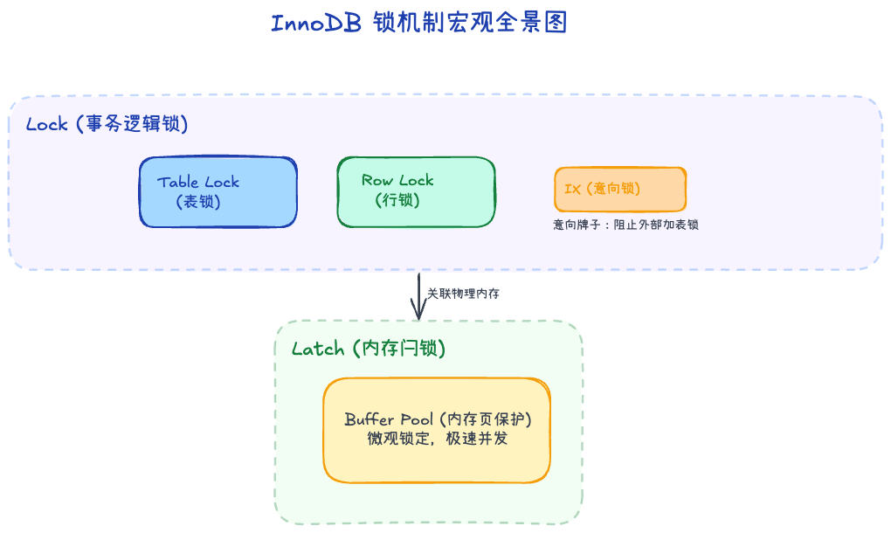
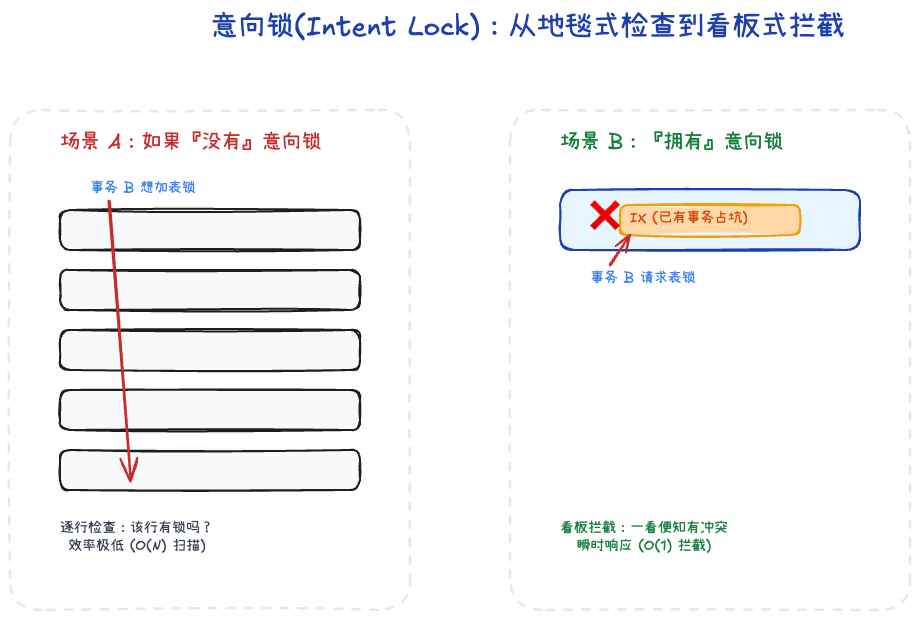
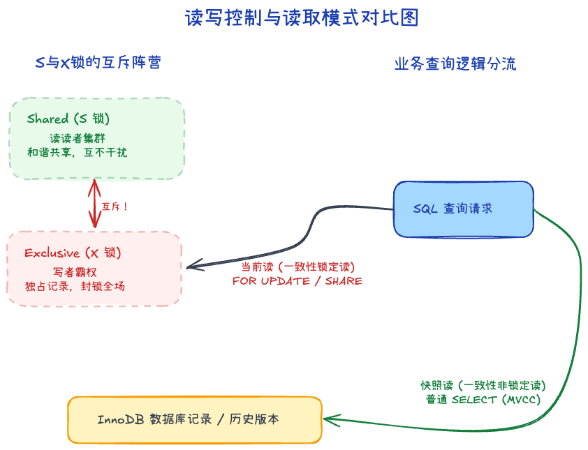

# 4.1 锁机制：类型与场景

在多并发环境下，如何优雅而不受干扰地操作数据？数据库引入了强大的锁机制。

## 一、 Lock 与 Latch 的本质区别

在讨论锁之前，我们需要区分 InnoDB 引擎内部的两个概念。这在底层源码和排查死锁状态时经常被提及。

1. **Latch (闩锁)**：
   - 它是更底层、更微观的锁。
   - **保护对象**：内存中的数据结构（如 Buffer Pool 中的页、LRU 链表）。
   - **目的**：确保多线程运行在操作系统层面时，内存空间的数据不被破坏。它没有死锁检测机制，处理极其迅速。
2. **Lock (事务锁)**：
   - 这是我们作为 DBA 或开发者需要重点关注的。
   - **保护对象**：数据库逻辑结构上的数据（表、行）。
   - **目的**：实现事务的**隔离性**。由于持有时间可能漫长（贯穿整个事务），它会参与死锁检测。

## 二、 锁的粒度与标记：表锁与行锁

InnoDB 出色的高并发表现，很大程度上归功于其精细的锁粒度。

1. **表级锁 (Table Lock)**：
   - 直接把整张表封印。通常发生在执行 DDL 操作或显式调用 `LOCK TABLES` 时。锁的管理成本极低，但并发度灾难级。
2. **行级锁 (Row Lock)**：
   - 分配到单条记录头上的锁。并发度最高。
   - **注意：行记录锁依然是有代价的**。事务需要为受波及的每一行维护一个锁对象信息。如果在没有良好索引支持的情况下执行大规模更新，甚至可能导致锁的数量过多发生“锁升级”或者内存耗尽。

**神秘的“意向锁” (Intent Lock)**：
意向锁其实是一种**表级锁**。它的作用非常巧妙：像是在门口挂个牌子。

假设事务 A 锁住了表里的某几行数据。这时事务 B 想直接封锁整张表（加表锁）。如果没有意向锁，事务 B 必须全表扫描每一行去确认“有没有人占坑”，效率极低。

有了意向锁，事务 A 在锁行之前，必须先在表级别挂个“意向锁”牌子。事务 B 看到这个牌子，就知道表里有人，直接排队阻塞即可。

## 三、 锁的两个模式：S与X

在具体的操作上，InnoDB 为行数据赋予了以下两种访问权限控制：

- **共享锁 (Shared Lock / S 锁)**：也就是常说的读锁。允许多个事务同时拿到，大家一起和谐地读。但只要挂着 S 锁，任何人都不能修改它。
- **排他锁 (Exclusive Lock / X 锁)**：也就是常说的写锁。非常霸道，一旦某事务获取，独占记录，其他事务既不能读也不能写，只能干等着。

### 一致性锁定读（当前读）
当你需要在查询的瞬间同时确保数据安全时，你需要主动出击加锁：
- `SELECT ... FOR SHARE`（老版本叫 `LOCK IN SHARE MODE`）：强制加 S 锁。我读完了别人也别想改，直到我放开。
- `SELECT ... FOR UPDATE`：强制加 X 锁。这条数据我看上了，谁也别动，读写全部给我滚开。

### 一致性非锁定读（快照读）
难道每一次读不到数据都要干等着吗？并非如此。依靠后续将在数据一致性章节中详细讲解的 **MVCC（多版本并发控制）技术**，普通的 `SELECT` 不会去硬抢锁，而是读取数据被锁之前的“历史快照版本”。这是 InnoDB 高并发的点睛之笔。

## 四、 总结：MySQL 锁体系的逻辑映射

MySQL 的锁体系可以抽象为 **对象、层级、模式、范围** 的四维叠加：

### 1. 锁的对象层级（物理 vs 逻辑）
- **Latch**：针对**内存数据结构**（如 Page）。
- **Lock**：针对**逻辑数据对象**（如 Table、Row）。

### 2. 锁的粒度与模式（在哪锁 vs 怎么锁）
这是锁冲突判定的核心二维坐标：

- **粒度 (Granularity)**：
    - **表级锁 (Table Lock)**：锁定全表（含用于协调的意向锁 IS/IX）。
    - **行级锁 (Row Lock)**：精准锁定特定记录，InnoDB 的高并发保障。
- **模式 (Mode)**：
    - **Shared (S)**：共享锁。读读并发，读写冲突。
    - **Exclusive (X)**：排他锁。独占记录，完全互斥。

### 3. 行锁的细分范围 (Scope)
在 InnoDB 中，行级锁本质是基于**索引**的。根据扫描范围，它存在三种形态：
- **Record Lock**：锁定索引记录本身（单点）。
- **Gap Lock**：锁定索引间隙（不含记录），专门用于防止幻读插入。
- **Next-Key Lock**：Record + Gap 的组合（封锁一段区间）。在 RR 隔离级别下，锁定涉及的索引记录及其间隙。

### 4. 逻辑映射与关联
- **意向锁机制**：实现了表锁与行锁的**纵向协议**。当事务想持有一个 **Row X** 锁时，必须先持有 **Table IX**。这使得大粒度操作（如 DDL）在表级即可判定是否冲突。

