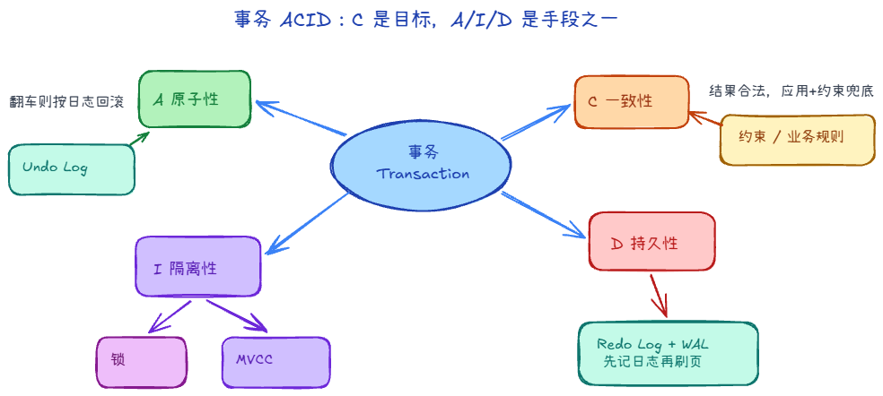

# 5.1 事务模型与 ACID 原理

当你向数据库下达多个相关的修改指令，并且期望它们像一个不可分割的整体一样运行时，你就需要依赖数据库中最伟大的魔法——**事务 (Transaction)**。

## 一、 ACID 四大金刚

如何评判一组操作配不配得上“事务”的称号？必须同时满足四个维度的考验，也就是经典的 ACID 特性：

1. **原子性 (Atomicity)**
   - **内涵**：“要么同生，要么共死”。事务中包含的一连串操作，要么全部执行成功落地生根；如果在某一步翻车了，哪怕前面的已经干完了，也必须完全倒退回最初啥也没干的样子。
   - **底层基石**：依靠 **Undo Log**（撤销日志），记录了怎么“把做错的事反着复原一遍”。
2. **一致性 (Consistency)**
   - **内涵**：“不能凭空出现违背逻辑的幽灵”。事务前后数据保持一致。它其实是另外三大特性努力的终极业务目标。
   - **底层基石**：主要由上层业务应用开发者设计逻辑保证，同时依靠数据库层的各种强约束（主键、外键唯一等）来兜底。
3. **隔离性 (Isolation)**
   - **内涵**：“不管外面打成什么样，我的世界是清净专注的”。在并发场景下，众多事务如同几条平行线跑在服务器上，它们之间绝对不能互相干扰。
   - **底层基石**：依靠前面重头介绍的 **锁机制 (Lock)** 配合后续即将拆解的 **MVCC (多版本并发控制)**。
4. **持久性 (Durability)**
   - **内涵**：一旦数据库跟你说“OK 这单接了（Commit）”，哪怕下一秒服务器主板被劈断，那些数据也必须永远封存在了硬盘深处。
   - **底层基石**：依靠 **Redo Log**（重做日志）通过 WAL 机制强行续作。

## 二、 四个必须搞懂的隔离级别

隔离性如果拉到绝对安全值（把所有人都扔进排队的独木桥排队依次慢慢跑），会导致数据库的吞吐性能极差。因此 SQL 标准制定了四种不同程度的“睁一只眼闭一只眼”缓冲带地带，称为隔离级别。InnoDB 针对它们做出了具体的设定支持：

1. **Read Uncommitted (读未提交)**
   完全的法外狂徒，连别人没上报的修改都能明目张胆地读取。虽然跑得飞快，但灾难性的**脏读**频发。
2. **Read Committed (读已提交 / RC)**
   比较正统的作风，每次都是去读当前那一刻切实生效了的。但由此导致你在这个事务内如果因为分神前后看了两次同个资源，它由于别人刚提交了，这玩意儿被别人凭空改变了（**不可重复读**）。大多数常规商业库如 Oracle 默认就是它。
3. **Repeatable Read (可重复读 / RR)**
   这是 **MySQL InnoDB 雷打不动的默认级别**。它拥有“执着”的心态，不管外头发生了什么，一进该事务世界，看到的数据始终宛如昨日重现（解决不可重复读），而且极高地防御了（依赖行锁防）**幻读**现象。
4. **Serializable (串行化)**
   这是最古板极端的封控。在有行级争夺时，读操作也强制给加上 S 共享锁，写操作加 X 排他锁，大家回到小黑屋排队。彻底告别幻影异常等并发疑难，但非常容易成为系统瘫痪（死锁）的重灾区。
