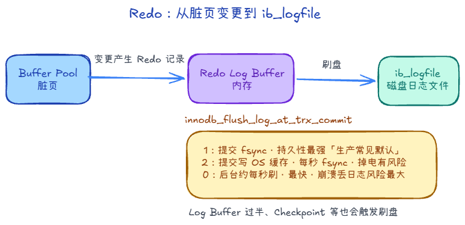

# 6.1 Redo Log 与崩溃恢复

**Redo Log（重做日志）** 是 InnoDB 为保证**持久化**设计的物理日志：内存里的脏页还没刷回数据文件时，若进程崩溃或断电，重启后仍可根据 Redo 把已提交事务的修改重做回来。

## 一、 基本形态

- **文件**：默认一组循环文件，如 `ib_logfile0`、`ib_logfile1`，写满后回到开头覆盖（配合 Checkpoint，见下）。
- **内容**：记的是**页上的物理修改**（表空间号、页号、偏移、新值等），恢复时按日志对页内字节重做即可，**不必再解析 SQL**。与 Binlog 的「语句/行变更」不是一类东西。
- **块大小**：日志按 **512 字节** 块组织，与常见磁盘扇区对齐，便于整块写入，减少「写一半」带来的校验问题。

### Write Pos 与 Checkpoint

在一组循环 Redo 文件里，可以粗想成两个位置在「追着跑」：

1. **Write Pos**：当前新日志写到哪里；有变更就往这里追加。
2. **Checkpoint**：该位置**之前**对应的脏页，已经刷回磁盘（数据文件里的页和日志对齐到安全点）。

Checkpoint 之前的日志所占空间可以视为已「完成使命」，可被后续循环覆盖。若 **Write Pos 追上 Checkpoint**（可写空间耗尽），InnoDB 需要先把脏页刷盘、推进 Checkpoint，期间可能阻塞新写入，负载高时这是需要关注的瓶颈之一。

## 二、 WAL：为什么先写日志

**WAL（Write-Ahead Logging）**：**先写 Redo，再异步刷数据页**。

- 改数据页往往是**随机写**，散落在表空间各处，磁盘寻道成本高。
- 写 Redo 是往日志文件**顺序追加**，I/O 模式更简单，吞吐通常更好。

所以「先记一笔顺序日志」比「每次改完立刻随机落盘」更适合高并发下的持久化路径；真正数据页由后台线程按策略刷盘。

## 三、 Redo Log Buffer 与刷盘

事务产生的 Redo 先进入内存里的 **Redo Log Buffer**，再按策略和触发条件刷到 **ib_logfile**。

**`innodb_flush_log_at_trx_commit`（提交时怎么刷）** 常见三档：

- **1**：每次提交把日志刷到磁盘（`fsync`），持久性最强；一般生产默认推荐。
- **2**：提交时写到 OS 缓存，每秒再 `fsync`；掉电可能丢最近一秒内已提交事务的 Redo（若机器也宕）。
- **0**：提交不写盘，由后台约每秒刷；提交最快，崩溃丢日志风险最大。

此外，**Log Buffer 用到一定比例**（如约一半）、**Checkpoint 推进**等也会促使 Redo 刷盘，不只在提交瞬间发生。

## 四、 LSN 是什么

**LSN（Log Sequence Number）** 可理解成 Redo 的递增序号，常见几处含义：

1. **日志推进**：表示已产生的 Redo 量 / 当前写到日志文件的进度。
2. **Checkpoint**：小于等于 **Checkpoint LSN** 对应的修改，其数据页被认为已落盘，这段 Redo **可被循环覆盖**；**崩溃恢复时通常从该 Checkpoint 位置往后扫**，不必从文件头重放，缩短恢复时间。
3. **数据页**：页头里有 **`FIL_PAGE_LSN`**（页最后一次被修改时的 LSN）。若 **页 LSN 小于日志里应对应的 LSN**，说明页落后于已记录的修改，恢复时要对该页 **Redo**。

## 五、 崩溃恢复（Crash Recovery）

重启后 InnoDB 根据 Redo 与页上的 LSN **对比、重放**，把已提交相关修改补回数据页（前提页本身物理结构完整；页若损坏，单靠 Redo 无法「拼好碎片页」，那是 Doublewrite / 备份域的问题）。

要点：**不靠脏页是否还在内存**，而靠 **日志里已持久化的修改**；恢复起点与 **Checkpoint**、**页 LSN** 对齐。
