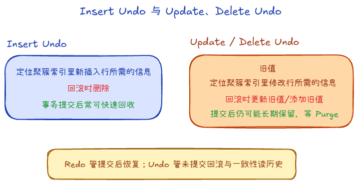
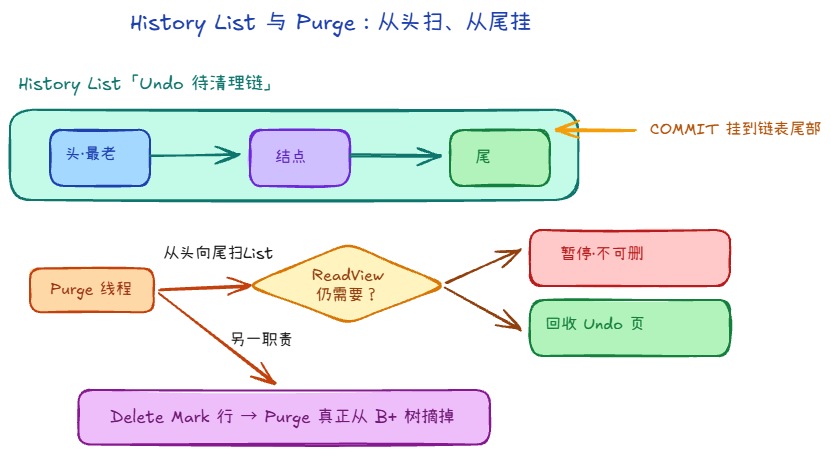

# 6.2 Undo Log 与 Purge 机制

**Redo** 面向「提交后也要能恢复」；**Undo** 面向「没提交要能回滚」以及 **MVCC 读旧版本**。事务原子性和一致性读都依赖 Undo。

## 一、 Undo 记什么

Undo 记的是**如何撤销本次修改**的**逻辑**信息：常见是**反向操作**（例如你 `INSERT` 一条，回滚对应 `DELETE`；`UPDATE`/`DELETE` 则记下改前镜像以便回滚或构造旧版本）。不是 Redo 那种「某页某偏移写什么字节」。同一行可能被多个事务并发访问，Undo 还要支撑别人顺着版本链读历史快照。

常见两类：

1. **Insert Undo（插入产生的 Undo）**
   - 插入的新行对其他事务往往还不可见，回滚时删掉即可。
   - **事务一旦提交**，这类 Undo 通常**可以尽快回收**：不再需要给别的事务当「历史版本」用。

2. **Update / Delete Undo（修改、删除产生的 Undo）**
   - 保存修改前的行内容（或删除前的形象），供 **MVCC** 构造旧版本。
   - **即使本事务已提交**，只要还有别的事务的快照可能用到这条旧版本，就**不能立刻删**。
   - 这些 Undo 会进入 **History List** 等结构，由 Purge 在确认无人需要后再清理。

数据结构：

- **一条记录里大致有什么**：公共头里有**类型**（插入 / 更新）、长度、事务与表等元信息。**Insert Undo** 体量小，主要能**定位刚插入的那一行**，回滚时删掉即可。**Update/Delete Undo** 要带 **改前的列数据（before image）** 等，才能回滚或拼出旧版本；因此更重、也更晚才能 Purge。

## 二、 Purge 在做什么

**Purge** 是后台线程，主要负责两件事：

1. **清理已标记删除的行**  
   InnoDB 的删除多是先打 **Delete Mark**，行仍占索引位置。Purge 在确认没有活跃事务再需要这些行的旧版本后，把行真正从 B+ 树里摘掉，空间可被复用。

2. **回收 Undo 空间**  
   依赖 **History List** 组织待清理的 Undo：事务 **COMMIT** 时，相关 Undo 常**挂到链表尾部**；**Purge 从链表头部（最老）往新扫**，确认某段 Undo **不再被任何 ReadView / 旧版本链需要** 就回收；若碰到**仍被引用**的，通常**先停在这一侧**，避免误删别人还要用的历史。

简记：**Insert Undo 提交后往往很快可丢；Update/Delete Undo 要等 MVCC 不再需要，由 Purge 慢慢收。**
