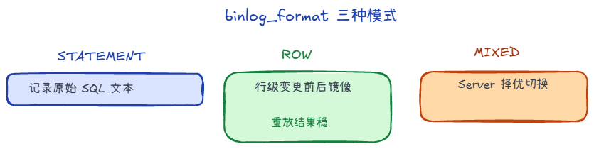
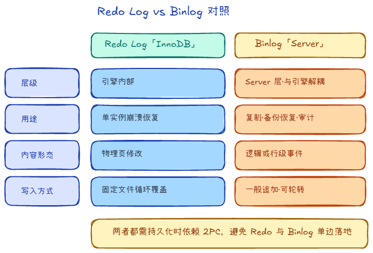

# 6.3 Binlog 

**Binlog（二进制日志）** 在 MySQL **Server 层**，不属于 InnoDB 独享；所有引擎只要走 Server 执行「会改数据」的语句，都可以产生 Binlog。它用于**主从复制**、**按时间点恢复（PITR）** 等，和 InnoDB 内部的 Redo 职责不同。

## 一、 记录格式（`binlog_format`）

1. **STATEMENT**  
   记录**原始 SQL**。省空间，但像 `NOW()`、`UUID()` 等在不同机器、不同时刻重放可能不一致，有「主从不一致」风险。

2. **ROW（常用）**  
   记录**行级变更**（变更前/后的行镜像，依事件类型而定）。重放结果更确定，代价是体积往往更大。

3. **MIXED**  
   由 Server 酌情选 STATEMENT 或 ROW：能安全用语句级就省空间，有风险则退回 ROW。

生产上 **ROW** 最常见；具体以业务与版本文档为准。

## 二、 Redo Log 与 Binlog 对比

| 维度 | Redo Log | Binlog |
| --- | --- | --- |
| 层级 | **InnoDB 存储引擎**内部 | **Server 层**，与引擎解耦 |
| 主要用途 | **崩溃恢复**（单实例内页恢复） | **复制、备份恢复、审计** |
| 内容倾向 | **物理**：哪个页、怎样改 | **逻辑/行级**：改了哪些行、何种事件 |
| 写入方式 | 固定大小文件 **循环覆盖** | 一般 **追加**，可轮转文件、可送从库 |
| 与提交的先后关系 | WAL 路径里持续写；和 **两阶段提交** 一起保证与 Binlog 一致（见 6.4） | 在 **2PC** 流程里与 Redo 对齐后再视为对外可见 |

Redo 解决「本机掉电页是否一致」；Binlog 解决「能不能在别机重放同一份变更」。两者都要持久化时，依赖 **2PC** 避免出现「Redo 认为已提交、Binlog 没落盘」或反过来的分裂状态。

## 三、 Redo、Undo、Binlog 各管什么（对照）

| 日志 | 层级 | 主要用途 |
| --- | --- | --- |
| **Undo Log** | InnoDB | **回滚**未提交事务；**MVCC** 读历史版本 |
| **Redo Log** | InnoDB | **崩溃恢复**：已提交修改在页未刷盘时仍能重做 |
| **Binlog** | Server | **主从复制**、按时间点恢复、审计等 |

