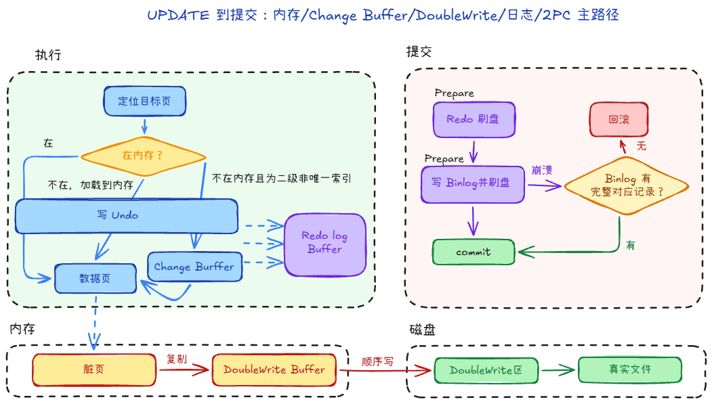

# 6.4 核心串联：一条更新语句的完整流程

前面几篇把 Redo、Undo、Binlog 分开讲了。这里用一条 **UPDATE** 把主路径串起来，方便对照「内存、日志、提交、刷盘」各自发生在哪一步。

## 一、 执行阶段：Undo、Redo、Change Buffer 如何配合

1. **定位目标页（或走 Change Buffer）**  
   在 **Buffer Pool** 里找目标页。若目标是**二级非唯一索引**且页不在内存，可先不读该页，改写 **Change Buffer** 记录，后续再 merge 到真实索引页。

2. **先组织 Undo，再应用行修改**  
   先生成本次修改所需的 **Undo** 信息（回滚与 MVCC 读旧版本要用），再在内存中改行数据。  
   改完后数据页（以及可能的 Undo 页）都可能成为**脏页**。

3. **Redo 伴随页修改持续产生**  
   无论是写 Undo 页、改数据页，还是写 Change Buffer 相关页，都会把对应物理变更先写入 **Redo Log Buffer**。  
   提交或触发刷盘时再按策略写入 **Redo 日志文件**。此时数据文件里的页仍可能是旧值，这是 WAL 的正常状态。

若在这里直接认为「事务成功」而不协调 Binlog，崩溃后可能出现 **InnoDB 与 Binlog 对同一事务认定不一致**，主从也会乱。因此提交要走下面的 **两阶段提交（2PC）**。

## 二、 提交：Redo 与 Binlog 的两阶段提交（2PC）

目标：**Redo 与 Binlog 对「这个事务是否提交」达成一致**，且崩溃恢复时能据此裁决。

1. **Prepare（引擎）**  
   InnoDB 将本事务的 Redo 刷到磁盘（达到持久化要求），事务在引擎侧标记为 **prepare**，尚未结束。

2. **写 Binlog（Server）**  
   Server 把本次事务对应的 Binlog 事件写入 **Binlog 文件**并刷盘（策略受 `sync_binlog` 等影响）。

3. **Commit（引擎）**  
   Binlog 写成功后，引擎把该事务从 prepare 改为 **commit**，提交完成。

## 三、 崩溃恢复时怎么判

重启后若发现某事务在 Redo 里是 **prepare**：

- 若 **Binlog 里已有完整对应记录**：说明已走到「可对外宣告」的一侧，引擎会把该事务**提交**。
- 若 **Binlog 里没有**：说明可能在写 Binlog 前崩溃，引擎**回滚**该事务。

这样不会出现「从库以为提交了、主库 InnoDB 却丢了」这类单边落地。

## 四、 性能上常见的两个点

1. **组提交（Group Commit）**  
   多个事务的 prepare / 写 Binlog / commit 在时间上靠近时，可以**合并刷盘**，减少 `fsync` 次数，提高吞吐。

2. **脏页落盘与 Doublewrite**  
   Redo / Binlog 保证的是**持久化与复制语义**；数据页最终仍由 **Page Cleaner** 等线程异步刷回 **表空间**。
   刷脏时常见路径是：脏页先写入内存中的 **Doublewrite Buffer** → 顺序写到共享表空间里的 **Doublewrite 区** 并 `fsync` → 再写到数据文件的真实位置（离散写）。这样即使写数据页中途掉电，还有机会从 Doublewrite 里拷回完整页，降低「半页写」导致页损坏、Redo 无法应用的风险。

> 对照记忆：**Change Buffer** 解决的是「页不在内存时，二级索引变更先缓写、后 merge」；**Doublewrite** 解决的是「脏页真正落盘时，避免半页写损坏」。

