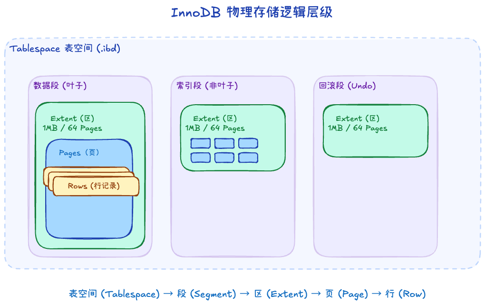
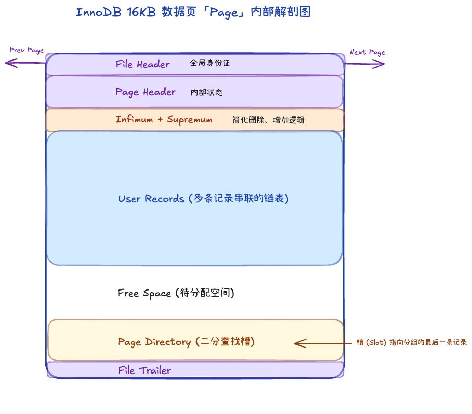

# 2.1 物理文件结构与存储逻辑

在 InnoDB 中，所有的数据都被牢牢地封装在特定的物理与逻辑结构之下。理解数据的摆放方式，是理解数据库性能好坏的前提。

## 一、 IOT (索引组织表) 概念

InnoDB 中的表，被称为**索引组织表 (Index Organized Table, IOT)**。
这意味着表中的**所有数据都是根据“主键”的顺序来物理存放的**。整个表本身就是一棵巨大的 B+ 树，这棵树就是主键索引树（聚簇索引）。

怎么确定主键？InnoDB 有严密的规则：
1. 首先，看表有没有明确定义的主键。
2. 如果没有，寻找第一个非空且唯一的索引作为主键。
3. 如果连这个都没有，InnoDB 会尽职地为你自动生成一个 6 字节大小的隐藏主键（`DB_ROW_ID`）。

无论如何，表里的数据必须依附在一棵“主键树”上。

## 二、 逻辑存储结构

InnoDB 把在磁盘上的空间从大到小进行了极其严密的逻辑划分：

**表空间 (Tablespace) → 段 (Segment) → 区 (Extent) → 页 (Page) → 行 (Row)**

1. **表空间 (Tablespace)**：最高的逻辑层级，通常对应磁盘上的 `.ibd` 物理文件。它是数据的“大仓库”。
2. **段 (Segment)**：这是一个逻辑上的分类概念，不要求物理连续。常见的段有：
   - **数据段 (Leaf node segment)**：专门存放 B+ 树的叶子节点（真正的数据行）。
   - **索引段 (Non-leaf node segment)**：专门存放 B+ 树的非叶子节点（目录）。
   - **回滚段 (Rollback segment)**：专门存放用于事务回滚的 undo 数据。
3. **区 (Extent)**：由**连续的页**组成的一段物理空间。
   - **规格**：在默认页大小为 16KB 的情况下，**1 个区 = 64 个连续的页 = 1MB**。
   - **核心意义**：为什么不能直接分配“页”？因为如果每次表变大，InnoDB 就去磁盘上到处申请一个个零散的页，磁头就会在磁盘上疯狂跳跃（随机 I/O）。有了“区”，InnoDB 一次性申请连续的 1MB 或者几个 1MB，保证了数据在物理磁盘层面的高度集中，极大优化了**顺序 I/O 性能**。
4. **页 (Page)**：InnoDB **磁盘管理和内存交换的最小单位**，默认 16KB。一切读写操作，最终都是以“页”为单位装进内存的。
5. **行 (Row)**：最小的颗粒度，里面存放着一条条真实的业务数据。

## 三、 数据页 (Page) 的内部微观结构

当我们把视线聚焦到一张 16KB 的数据页上，会发现它内部其实是一个微缩的操作系统。一页被划分成了 7 个部分：

1. **File Header (文件头)**：占用固定 38 字节。记录着页的“全局身份证”：该页属于哪个 Space ID（表空间ID），该页在表空间（.ibd文件）中的页号，以及它的前一页和后一页的位置指针（把各个兄弟页串成双向链表）。
2. **Page Header (页头)**：占用固定 56 字节。记录当前这个页的内部状态（比如有多少行记录，最后插入位置等）。
3. **Infimum + Supremum (虚拟行界限)**：不管这页空不空，页里始终躺着两行“假数据”。一个是 Infimum (最小值)，一个是 Supremum (最大值)。
   - 起点：Infimum 的 next_record 指针永远指向这一页里主键值最小的那行真数据。
   - 终点：这一页里主键值最大的那行数据，它的 next_record 指针永远指向 Supremum。
   - 回路：而 Supremum 的指针指向 0（空），宣告本页结束。
4. **User Records (真正的数据行)**：用来存放上层插入的一条条真实数据（下一节详述其格式）。它们按照主键顺序形成一个单向链表结构。
    - **物理乱序**：新记录直接插入 `Free Space` 的空闲位置，物理存放顺序与主键大小无关。
    - **逻辑有序**：依靠记录头部的 `next_record` 指针，将数据行串联成按主键从小到大排列的单向链表。这避免了因插入新数据而导致昂贵的物理记录搬迁动作。
5. **Free Space (空闲空间)**：页里面还没被用到的空间，新插入一行数据就会从里面抠一块出来。一旦耗尽，这一页就爆满，准备发生下一层的“页分裂”。
6. **Page Directory (页目录)**：**页内搜索的“高速公路”**。
    - **逻辑**：既然链表已经逻辑有序，InnoDB 每隔约 4~8 条记录就划为一个“组 (Group)”，并提取每组主键最大的那行记录的偏移量，存入底部的**槽 (Slot)** 中。这些槽连在一起就构成了一个稀疏索引。
    - **二分直达**：搜索某主键时，先在这些槽中用**二分查找法**瞬间定位到目标大概所在的“小组”。
    - **链表精扫**：定位到具体小组后，再跳回链表顺着指针走几步（最多 8 步）即可精准锁定目标。
    - **意义**：这让单页内数百条记录的查找复杂度，从低效的 $O(n)$ 全页扫描降到了高效的 $O(\log n)$。
7. **File Trailer (文件尾巴)**：占用固定 8 字节。它的唯一作用是，当你读页数据时进行校验，看看这 16KB 是不是曾经在写到一半时突然断电损坏了。
