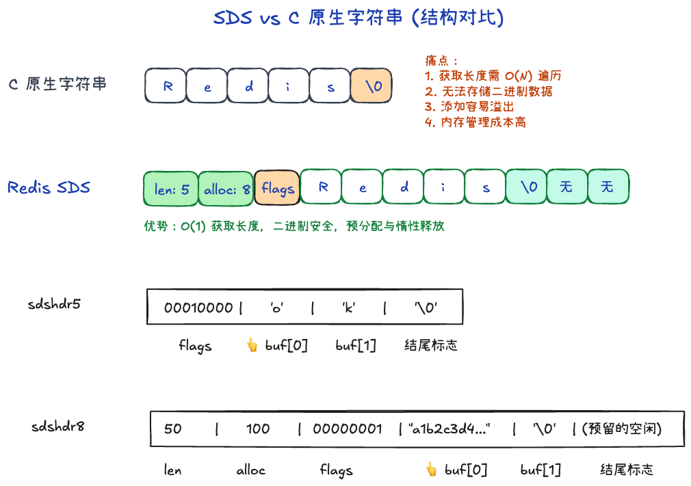

# SDS

C 语言原生的字符串很笨：

1. 它不知道自己有多长，每次想知道长度都要从头数到尾
2. 不安全，如果你想往后面加点字，一不小心就会缓冲区溢出
3. 性能差，每次改字符串都要**手动申请/释放内存**
4. 无法存二进制数据，`\0` 直接截断

所以Redis导入了SDS

## SDS 核心结构



SDS 本质是对 C 语言数组的一层“智能外壳”封装。尽管 Redis 3.2 之后为了极致省内存将底层头部结构分为了五种（`sdshdr5/8/16/32/64`），但它的核心逻辑均包含以下 4 个部分：

```text
+--------+----------+-------+-------------------------+
|  len   |  alloc   | flags |   buf[] (实际的字节数组)  |
+--------+----------+-------+-------------------------+
```

1. **`len` (当前长度)**：记录字符实际占用的数量。极大降低了获取长度的成本（O(1)），也是它实现**二进制安全**的根本所在（不以 `\0` 判断结束，而是完全根据 `len` 截取读取）。
2. **`alloc` (分配容量)**：记录整体分配的内存大小。通过计算 `alloc - len` 就可以知道剩余可用空间。这完美支撑了空间预分配和惰性空间释放，杜绝了原生 C 的**缓冲区溢出**和**反复发生系统调用的性能差**问题。
3. **`flags` (头部类型标志)**：始终占据 1 个字节，其低 3 位记录了当前使用的是哪一个档位的 Header 结构（详见下方）。
4. **`buf[]` (真正的数据)**：存放实际被存进来的字符内容。有意思的是，无论你存了多长的文本，Redis 依然会强制帮你在末尾加一个隐含的 `\0` —— 这是为了能轻松通过这层壳去**兼容**大量 C 语言原生的原生库函数，不用重复造轮子。

## 为什么需要 flags？(极致省内存的“快递箱”逻辑)

**原版的痛点**：在 Redis 3.2 的老版本以前，并没有 `flags`，当时 `len` 和 `alloc` 雷打不动地各占 4 字节。这意味着哪怕用户只存一个极短的 `"ok"`（2 字节），也得白搭进去 8 字节的元数据空间。**这就像拿一个装电视的大号纸箱去快递一颗弹珠**，十分浪费。

**3.2 的改革（多种档位的包装箱）**：
于是 Redis 大笔一挥，订制了 5 种不同口径的头部规格（即 `sdshdr5` 到 `sdshdr64`）：
- **极其短的字符串（小于 32 字节）**：名叫 `sdshdr5`。由于极短，它甚至连 `len` 和 `alloc` 这两个字段都省了！直接把长度压缩到了 `flags` 这个单字节的高 5 位里面，极其凶残。
- **比较短的字符串（255 字节以内）**：名叫 `sdshdr8`。只需分别用 **1 个字节** 存 `len` 和 `alloc` 就足够了。
- **中等偏长（6.5 万字节以内）**：名叫 `sdshdr16`。分别用 **2 个字节** 存 `len` 和 `alloc`。
- **长字符串（42 亿字节以内）**：名叫 `sdshdr32`。此时才用回 **4 个字节** 存储。
- **超长的大数据载体**：名叫 `sdshdr64`。使用 **8 个字节** 存储容量。
这样大刀阔斧一砍，极短字符串的占位开销从原先恐怖的 8 字节瞬间缩水到了 1 到 2 个字节，省出了海量内存。

**flags 在这里扮演了什么角色？**
既然前面的“纸箱”前缀大小变来变去（有时 1 字节，有时 2 字节），后续 Redis 拿到这一串字符串想要回头读取长度时，如果完全两眼一抹黑，它到底该往前推导几个字节呢？
这个时候 `flags` 便成了最亮眼的点。
它就像**一张雷打不动永远夹在数据（buf）正前方的小纸条**（固定 1 字节）：
1. Redis 访问一个已存的 SDS 时，指针最先接触的是实际存储的字符数据（`buf`）。
2. 指针不慌不忙踩个**倒车，仅需往回倒一格（-1 个字节）**，就百分之百找到了这段“防伪标签” `flags`。
3. 读出 `flags` 后，根据其低 3 位的暗号，Redis 瞬间就明白了前面的结构：
   - **如果低 3 位是 0（代表 `sdshdr5`）**：
    4. 把这个字节向右移 3 位（丢掉低 3 位），得到 00010，
        换算得出：原来后面的字符串长度是 2
    5. alloc 呢？sdshdr5 没有容量的概念，它不支持动态修改。
        只要改动，大概率就会抛弃掉这个 sdshdr5 的微缩包，
        就地重新分配成 sdshdr8。

   - **如果低 3 位是 1（代表 `sdshdr8`）**：
    4. 倒退1格，是alloc
    5. 再倒退1格，是len

正因为夹在正中间的 `flags` 承担了“记号员”的责任，这套长短百变的省钱体系才能畅通无阻地被快速解析。

## SDS优点
SDS聪明在：

1. 常数时间获取长度
2. SDS 依赖 `len` 字段而非 `\0` 判断字符串结束，拼接避免内存泄漏，同时二进制安全
3. 惰性空间释放：字符串缩短时不会立即回收内存，可供后续使用
4. 兼容 C 字符串函数

## 扩容
若新长度 < 1MB，加倍扩容；否则每次多分配 1MB（避免过度浪费）