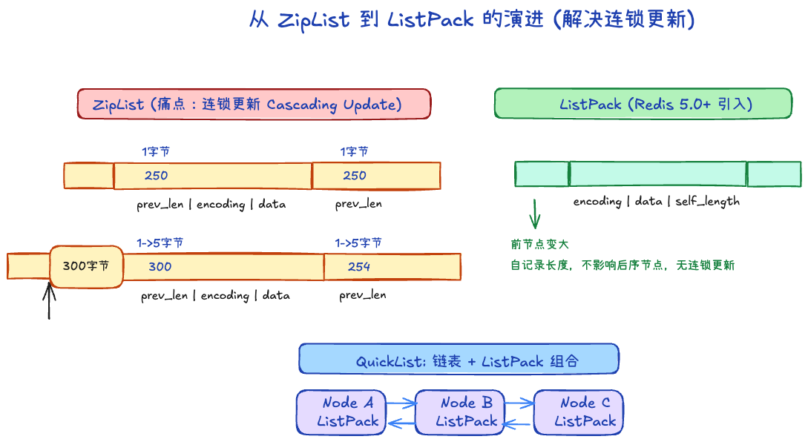

# 连续内存列表：ZipList、ListPack 与 QuickList

Redis 对待内存就像对金钱一样抠门，这三种结构的演进史，就是一部“如何榨干内存最后一滴价值”的血泪史。



## 1. 为什么不用传统双向链表？

假如你要存一个很小的列表 `[10, 20, 30]`。
如果在标准 C 语言里搞一个双向链表，每一个节点除了存数据本身以外，还必须额外存**两个指针**（一个指向上一个节点 `prev`，一个指向下一个节点 `next`）。在 64 位系统下，两个指针加起来就要吃掉 **16 字节**！
你存个数字 `10` 只需要 2 字节，为了管这 2 字节搭进去 16 字节的附加开销，这简直是“买椟还珠”。
此外，传统链表的内存是零散分布在各个角落的（不连续），这会导致 **CPU 缓存命中率极差**。

---

## 2. ZipList (压缩列表)：极致但危险的设计

为了解决上述问题，Redis 痛下杀手：**全砍掉！把所有本该是指针的东西全扔了，硬生生把所有节点挤进一块连续的内存数组里！就像挤地铁一样，人贴着人。**

厉害在极致省内存、连续排布结构，极大地增加了 CPU 缓存命中率。

### ZipList 的宏观结构
一整张 ZipList 大概长这样：
```text
+---------+--------+-------+--------+--------+--------+--------+
| zlbytes | zltail | zllen | entry1 | entry2 | entryN | zlend  |
+---------+--------+-------+--------+--------+--------+--------+
```
- `zlbytes`：记录整个列表占了多大内存（O(1) 拿字节总长）。
- `zltail`：记录最后一个节点（尾巴）偏移量，**用来配合倒序遍历**。
- `zllen`：里面有多少个节点（entry）。
- `zlend`：恒定为 `255` 的特例结尾符。

### 微观结构：剥开单个 Entry
因为大家紧靠在一起，没有了指针，如何实现“倒车”（从右往左遍历）？
Redis 给每个 `entry` 设计了极度精妙的·内部包裹结构：
```text
+-----------------------+----------+---------+
| previous_entry_length | encoding | content |
+-----------------------+----------+---------+
```
- **`previous_entry_length`**：记录前一个节点的字节长度。倒车时，只要往左挪这个长度的距离，就能精准踩到前一个节点的头上。
- **`encoding`**：当前节点存的什么类型（数字还是字符串？）以及自己的长度。
- **`content`**：自己真正的数据。

### 致命缺陷：连锁更新 (Cascading Update)

为了把省钱做到走火入魔，Redis 对 `previous_entry_length` 设计了两个档位的体积分配：
- **1 字节**：如果前任长度 < 254 字节。
- **5 字节**：如果前任长度 >= 254 字节。

**灾难场景：**
假设现在连续挤着一百个 Entry，且大家的前一人的数据长度刚好都是 **250 字节（< 254）**。此时大家的 `previous_entry_length` 都只用 **1 字节** 存储，完美省钱状态。
突然，有人在最前面插队，塞入了一个 **300 字节（>= 254）** 的庞然大物。
1. 第 2 个节点一看前任变成 300 字节了，自己原先 1 字节的小口袋装不下这个数字记录了，被迫从 1 字节**物理扩容**到 5 字节。
2. 因为自己的账本变厚了，第 2 个节点自己的总体积瞬间从原本安全的 250 变成了 **254 字节**！
3. 糟糕！第 3 个节点猛一回头，发现前任踩到了 254 字节红线，自己也必须跟着强制扩容成 5 字节。
4. 紧接着，第四个因为第三个的膨胀被挤破，第五个因为第四个膨胀跟着爆开……

原本只是在排头插了个队，结果像多米诺骨牌一样导致后面所有数据全部需要发生**内存重新分配和拷贝**！时间复杂度直接飙升到 $O(N^2)$，引起 CPU 拥塞飙升。

这就是著名的 **连锁更新**。因为太不可控，ZipList 后来被 Redis 官方彻底嫌弃，逐渐退出历史舞台。

---

## 3. ListPack：ZipList 的完美替代品

到了 Redis 5.0 之后，引入了 `ListPack` 去彻底接班并解决连锁更新这个大毒瘤。

**怎么解决的？**
极其聪明的倒转思维：**不再记录别人（前一个人）的长度，改为老老实实记录“我自己的长度”。**

在 ListPack 中，内部节点的结构变异成了这样：
```text
+----------+---------+-------------+
| encoding | content | self_length |
+----------+---------+-------------+
```
既然倒序遍历需要往回找长度，ListPack 干脆就把自己的长度 `self_length` 像尾巴一样拖在自己的最后面。

想往回跳？没问题，你顺着指针往回看一个字节，那就是前一个节点的“尾巴”，它清楚地写着前任的总长，你照着数字一跳就跨过去了。
这样一来，无论哪个节点因为修改而变胖，**它的长度变化只会记在它自己本人的尾巴上**，绝对不会引起后一个节点的数据变动。一次修改只会触发一次局部的内存拷贝，绝对不可能再引发多米诺骨牌式的全员扩容！

---

## 4. QuickList：大一统的终极形态

单块连续内存再怎么猛，一旦遇到极端高发场景，数据量大到变成几十兆、上百兆的列表时，向操作系统一次性申请这么大的连续大内存块不仅极为困难，万一你要在中间插入数据，单次内存挪动大挪移的成本也是史诗级的灾难。

为了兼顾“零碎节点省内存”和“支持超大数据总量”，Redis 灵机一动找了缝合方案：**QuickList（快速列表）**。

通俗来说就是：我把长长的列表切成一段一段的。
- **每一段是一节“高铁车厢”，也就是一个独立的连续内存块（底层用旧版的 ZipList 或新版的 ListPack 填充）。**
- **而车厢与车厢之间，用传统的双向链表挂钩连起来！**

这样既享受了车厢内部（ListPack/ZipList）连续高效率和极致数据的无排骨化压缩，又避开了一整张漫无边际超级巨表的整体拷贝压力。这套巧妙的折中复合体系，最终成为了支撑整个 Redis 的终极通用底层。