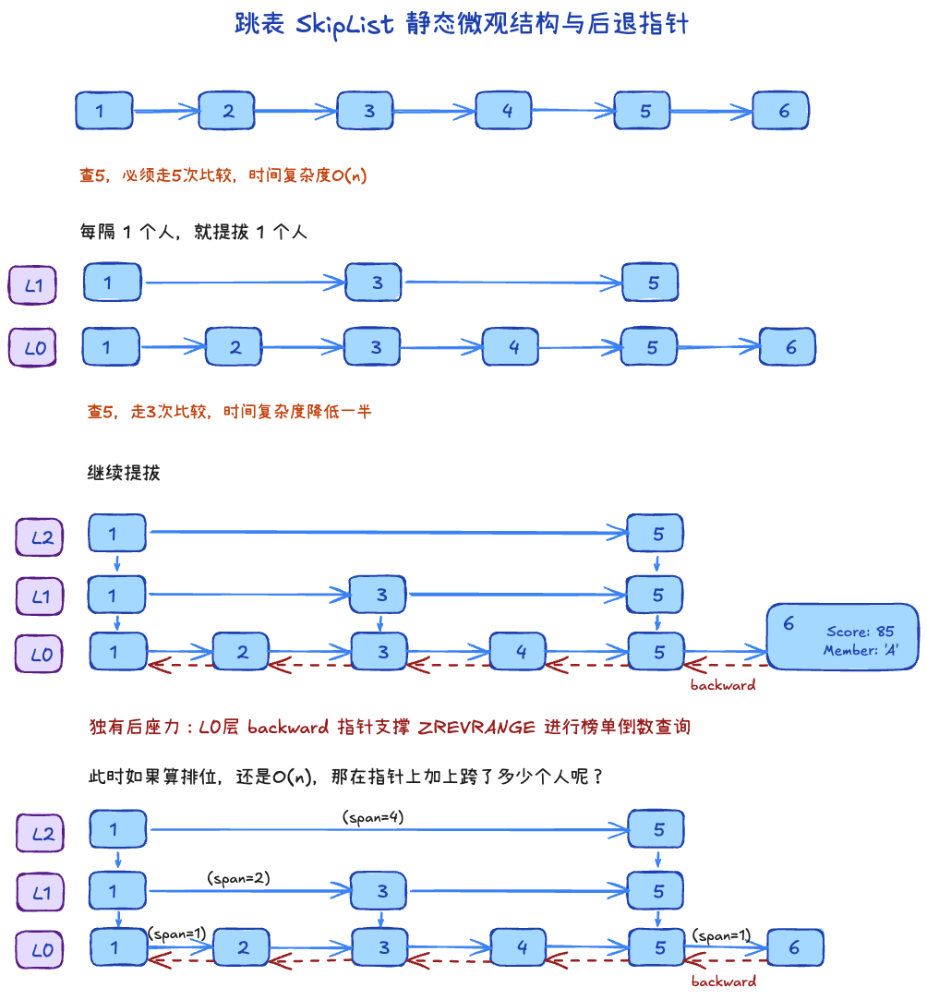
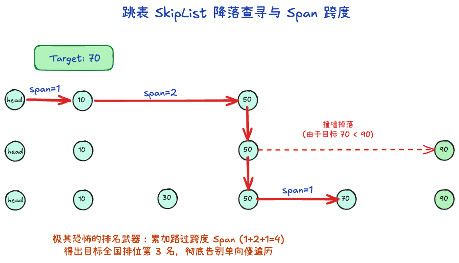
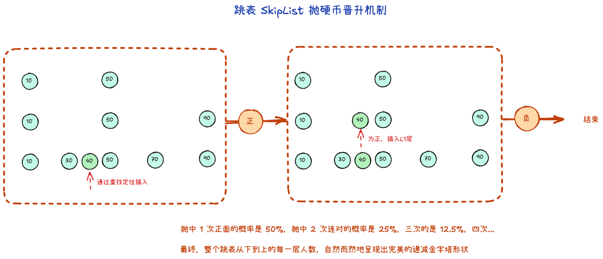
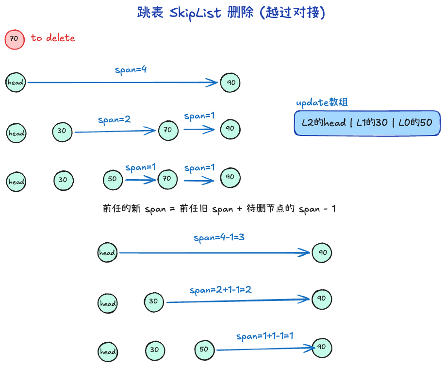
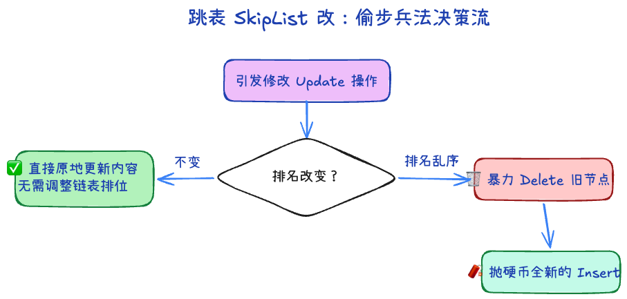

# 跳表 (SkipList)：ZSet 的灵魂骨架

在 Redis 中，为了支持排行榜等有序集合 (`ZSet`)，需要一种既能快速查找，又能快速做范围浏览的数据结构。

提到高效查找，很多人脑海中第一时间浮现的是**红黑树**或 **B+树**。
- **不用 B+ 树**：B+ 树是为了降低磁盘 I/O 深度应运而生的又矮又胖的结构，而 Redis 是纯内存操作，没有磁盘读取瓶颈，不需要这层设计。
- **不用红黑树**：红黑树实现过度复杂，每次插入/删除容易引发大面积的左旋、右旋来维持树平衡；且它的中序遍历来做范围查询不够直观。

于是 Redis 选择了一种基于**“空间换时间”**的极简天才设计：**带多层索引的链表 —— 跳表 (SkipList)**。

---

## 一、跳表核心组件大起底



Redis 的跳表节点并非简单的单向链表，每个节点主要包含 4 个核心要素：
1. **双重排序**：每个节点同时存着 `Score` (积分) 和 `Member` (具体值)。比较时，**先看分数；如果分数一模一样，再按 `Member` 的字典顺序比对**。
2. **多级前向指针 (`forward[]`)**：这是一个数组。数组的每一项代表该节点能进入的楼层。比如它长到了第 3 层，就会有指向 L1、L2、L3 下一个节点的三根指针。
3. **后退指针 (`backward`)**：这个指针只有**最底层（L0 层）**才有。它指向正前方的紧贴兄弟节点。目的在于支持极其流畅的**从右往左的逆向遍历**（比如搞排行榜查倒数前十 `ZREVRANGE`）。
4. **跨度 (`span`)**：高频考点！它是标记每一根 `forward` 指针“一步跨越了底层多少个人头”。主要用于瞬间算出**排位（Rank）**。

```c
typedef struct zskiplistNode {
    sds ele;                           // ① 这个就是 Member (比如 "王二狗")
    double score;                      // ② 这就是具体的分数 Score
    struct zskiplistNode *backward;    // ③ 专属于最底层的往回退的指针 (用于倒车查榜)

    // 🔥极其核心的地方：层数数组🔥
    struct zskiplistLevel {            
        struct zskiplistNode *forward; // ➡️ 前进指针：指向前方那个人的具体内存地址
        unsigned long span;            // 📏 跨度：单纯的一个数字，完全和上面的指针捆绑在一起！
    } level[];                         
    
} zskiplistNode;
```

### 为什么指针要有跨度 (span)？

跳表的本质是加速查找数据，跨度并不是为了查找目标（比对分数就行了）设计的，它**仅仅是为了一种查询服务：排行 (Rank)**。

比如业务场景要求：**“查出《英雄联盟》积分 2548 分的玩家现在排全国第几名？”（即 `ZRANK` 指令）**

如果是普通索引，你找到了那个人，但你没法知道前面到底站了多少个人，你只能从头退回去一个一个数。
**有了 `span` 之后怎么破局的？**
每次从高层往右飞越时，指针身上的 `span` 早就记录了“这一飞越过了底下 10 个人”。Redis 在往下掉的寻步过程中，只需要把走过的指针身上的 `span` **累加在一起**的，加起来！
等找到那个玩家时，累加的总和刚好也就是他前排的人头数。一个 $O(1)$ 的简单加法，使得算全国排名的时间被提速到了恐怖的 $O(\log n)$！

---

## 二、四大金刚操作：增、删、改、查

为了保证高效，跳表的增删改查无一不透露出它的极简哲学。

### 1. 查 (Search)：高空跳伞的寻址游戏



跳表之所以叫跳表，就是因为它能“跳”。假设你要找分数为 70 的玩家：
1. 它从最顶层的“快车道”（最高索引）头节点出发，看向右边。
2. **继续开**：如果右边节点分数 `< 70`，就顺着快车道大胆往右走。
3. **往下掉**：如果右边节点分数 `>= 70`（或者开到头了无路可走），说明走过了，这时候原地**往下掉一层**，进入相对慢一点的车道。
4. 如此反复向右、向下沉降，最终一定会降落到底层的单向链表里，精准锁定目标。
> 时间复杂度：因为每次掉层相当于砍掉一大部分无用节点，查询效率等同于二分查找的 $O(\log n)$

### 2. 增 (Insert)：原地抛硬币决定层高



红黑树为了插个体面人，要疯狂变色旋转。跳表偏不，它纯靠“听天由命”。
1. **搜索定位**：先按照上面“查”的逻辑，摸到底层，找到新节点应该插入的老实位置。
2. **晋升抛硬币**：把新节点插在 L0 层后，系统开始帮节点**抛硬币**：
   - 正面：拔高一层，建一个 L1 的索引指针。
   - 再抛还是正面：再拔高一层，建 L2 索引指针。
   - 反面：游戏结束，层高就此定格。
   > 这种随机化确保了宏观概率上，越高的楼层节点数越少（大概是前一层的一半或四分之一），巧妙地利用随机概率维持了整体查询平衡，彻底抛弃了繁重的树型再平衡。
3. **更新指针与跨度**：将沿途被打断的老指针接向新节点，并**重新计算更新路过的跨度（span）数字**。

### 3. 删 (Delete)：过河拆桥与神奇的跨度计算



删除主要分三步：
1. **寻找全楼层“前任”**：用“查”的逻辑往下掉落时，系统会顺手用一个update数组记住所有掉落处、以及最后撞到该节点的前端节点（即它的所有前任）。
2. **处理拆除与算数（核心）**：
   - **对于正面连着它的前任**：前任的指针放开目标，越过去直接连到下家。此时这根新拼接的线跨度怎么算？毫无开销的加减法：`新跨度 = 前任跨度 + 目标跨度 - 1`。
   - **对于在高空“飞过”它的远端前任**：由于目标也就是底下某个人死掉了，这根高空线不用改连向，但罩着的人平白少了一个，所以它的跨度只需简单暴躁地：`span - 1`。
3. **擦屁股收尾**：接好底层的后退（backward）指针，并最终释放它的内存。如果这家伙恰好是目前全国长得最高的，一旦删除，系统会顺手把整个跳表的标定层高也拉低。

### 4. 改 (Update) 的偷懒兵法



在 Redis 有序集合中，“改”的本质其实是去**更新某个已有 Member 的 Score 分数**
当你去覆盖更新一个人的积分时：
- **情况 A（分数虽然变了，但没破坏前后排名）**：比如原本是 10 分，现在更新为 12 分，而它左边的人是 5 分，右边是 20 分。就算改成 12，它按理说还是乖乖呆在这个坑位里！这时极其节俭：**直接原地把双精度浮点数 score 修改掉**，整个跳表的指针网络连一根毛都不用动！
- **情况 B（分数发生了剧烈变动，引发了名次变更）**：此时旧坑位彻底作废！Redis 绝不搞复杂的链表节点沿途平移挪动，它是怎么做的？
  **直接对它先触发一遍纯粹的 `Delete`，然后拿着全新的分数，去入口处排队，执行一遍全新的抛硬币 `Insert`！**
  这种“先删后重建”的组合拳，用最傻瓜式的已有逻辑，避开了极其深度的指针移位计算，完美化解了乱序死局。

> **那可以去修改 Member 吗？**
> **不行！在底层根本就不存在“修改 Member”的通道。** 主要有两层极其森严的物理约束：
> 1. **字典顺序防线**：即便强行改了内容，如果遇到同分的情况，打破了原有的字典首字母排序，跳表的网状结构立刻陷入死局。
> 2. **哈希底层崩溃**：最核心的原因是，ZSet 底层可是捆绑了 `Dict`(字典哈希表) 的！如果你修改了字符串内容，哈希散列值必然大变，原来对应的哈希槽（桶）直接就找不到魂了。所以：**你要是真想换人，只能乖乖在业务代码里走两步：先 `ZREM 旧人`，再去 `ZADD 新人`。**

