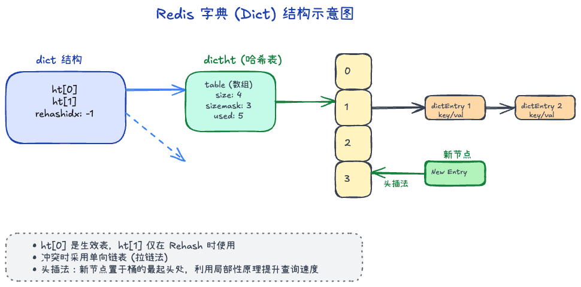
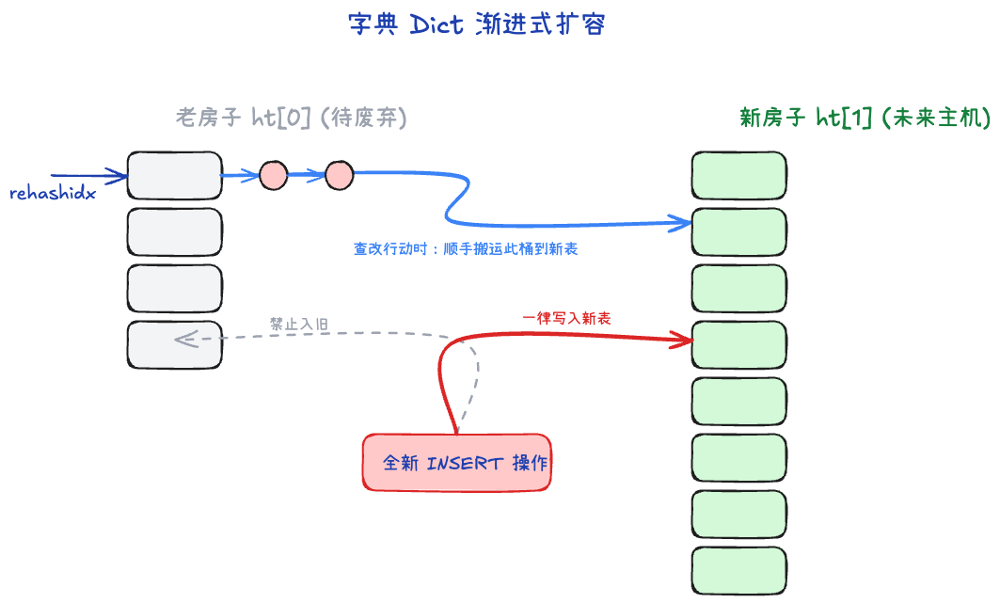

# 字典 (Dict)：Redis 的基石与渐进式扩容奇迹

当我们谈论 Redis 时，我们管它叫 “Key-Value 数据库”。在这个庞大的系统里，全局所有的 Key 和 Value 就是被存储在一个被称为 **Dict (字典)** 的巨大底层结构中的。此外，如果你的基础数据结构 `Hash` / `Set` 里面的内容太多，底层也会退化成使用 Dict 来存储。

它的本质其实就是一个极其经典的 **Hash 表（哈希表）**，但在这个极客版本中，蕴含了极其暴力的优化。

---

## 一、微观：经典的“数组 + 链表”

在微观层面，Redis 处理哈希冲突的方法非常复古且稳定：**拉链法**。
底层就是一个带有大量指针的数组（桶）。当你把一个字符串通过哈希函数算出一个位置（比如 5 号位），你就把自己存到 5 号位。
如果别人算出来也是 5 号位呢？
- Redis 选择把多个冲突的节点用一根**单向链表**串起来。
- **细节（头插法）**：遇到冲突时，新来的数据会直接插在链表的**最起头处**。因为 Redis 认为：刚刚才被插入的数据，接下来马上被查阅的概率极其高（局部性原理），放车头能达到 O(1) 的秒查。

---

## 二、宏观外壳：著名的“双表机制” ( ht[0] 与 ht[1] )

如果你去翻看 Redis 的 C 语言源码，你会发现 Dict 外壳里包着的 Hash 表不是 1 个，而是 **2 个 (`ht[0]` 和 `ht[1]`)**！同时还附带了一个关键的整数标记叫 **`rehashidx`**（平时它是 `-1`）。

为什么平白无故要多放一个 Hash 表？
这引出了 Redis 字典设计里最伟大的痛点解法：**为了应对极度危险的哈希表扩容。**

## 三、最大的难点：渐进式 Rehash 

随着装进去的数据越来越多（比如数组大小是 4，但挂了 40 个节点），哈希冲突就极为严重，长长的链表让查询速度退化甚至趋近于 O(N)。这时候必须**扩容（Rehash）**。

在普通的语言（比如 Java 的早年 HashMap）里，扩容是这样搞的：
申请一个两倍大的新数组，写个 `for` 循环，把几十万个老节点全部算一遍新哈希值，然后一个个装进新数组。
**死穴**：Redis 可是**单线程**处理全部业务的！如果在遇到千万级 Key 的超级大库扩容时，让单线程去干这个循环搬砖的活，整个 Redis 服务器会直接失去响应卡死好几秒，这种停顿对线上业务是灭顶之灾。

**Redis 的神操作出场了 —— 渐进式 Rehash（蚂蚁搬家）：**

1. **准备新房**：条件触发后，给备用表 `ht[1]` 申请一大块新内存（一般是原来的两倍大）。
2. **启动搬家标志**：把 `rehashidx` 从 `-1` 改成 `0`，昭告天下：“Rehash 开始了！”。
3. **顺手牵羊（蚂蚁搬家）**：此时 Redis 继续正常去接客处理客户端的业务。**但是！**此后你每次对字典发起一次**增、删、改、查**，Redis 都会“顺手”把 `rehashidx` 那个篮子（哪怕是条链表）里的全部残余节点，重新计算哈希值，统统搬运进新房 `ht[1]`，然后 `rehashidx++`。
4. **后台帮催**：如果客户端很久都不来操作，那不是永远搬不完了？别怕，Redis 在后台有个定时器任务（Cron Job），只要 CPU 空闲闲着没事干，它也会暗中以 1 毫秒的时间片偷偷帮忙搬运几个桶。
5. **大功告成**：当老房子 `ht[0]` 彻底空了，系统就把 `ht[1]` 改名为 `ht[0]`，并清空释放老空间，把 `rehashidx` 变回 `-1`，扩容丝滑收场！

---

## 四、Rehash 期间的“精神分裂”：增删改查怎么干？

在长达数分钟的“蚂蚁搬家”过渡期，一半数据在旧表，一半数据在新表。这期间如果有了新的增删改查动作，到底是去哪张表搞？
Redis 定了一套极其稳妥的“过渡期治安法”：

- **查、改、删**：先去 `ht[0]` 找，如果老房子没找到？那就立马去新房子 `ht[1]` 找。确保不会漏掉任何一条数据。
- **增（极其关键）**：如果此时来了新的写入请求，**直接写进新表 `ht[1]`！绝对不再往 `ht[0]` 里塞哪怕一个新字。**
> 这神来一笔保证了：只要搬家一开始，旧表 `ht[0]` 里的数据就成了“无源之水”，只会随着搬运只减不增，总有一天它必然会被清空！

---

## 五、什么时候触发扩容/缩容？ 

Redis 判断挤不挤，取决于一个值：`负载因子 (Load Factor) = 已存节点总数 / Hash数组大小`。

- **正常扩容**：当负载因子 `>= 1` 时触发扩容。
- **放宽底线**：你如果在用 `BGSAVE` 备份数据，或者 `BGREWRITEAOF` 持久化，系统正在用子进程拼命拷贝内存。为了不引发海量内存写时复制（COW）导致系统卡死，Redis 极其聪明地放宽了要求，即使很挤了也不搬家，只有忍无可忍达到 `>= 5` 时才会强行掀桌子扩容。
- **能伸能缩（缩容）**：很多数据库只会变大不会变小。Redis 为了节约金钱，当你大规模删除了数据，负载因子 `< 0.1`（即空置率高达 90%）时，它会触发缩容机制，申请一个极小的 `ht[1]` 把大家聚拢，释放多余内存。
