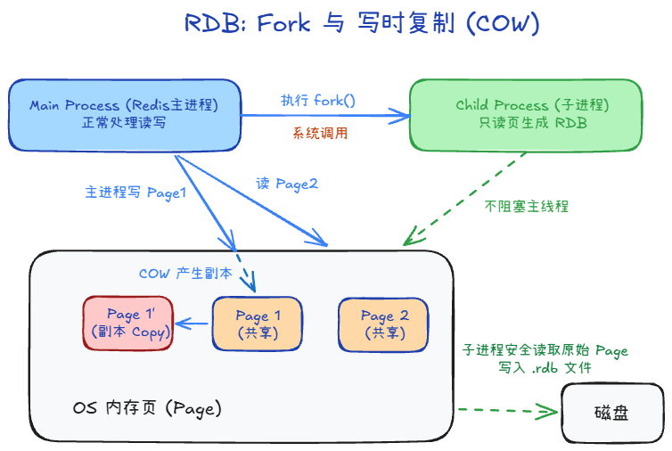
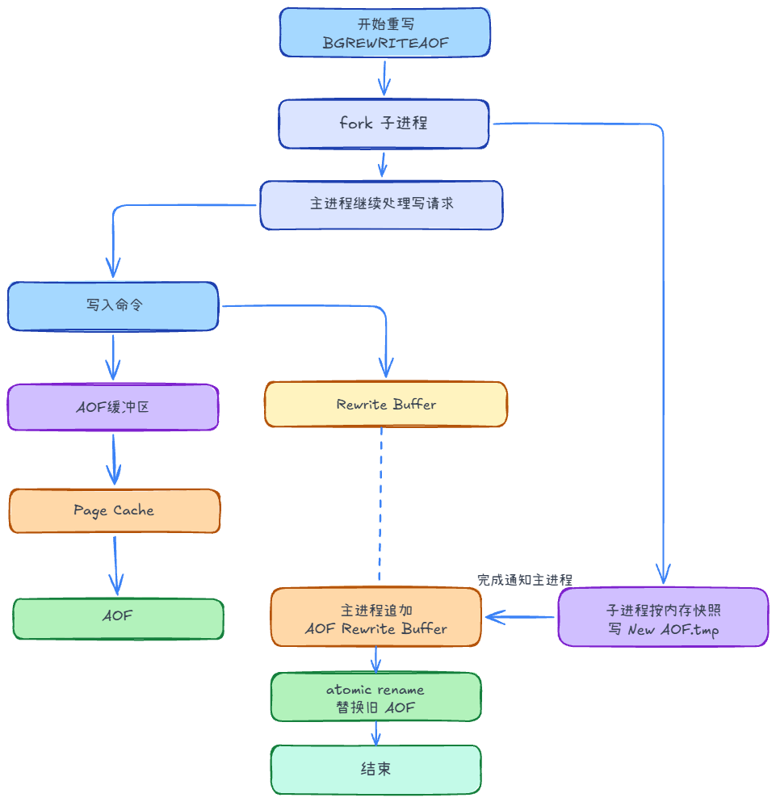

# 持久化
Redis 怎么备份呢，把内存里的数据，安全地留到磁盘上

## RDB

快照（Snapshotting，即 RDB - Redis DataBase）是将内存中的数据以二进制的形式保存到磁盘上的过程。

### 快照的触发方式

- **手动触发：**
    - `SAVE`：由主线程执行，**会阻塞**所有的客户端请求，直到快照完成。生产环境**千万不要用**。
    - `BGSAVE`：调用 `fork` 系统调用创建子进程（此时阻塞），然后由子进程异步处理，**不阻塞主线程**。这是最常用的。
- **自动触发：**
    - 在 `redis.conf` 中配置 `save <seconds> <changes>`。例如 `save 60 1000` 表示 60 秒内只要有 1000 次修改，就自动触发 `BGSAVE`。

### 核心原理 Copy-on-Write (写时复制)

- **Copy-on-Write (写时复制) 机制：**
    - 在 fork 之后，父子进程共用相同的物理内存页。
    - **如果主进程只是读数据：** 父子进程共用内存，互不影响。
    - **如果主进程需要修改数据：** 当主进程要修改某个数据项时，操作系统会将该数据项所在的“内存页”复制一份，然后主进程在该副本上进行修改。
    - **子进程视角：** 子进程看到的依然是 fork 那个瞬间的内存镜像。它会持续地将这部分数据写入到磁盘的 .rdb 文件中。

### 问题
1. 在进行快照操作的这段时间，如果发生服务崩溃怎么办？
磁盘上要么还是上一份完整 RDB，要么本次临时文件作废，启动时仍用上一份成功快照

2. 可以每秒做一次快照吗？
可以配（例如 save 1 1），但一般不这么做：fork + 写盘很吃 CPU、磁盘，写多时 CoW 还会顶内存；每秒快照容易把实例拖垮。要「近似每秒落盘」更常见是用 AOF + appendfsync everysec，而不是每秒 RDB。

## AOF

AOF（Append Only File，追加文件），以写入命令的方式写到日志中

### 过程

1. **命令追加 (Append)：** 命令先被写入到 AOF 缓冲区。
    - 为什么把命令追加到aof_buf中？每条命令都直接落盘会频繁触发 write/fsync，吞吐会明显下降。先写内存缓冲区可批量刷盘，更高效。
    - 配合 appendfsync 策略：always / everysec / no 都是围绕“先缓冲再按。
2. **文件写入 (Write)：** 缓冲区内容写入到系统的页面缓存 (Page Cache)。
    - 这是用户态到磁盘的标准路径：Redis 进程不能直接操作硬盘设备，只能先通过 `write` 把数据交给内核。
    - 内核先写入 Page Cache，可以合并小 IO、减少随机写，避免每条命令都等待磁盘，显著提升吞吐。
    - 但此时数据仍在内存中，只有执行 `fsync`（或内核后续回写）后才算真正落盘，因此宕机时仍可能丢失未刷盘的数据。
3. **文件同步 (Fsync)：** 将系统缓存中的数据真正“落盘”到硬盘

### appendfsync

在 redis.conf 中，你可以控制同步策略：

- **always (最安全)：** 每一条命令都同步，性能最差，几乎不会丢数据。
- **everysec (最推荐)：** 每秒同步一次。这是性能与安全性的完美平衡，也是**生产环境的默认配置**。万一宕机，最多丢失 1 秒的数据。
- **no (完全由 OS 决定)：** 最快，但把数据的生死交给操作系统，不推荐。

### AOF 重写（Rewrite）

AOF会记录每个写命令到AOF文件，随着时间越来越长，AOF文件会变得越来越大。如果不加以控制，会对Redis服务器，甚至对操作系统造成影响，而且AOF文件越大，数据恢复也越慢。为了解决AOF文件体积膨胀的问题，Redis提供AOF文件重写机制来对AOF文件进行“瘦身”。

1. 由于 AOF 重写会进行大量的写入操作，为了避免对 Redis 正常处理命令请求造成影响，Redis 将 AOF 重写程序放到子进程里执行。
2. AOF 文件重写期间，Redis 还会维护一个 **AOF 重写缓冲区**，该缓冲区会在子进程创建新 AOF 文件期间，记录服务器执行的所有写命令。
3. 当子进程完成创建新 AOF 文件的工作之后，服务器会将重写缓冲区中的所有内容追加到新 AOF 文件的末尾，使得新的 AOF 文件保存的数据库状态与现有的数据库状态一致。
4. 最后，服务器用新的 AOF 文件替换旧的 AOF 文件，以此来完成 AOF 文件重写操作

## RDB 和 AOF 的区别

- **数据形式：**
    - RDB：某一时刻的全量快照（二进制）。
    - AOF：按时间顺序记录写命令日志。
- **数据丢失窗口：**
    - RDB：可能丢失上次快照之后的所有数据。
    - AOF：通常丢失更少（例如 `everysec` 常见是约 1 秒窗口）。
- **性能与体积：**
    - RDB：文件更小、恢复更快，对运行期影响集中在 `fork + 写盘` 时刻。
    - AOF：文件通常更大、恢复较慢，但数据更“新”；靠重写控制体积。
- **使用建议：**
    - 只追求快速恢复、可接受更多数据丢失：偏向 RDB。
    - 更重视数据完整性：偏向 AOF。
    - 生产常见做法：RDB + AOF 一起开。

## 混合持久化

AOF 重写的时候就直接把 RDB 的内容写到 AOF 文件开头

