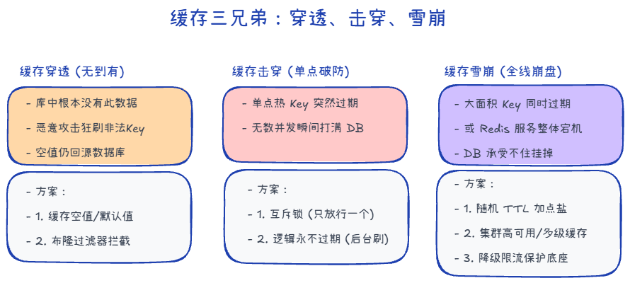

# 缓存三兄弟

假设呢我们在一个商城里面

## 缓存穿透

有个黑客写了一段代码，他老是用不存在的商品来访问请求。
大量的请求过来，它既不在缓存，也不在数据库里，就会造成一个数据库的压力过大。

1. 缓存无效 key。如果请求每次都不同，则没有用
2. 接口限流
3. 布隆过滤器：我说它不存在，那它肯定不在；我说它存在，它可能在

### 布隆过滤器

布隆过滤器本质上是一个超长位数组（Bitmap）+ 多个哈希函数，用来快速判断一个 key **是否可能存在**。

- **核心结论：**
    - 说“不存在”时，一定不存在。
    - 说“存在”时，只是可能存在（有误判）。

- **写入流程：**
    1. 拿一个数据（如 `User123`）。
    2. 用多个哈希函数计算多个下标（如 10、50、80）。
    3. 把位数组对应位置都置为 1。

- **查询流程：**
    1. 对待查询 key 计算同样的多个下标。
    2. 只要有一个位置是 0 => 一定不存在。
    3. 如果全部是 1 => 可能存在（再查缓存/数据库确认）。

- **优点：**
    - 空间占用小，查询快，适合挡住大量不存在 key 的请求（缓存穿透）。

- **缺点：**
    - 有误判率（false positive），不能 100% 判断“存在”。
    - 标准布隆过滤器不支持删除（可能影响其他 key）。
    - 容量固定，超出设计规模后误判率会升高。

## 缓存击穿

iPhone 16 缓存过期，又是热点请求，大家都想买

1. **永不过期**：设置热点数据永不过期
2. **提前预热**：在缓存失效前提前预热数据
3. **加锁**：使用分布式锁避免多个请求同时查询数据库

## 缓存雪崩

比如说有10万个人同时点击10万个产品，但是刚好缓存过期了，**大面积瘫痪**

1. **针对 Redis 服务不可用的情况**：使用 Redis 集群，多级缓存
2. **针对大量缓存同时失效的情况**：设置随机失效时间、提前预热、分批设置过期

# 双写一致性

## 手动挡-Cache Aside（旁路缓存）

广泛使用。应用程序的写操作完全绕过了缓存，直接操作数据库：

1. 读数据时，先从缓存读，如果缓存没有，从数据库读，并将读取到的数据存到缓存。
2. 写数据时，先写入数据库，然后删除缓存

写操作则存在风险，数据库和缓存毕竟是两套系统，如果都需要进行修改，它们的先后顺序可能导致数据不一致

**1.先更新缓存，再更新数据库**

第一次先更新缓存，然后更新数据库失败，第二次读缓存读的是错误的值

**2.先更新数据库，再更新缓存**

A更新数据库，更新缓存时网络延迟

B更新数据库，更新缓存成功

此时A更新缓存成功，数据不一致

**3.先删缓存，后改数据库**

 你刚删，读请求就把旧数据又搬回缓存了。

**4.先改数据库，后删缓存**

可能有什么不一致？

1. 缓存刚好失效
2. 读请求A访问数据库读到旧值
3. 写请求B修改为新值 删除缓存
4. 读请求A把旧值写回缓存

写库通常比读库慢，概率极低，除非第二步删缓存失败

1. **消息队列重试**：把要删除的 Key 发到 MQ，删不掉就一直试。
2. **订阅 Binlog**：用 Canal 这种工具监控 MySQL 的变化，一旦发现数据库变了，由 Canal 负责去删 Redis，把业务代码解耦

## 自动挡-Through 系列

**Read Through（读穿）：** 缓存没中？缓存服务自己去库里查，查完填好再给业务。

**Write Through（写穿）：** 业务写缓存，缓存服务**同步**写到数据库。数据最安全

**Write Behind（写回）：** 业务只管写缓存，缓存服务**异步**、批量地往数据库同步