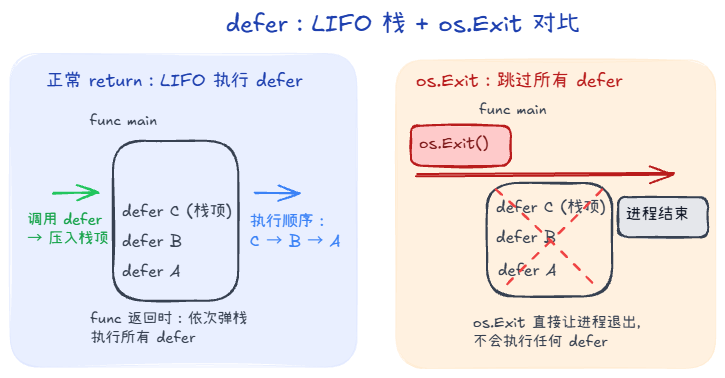
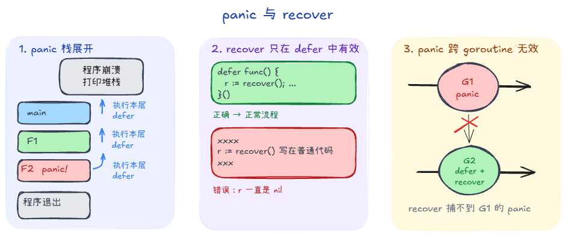
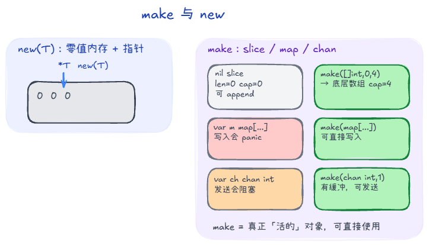

## 二、defer：用“倒序执行”收尾

### 1. defer 是什么？

在函数中使用 `defer f()`，表示**在当前函数返回前**，自动执行一次 `f()`：

```go
func readFile(name string) error {
    f, err := os.Open(name)
    if err != nil {
        return err
    }
    defer f.Close() // 函数退出前一定会执行
    // ... 读文件 ...
    return nil
}
```

### 2. 两个重要特性

- **后进先出（LIFO）**

  ```go
  defer fmt.Println("A")
  defer fmt.Println("B")
  // 输出：B 再 A
  ```

- **遇到 `os.Exit` 不会执行**

  ```go
  func main() {
      defer fmt.Println("never print")
      os.Exit(1) // 直接让进程退出，所有 defer 都不会执行
  }
  ```


---

## 三、panic & recover：Go 的“异常”机制

### 1. panic：程序进入“异常”状态

- 可以**主动调用**：`panic("something wrong")`
- 也可以由运行时触发：例如数组越界、空指针等

一旦某个函数里发生 `panic`：

1. 当前函数**立刻停止后续普通代码**的执行；
2. 依次执行当前函数中已经注册的 `defer`；
3. 返回到上一层调用者，继续做同样的“执行 defer → 返回”；
4. 如果一路都没人 `recover` 它，最终由 `runtime` 打印堆栈并**终止程序**。

> 注意：**panic 自己不打印任何东西**，真正打印信息的是最外层 `runtime`。

另外，对于标准 Go 编译器，有些错误是**无法被 recover 捕获的**（比如栈溢出、OOM 等），程序会直接崩溃。

### 2. recover：从 panic 中“拉回现场”

`recover` 只能在 **`defer` 的函数里调用才有效**：

```go
func safeRun(fn func()) {
    defer func() {
        if r := recover(); r != nil {
            fmt.Println("caught panic:", r)
        }
    }()
    fn()
}
```

几点要点：

- `recover()` 返回 `nil` 的几种情况：
  - 没有发生 panic；
  - 发生 panic，但你不是在 `defer` 里调用；
  - 发生 panic，但 panic 的值本身就是 `nil`。
- panic **跨 goroutine 无效**：在一个 goroutine 里 panic，另一个 goroutine 里的 `recover` 捕不到。



---

## 四、make & new：两种完全不同的“分配方式”

### 1. new：给任意类型分配一块零值内存

`new(T)` 做的事情：
- 为类型 `T` 分配一块内存；
- 将这块内存置为 **零值**；
- 返回 `*T`（指向这块零值内存的指针）。

示例：

```go
type User struct {
    Name string
    Age  int
}

u := new(User) // *User，字段都是零值
fmt.Println(u.Name, u.Age) // "" 0
```

几乎**任何类型**都可以用 `new`，但对复合类型（`map`、`slice`、`chan`）来说，只是“得到一个指针指向零值”，并不保证它已经可用。

### 2. make：为内建引用类型做“完整初始化”

`make` 只用于三种类型：
- `slice`
- `map`
- `chan`

它会：
- 分配底层数据结构的内存；
- 做好必要的初始化；
- 返回 **非零值** 的该类型，而不是指针。

#### 2.1 为什么 `slice` / `map` / `chan` 要用 `make`？

- 对 `map`：
  ```go
  var m map[string]int     // == nil
  // m["a"] = 1            // 这里直接赋值会 panic

  m = make(map[string]int) // 完整初始化
  m["a"] = 1               // OK
  ```

- 对 `chan`：
  ```go
  var ch chan int // == nil
  // <-ch         // 这里会永久阻塞

  ch = make(chan int, 1)
  ch <- 1        // OK
  ```

- 对 `slice`：
  ```go
  var s []int      // == nil，但可以被 append 使用
  s = append(s, 1) // Go 会自动为它分配底层数组
  ```

  尽管 nil slice 也能直接 `append`，但在实际工程中，我们经常需要：
  - 提前确定容量，减少扩容开销；
  - 明确区分“未初始化”和“已初始化但空”两种语义。

  这时最好用：
  ```go
  s := make([]int, 0, 16)
  ```


### 3. 总结：什么时候用谁？

- **想要一个任意类型的“零值指针”**：用 `new(T)`；
- **想要一个可以直接用来读写的 `slice/map/chan` 值**：用 `make`；
- 其他情况大部分只需要用字面量或普通变量声明，不必刻意用 `new`。


