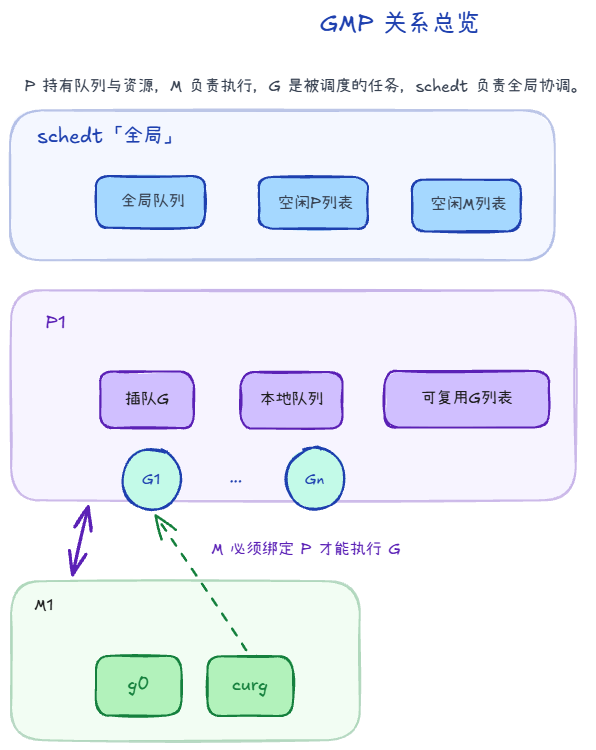
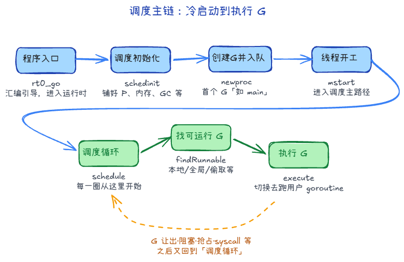
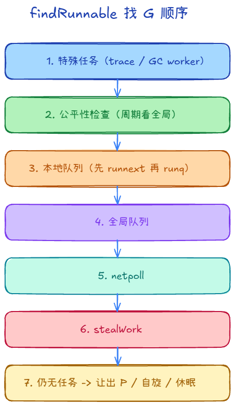
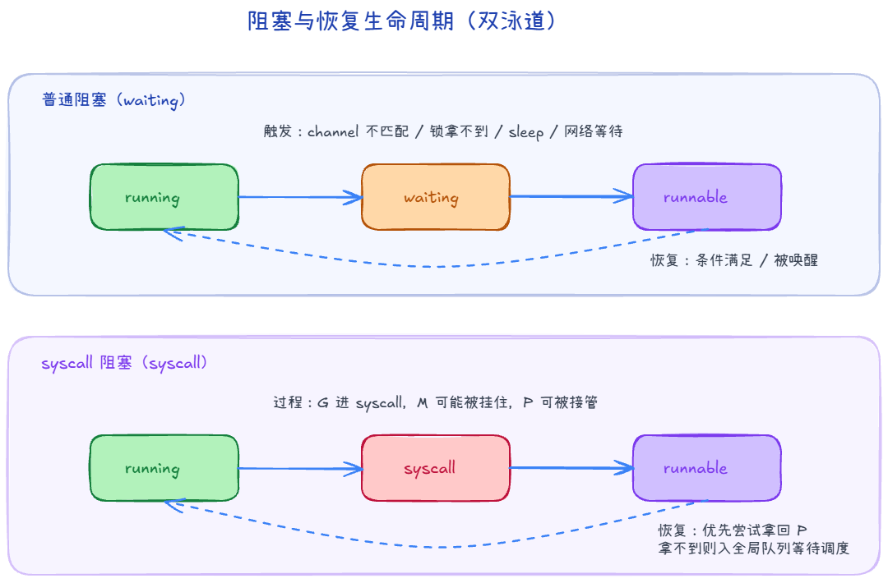

# GMP 机制：G、M、P 到底怎么配合

> 系列阅读：`GMP由来` -> `GMP机制` -> `GMP源码1`（上）-> `GMP源码2`（下）  
> 术语口径沿用上一篇：`G`=任务、`M`=线程、`P`=运行资源与本地队列、`schedt`=全局调度中心

## 这篇写给谁

- 已经知道 GMP 是为了解决什么问题。
- 想搞清楚 G/M/P/schedt 的职责分工，但不想一上来就被源码细节淹没。

## 一句话总览

GMP 可以先理解成一句话：**M 是工人，G 是任务，P 是工位与资源包，schedt 是全局调度中心。**

---

## 1. G：真正要跑的任务

`G`（goroutine）本质是“可调度的执行单元”，它同时带着两类信息：

1. **执行现场**：栈、PC、SP、上下文等（切回来能接着跑）。
2. **调度状态**：它现在是可运行、运行中、等待中，还是在系统调用中。

从写业务的角度，G 就是你 `go func(){...}` 出来的那个任务。
从 runtime 角度，G 是一份“可挂起、可恢复、可迁移”的执行快照。

---

## 2. M：真正干活的内核线程

`M`（machine）就是操作系统线程。

- 它负责把 G 真正跑在 CPU 上。
- 每个 M 有 `g0`（调度专用栈）和 `curg`（当前业务 G）。

可以把 `g0` 理解成“后台工作台”：调度、切换、运行时内部操作尽量在这里做，避免污染业务 G 的执行栈。

---

## 3. P：最容易被低估的角色

`P`（processor）不是物理 CPU，而是运行 goroutine 需要的一组逻辑资源。

最关键的是它管理了本地运行队列：

- `runnext`：下一跳优先执行位（“插队位”）。
- `runq`：本地普通队列。
- `gFree`：可复用的 G 缓存池。

为什么 P 重要？

1. 把“队列和资源”从 M 身上分离出来，M 可以换，P 的本地上下文还在。
2. 本地优先，降低全局锁竞争。
3. 更容易做工作窃取和负载均衡。

---

## 4. schedt：全局调度中心

可以把 `schedt` 看成“总控室”，它主要存全局共享资源：

- 全局可运行 G 队列（global runq）
- 空闲 M 列表、空闲 P 列表
- 全局 gFree、sudog、defer 等池子

当本地队列不够用，或者需要全局协调（比如唤醒更多工作线程），都会走到这个层面。

---

## 5. GMP 关系

1. M 必须先拿到一个 P，才有资格执行 G。
2. 拿到 P 后，优先从 P 的本地队列找 G。
3. 本地没有，再看全局队列，或者去别的 P 那里偷任务。
4. G 阻塞时会让出执行机会，等待被唤醒后重新入队。

如果只记一句：**“M-P 绑定后跑 G，本地优先，全球兜底，窃取均衡。”**

---

## 6. 机制

### 6.1 GMP 调度流程（主循环在干什么）

主流程可以先记这条链：

`rt0_go -> schedinit -> newproc -> mstart -> schedule -> findRunnable -> execute`

用大白话按顺序过一遍：

1. **程序刚起来**先进 `rt0_go`（入口汇编/引导）。
2. 接着 **`schedinit` 把调度器、P 的数量、内存/GC 等「场子」铺好**。
3. 再用 **`newproc` 捏出第一个要跑的 goroutine（比如 main）并塞进队列**。
4. 当前线程 **`mstart`，相当于「我开始上班」**：此后长期在调度逻辑里转。
5. 进入 **`schedule` 这个大循环**：每一圈先 **`findRunnable` 找一个能干活的 G**，找到了就 **`execute` 真正去跑它**。跑不下去（让出、阻塞、被抢占、syscall 等）又会回到 **`schedule`**，周而复始。

### 6.2 找 G 时按什么顺序找

这段如果对齐源码里的 `findRunnable`，顺序是“先处理必须优先的，再就近找活，最后兜底”：

1. 先看**特殊任务**：比如 trace reader、GC worker（这些是运行时的高优先级内部活）。
2. 然后做一次**公平性检查**：不是每次都看全局队列，但会按节拍（如每隔一段 tick）看一眼，避免本地队列长期“自嗨”把全局任务饿死。
3. 接着看本地队列：`runqget` 内部先看 `runnext`，再看普通 `runq`。
4. 本地没有，再看全局 runq。
5. 再看 netpoll：有没有网络事件刚好把某些 G 变成可运行。
6. 还没有，就进入 stealWork，去别的 P 试着“借/偷”任务（通常是忙闲不均时触发）。
7. 仍然没活：让出 P，M 进入自旋或休眠，等后续 `wakep`/事件唤醒。

**为何「全局队列」会在叙述里出现两次？** 
前者是 **公平性**：避免某个 P 本地一直有活、全局里的 G 长期饿死；后者是 **前面几步都落空后的兜底**：集中从全局再取一轮。

### 6.3  什么时候会阻塞

1. **普通阻塞（G 级别）**
   - 常见触发：`channel` 收发对不上、锁拿不到、`time.Sleep`、网络 I/O 暂时没数据等。
   - 直观上：是这个 G 当前干不下去，先从 running 变 waiting，等条件满足再回来。

2. **系统调用阻塞（syscall 级别）**
   - 触发：G 进入阻塞型系统调用。
   - 直观上：不仅 G 会卡在 syscall，当前 M 也可能被内核挂住；runtime 会尽量把 P 从这个 syscall 场景里剥离出来，交给别的 M 继续跑其它 G，避免整条执行通道被拖死。

### 6.4 阻塞后怎么办

阻塞不是“消失”，而是按类型走不同恢复路径：

1. **普通阻塞的恢复**
   - G 被挂到对应等待队列（channel/锁/网络事件等）。
   - 当前 M 不会傻等，通常继续找别的 G 跑。
   - 条件满足后，G 被标记回 runnable，塞回可运行队列，后续调度循环再执行它。

2. **syscall 阻塞的恢复**
   - G 结束 syscall 后先尝试快速拿回可用的 P。
   - 如果拿不到 P，就把自己转成 runnable 放入全局队列，等待后续调度。
   - 目标始终是：让“阻塞 syscall”尽量只影响当前调用，不拖垮整个调度吞吐。

---

## 这篇你应该记住的 3 件事

1. G 是任务，M 是线程，P 是让任务高效运行的资源与队列中心。
2. 调度不是“随机挑”，而是有明确优先级：本地优先、全局兜底、窃取均衡。
3. 阻塞不是失败，而是进入等待-唤醒-重入队列的标准生命周期。

