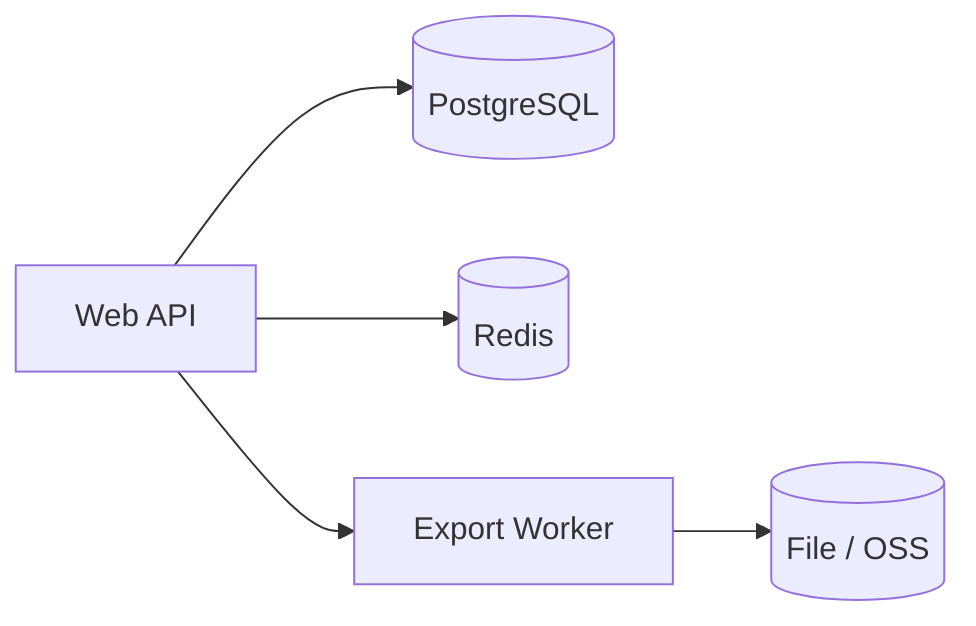

## 一、给定一个题目 怎么输入提示词（例如：实现一个工单处理系统）——考察 vibecoding 时在考什么

核心是**规格先于代码、切片交付、每轮可验收**。下面按顺序分轮投喂即可；每一轮都要求输出「可改动的文档或代码 + 本轮 DoD」。

速记（九轮，每轮要「可交付物 + DoD」）：

1. **需求边界** → 一页范围说明：用户/场景、做与不做、假设、成功标准；歧义写待定 + 默认假设。  
2. **PRD** → 故事、主路径与异常路径、名词表、非功能；划清 MVP 与二期。  
3. **技术方案** → 栈与版本、模块、与外部关系、状态机/关键逻辑、风险与备选、为何不用某方案；架构图 + 部署 + 观测/配置占位。  
4. **数据模型** → 实体/约束/索引/状态迁移；migration 思路与 PRD 字段对齐。  
5. **MVP 垂直切片** → 本轮只做几条故事、DoD（能演示或 curl）、本轮不做；验收步骤写死。  
6. **接口契约** → 路径、请求响应示例、错误码、幂等、分页；与模型字段一致。  
7. **代码** → 目录约定、风格参考、错误与日志、禁止项；按切片提交，文末写 `go run` / curl。  
8. **单测** → 表驱动 + 边界（空、非法迁移、并发若有）；核心领域有断言，不全堆 UI。  
9. **Code Review** → skills/清单跑一轮；逐条采纳或驳回留痕；产出问题列表 + 已修复项。

说明：开放性问题，无准确回答

### 1. 需求边界（先做，避免后面全盘返工）

- **提示里写清**：目标用户与场景、**做 / 不做**（范围外列 bullet）、假设（是否登录、是否多租户）、成功标准（例如「单人能在 10 分钟内走完主路径」）。
- **产出**：一页「范围说明」，后面 PRD/方案都不得超出此边界；有歧义处写「待定」并给默认假设。

#### 示例

我们先写一个文档，说明自己的想法：场景是什么，做什么不做什么，有什么要点，成功标准是什么

**目标用户与场景**
用户：10–50 人的研发团队负责人、行政/HR 助理。
场景：每周五前收齐各组周报，导出成一份 PDF/Word 给领导，不做全年绩效、不做 OKR 系统。

**做 / 不做**
做：创建周报模板、按组发链接填写、截止提醒、汇总导出、简单统计（提交率）。
不做：即时聊天、文件网盘、与 Jira/飞书深度双向同步、自定义工作流引擎、多语言。

**假设**
需要登录（企业邮箱 SSO 或手机号二选一，待定；默认假设：手机号 + 验证码）。
单租户：一家公司一个空间；多租户版 不做（写进「不做」）。

**成功标准**
新管理员在 10 分钟内：注册空间 → 建一个模板 → 发链接 → 模拟 3 人提交 → 导出汇总。
首版无 P0 缺陷即可上线内测。

### 2. 生成产品需求文档

- **提示里写清**：用户故事或用例列表、关键流程（主路径 + 1～2 条异常路径）、名词表、非功能需求（性能/安全若有硬性要求）。
- **产出**：可给产品/面试官看的 PRD；明确 **MVP 与二期** 划分。

#### 示例

先列故事与路径，再拆 MVP。

**用户故事（摘）**
- 作为管理员，我能创建周报模板（标题、若干填空项、截止时间），以便各组按同一格式提交。
- 作为组员，我能通过链接打开本周任务、填写并提交，以便负责人汇总。
- 作为管理员，我能查看谁已交/未交并一键导出汇总，以便周五前交给领导。

**关键流程**
- 主路径：登录 → 建模板 → 生成填写链接 → 组员打开链接登录 → 填写提交 → 管理员看列表 → 导出 PDF。
- 异常路径 1：已过截止时间，组员打开链接 → 提示不可提交，只读展示上周已交内容（若有）。
- 异常路径 2：组员重复提交 → 覆盖本周草稿或提示「已提交，是否覆盖」（待定；默认：**同周期内仅允许一条已提交记录，二次提交为更新**）。

**名词表**
- 空间：一家公司下的隔离数据域。
- 模板：管理员定义的周报结构 + 周期规则。
- 周期：自然周或管理员指定的起止日。

**MVP 与二期**
- MVP：单空间、单模板、手机号登录、提交列表 + 导出 PDF、截止后禁止新提交。
- 二期：企业 SSO、邮件提醒、Word 导出、多模板、按部门权限细分。

### 3. 生成技术方案文档

- **提示里写清**：技术栈与版本、模块划分、与现有系统关系、关键算法或状态机、风险与备选方案、**为何不用某方案**（一行即可）。
- **产出**：架构图（可 Mermaid）、部署形态（单机/容器）、观测与配置项清单（可先占位）。

#### 示例

**技术栈（示例）** Go 1.22 + chi、PostgreSQL 15、Redis（会话/限流）、对象存储或本地磁盘存导出 PDF。

**模块划分** `auth`（验证码）、`tenant`（空间）、`template`、`cycle`、`submission`、`export`（HTML→PDF）、`notify`（二期占位）。

**与现有系统关系** 首版独立部署，无 Jira/飞书对接；预留 Webhook 配置项（默认关闭）。

**关键状态** 周期：`draft` → `open` → `closed`；提交：`draft` → `submitted`（关闭后不可从 `draft` 变 `submitted`）。

**风险与备选** PDF 生成耗 CPU → 导出任务异步队列 + 轮询下载链接；备选：首版仅 Markdown  zip。

**为何不用某方案** 不用 Elasticsearch：当前仅按周期+用户列表查询，PostgreSQL 索引足够。

**部署形态** 单机 Docker Compose（web + db + redis）或 K8s 一套 Deployment + StatefulSet(DB)。

**观测与配置** 日志 JSON、请求 ID；配置项：`BASE_URL`、`SMS_PROVIDER`、`EXPORT_MAX_CONCURRENCY`（占位即可）。



### 4. 数据模型

- **提示里写清**：实体、字段类型、约束（唯一、外键、软删）、索引理由、**状态枚举**与合法迁移。
- **产出**：表结构或 ER 说明 + migration 思路；与 PRD 字段一一可对上。

#### 示例

**实体与要点**
- `tenants`：`id`, `name`, `created_at`；无软删首版可省略。
- `users`：`id`, `tenant_id`, `phone`, `role`（`admin` | `member`），`phone` 在 `tenant_id` 下唯一。
- `templates`：`id`, `tenant_id`, `title`, `schema_json`（字段定义）, `created_at`。
- `cycles`：`id`, `template_id`, `starts_at`, `ends_at`, `status`（`draft`|`open`|`closed`），`(template_id, starts_at)` 唯一。
- `submissions`：`id`, `cycle_id`, `user_id`, `body_json`, `status`（`draft`|`submitted`），`(cycle_id, user_id)` 唯一（每人每周期一条）。

**索引理由** `cycles(template_id, status)` 供管理员看当前开放周期；`submissions(cycle_id, status)` 供提交率统计。

**状态合法迁移** `cycle`: `draft→open→closed`（不可逆）；`submission`: `draft↔draft` 允许更新，`draft→submitted` 在 `cycle.open` 时允许；`cycle.closed` 后禁止 `draft→submitted`。

**Migration 思路** 001 建 `tenants/users`；002 `templates/cycles/submissions` + 唯一约束与外键 `ON DELETE RESTRICT`。

### 5. 生成 MVP 文档（垂直切片）

- **提示里写清**：本轮只做哪几条用户故事、**完成定义**（能演示的界面或 curl）、明确写「本轮不做」。
- **产出**：MVP 清单 + 验收步骤；宁可少做，也要能端到端跑通。

#### 示例

**本轮只做（垂直切片）**
- 故事：管理员创建模板并发布本周周期；组员登录后填写并提交；管理员查看周期内提交列表并触发导出（同步生成小 PDF 即可）。

**完成定义（DoD）**
- 浏览器或 curl 能跑通：注册/登录 → 创建模板 → 开放周期 → 另一用户提交 → 列表可见 → 下载 PDF 非空。
- 单元测试：周期关闭后提交接口返回 409（或业务错误码）。

**本轮不做** 邮件提醒、SSO、异步大任务队列、多模板并行、细粒度部门权限。

**验收步骤（可照抄做演示）**
1. `POST /auth/otp` + `POST /auth/login` 拿到 `Bearer`。
2. `POST /templates` + `POST /cycles` 将周期置为 `open`。
3. 换测试用户登录，`POST /cycles/{id}/submissions` 提交 JSON 与 PRD 字段一致。
4. `GET /cycles/{id}/submissions` 可见该条；`POST /cycles/{id}/export` 返回文件或下载 URL。

### 6. 生成接口文档（契约）

- **提示里写清**：REST/ RPC 路径、请求响应 JSON 示例、错误码约定、幂等与分页规则；与数据模型字段一致。
- **产出**：OpenAPI 片段或 Markdown 接口表；**前后端/面试官**可据此对齐后再写代码。

#### 示例

**约定** REST + JSON，`Authorization: Bearer <access_token>`；时间 ISO8601；错误体 `{ "code": "...", "message": "..." }`。

**错误码（摘）** `UNAUTHORIZED` 401；`FORBIDDEN` 403；`NOT_FOUND` 404；`VALIDATION_ERROR` 422；`CONFLICT` 409（如周期已关仍提交）。

**幂等** `POST /submissions` 同用户同周期：体相同可安全重放返回同一 `id`；体不同返回 409 `SUBMISSION_LOCKED`（与 PRD「更新」策略一致时再改文档）。

**分页** `GET` 列表：`?page=1&page_size=20`，响应 `{ "items": [...], "total": n }`。

**摘录（与模型字段对齐）**

`POST /templates`

请求：

```json
{ "title": "研发周报", "schema_json": { "fields": [{ "key": "done", "label": "本周完成", "type": "text" }] } }
```

响应：`201` + `{ "id": "...", "title": "...", "schema_json": { ... } }`

`POST /cycles/{id}/submissions`

请求：

```json
{ "body_json": { "done": "完成登录与导出接口" }, "submit": true }
```

响应：`200` + `{ "id": "...", "cycle_id": "...", "status": "submitted", "body_json": { ... } }`

周期已关时：`409` + `{ "code": "CYCLE_CLOSED", "message": "..." }`

### 7. 生成代码

- **提示里写清**：仓库目录约定、`@` 参考现有代码风格、错误处理与日志规范、禁止事项（不要乱加中间件）。
- **产出**：按 MVP 切片提交；每轮结尾要求 **如何 `go run` / 如何 curl**。

### 8. 生成单测

- **提示里写清**：表驱动用例、边界（空、非法状态迁移、并发若有）、mock 范围；覆盖核心领域逻辑而非全 UI。
- **产出**：可 `go test` 通过的测试；关键路径有断言而非只测能跑。

### 9. AI 辅助 Code Review

- **做法**：用 skills / 自定义规则跑一轮 review，或提示「按 OWASP/Go 常见坑列检查清单」；**逐条采纳或驳回并留修改记录**。
- **产出**：问题列表 + 已修复项；与下文「怎么保证」一致：**分块采纳、可执行验证、契约优先**。

## 二、怎么保证 AI 生成代码的正确性（测试、自测、Review）？踩过什么坑？

- 分块采纳：不整文件无脑接受；关键路径（鉴权、金额、并发、错误处理）一定自己过一遍或手写。
- 可执行验证：能跑单测/集成测就跑；没有测试的至少本地跑通主流程 + 边界用例。
- Review：功能写完会用 skills 触发 code review，对指出的问题逐条改并留记录（和团队规范一致的话更好）。
- 契约优先：接口字段、错误码先和产品/前端对齐，再让 AI 生成，减少「写得很好看但和协议不一致」

## 三、 有了ai后 你在未来项目中的期望

1. 对自己在项目里的期望
- 更快进入状态：新仓库用 AI 辅助读结构、画调用链，缩短 onboarding，但关键路径仍自己验证。
- 更高的人机分工：重复实现、测试骨架、接口说明交给 AI 初稿；设计、异常路径、安全与性能仍主要由人负责。
- 更可复制的交付：用提示词 + 检查清单把「需求—契约—MVP—单测—Review」跑成习惯，减少一次性聪明。

2. 对团队 / 项目的期望

- 有政策：能否用、哪些数据不能进模型、是否允许索引私仓，写清楚比「各自偷偷用」好。
- Review 不缩水：AI 生成的 diff 仍走同一套评审；必要时约定「关键模块必须双人看」。
- 文档与契约同步：AI 适合维护 API 说明、变更记录，期望项目里契约和实现更容易保持一致。

3. 对「项目结果」的期望（务实）

- 迭代更快，但技术债可控：不指望少写设计，而是少在机械劳动上耗时间
- 学习曲线仍在人身上：AI 缩短查资料时间，但判断对不对、该不该做仍要积累，所以仍希望和更强的人一起做有挑战的需求。