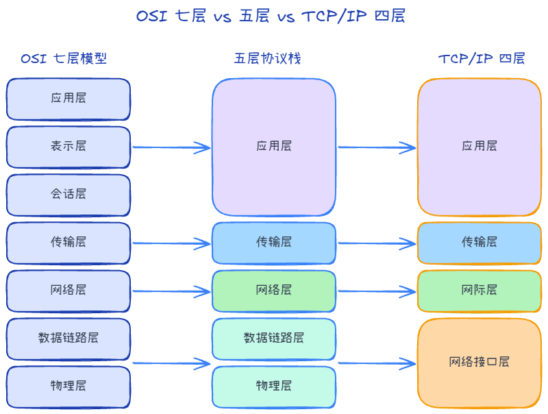
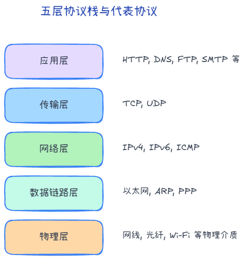
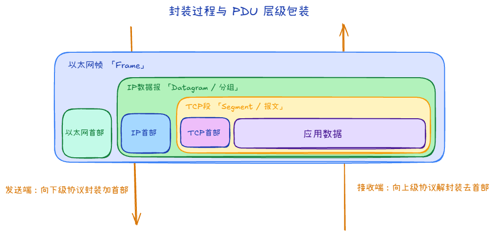

# OSI 与 TCP/IP：分层对照 + 各层典型协议一览

把网络拆成「层」，不是为了考试背书，而是为了：**定位问题时知道该查哪一层、读文档/抓包时知道当前在看哪一层的协议**。本篇只做地图与直觉，具体协议细节放在后续各篇。

---

## 1. 为什么要有分层

真实网络里，主机、路由器、交换机各自只做一部分事情。分层把「端到端传数据」拆成多个**职责清晰**的步骤：上层只依赖下层提供的服务，而不关心下层怎么实现。这样 TCP/IP 能在以太网上跑，换 Wi‑Fi、换光纤，上层应用往往不用改。

下面两套模型说的是同一件事的不同画法：**OSI 七层**偏教学，**TCP/IP** 偏工程实现。很多中文教材会再折中成**五层**（把 OSI 最上面三层合并成「应用层」），下文表格按五层写，最贴近日常说法。

---

## 2. OSI、五层与 TCP/IP 的对应关系

| OSI 七层 | 中文习惯叫法 | 五层模型中的位置 | TCP/IP 四层（常见说法） |
|----------|--------------|------------------|-------------------------|
| 7 应用层 | 应用层 | **应用层** | **应用层**（HTTP、DNS、SSH…） |
| 6 表示层 | （常并入应用） | ↑ | ↑ |
| 5 会话层 | （常并入应用） | ↑ | ↑ |
| 4 传输层 | 传输层 | **传输层** | **传输层**（TCP、UDP） |
| 3 网络层 | 网络层 / 网际层 | **网络层** | **网际层**（IP、ICMP…） |
| 2 数据链路层 | 链路层 | **数据链路层** | **网络接口层**（以太网、Wi‑Fi…） |
| 1 物理层 | 物理层 | **物理层** | 常并入「网络接口」 |

要点只有几句：

- **「应用层」在工程里是个大筐**：OSI 的会话、表示、应用，在 TCP/IP 里往往都统称应用层协议。
- **TCP/IP 的「网络接口层」**：对应 OSI 的数据链路层 + 物理层（比特怎么编码、帧怎么在介质上传），抓包时你看到的「Frame」主要来自这一带）。
- 后文说「第几层」时，若无特别声明，**按五层从下到上数**：物理 → 数据链路 → 网络 → 传输 → 应用。

---

## 3. 各层「协议地图」（认路用）

先建立「这一层大概管什么、常见词有哪些」的印象；与 Wireshark 里包展开顺序（Frame → IP → TCP → HTTP）也能对上号。

| 层级 | 这一层大致管什么 | 常见协议 / 概念（举例） |
|------|------------------|-------------------------|
| **应用层** | 具体应用语义：网页、域名、邮件… | HTTP/HTTPS、DNS、FTP、SMTP、SSH、MQTT… |
| **传输层** | 进程到进程：端口、可靠/不可靠、拥塞 | **TCP**、**UDP**；端口（如 80、443） |
| **网络层** | 主机到主机：跨网段寻址与路由 | **IPv4/IPv6**、**ICMP**、路由协议（如 OSPF、BGP 等，偏运维） |
| **数据链路层** | 同一链路/二层域内：帧、MAC | **以太网**、**ARP**（常视为紧贴 IP 的辅助）、交换机转发 |
| **物理层** | 比特与介质：电气、光、无线电 | 网线、光纤、Wi‑Fi 射频 |

**ARP** 常被放在「链路层与网路层之间」来讲：它为「已知 IP、求 MAC」服务，抓包常在以太帧里看到，后文写网路/链路时会再碰。

---

## 4. 封装与各层 PDU 叫法

数据从应用往下交时，每一层会给数据加上本层的控制信息（首部，有时还有尾部），像套娃一样，称为**封装**；对端再逐层剥掉，称为**解封装**。

各层对自己这一层「一整块数据单元」的习惯称呼（PDU）大致是：

| 层级 | 常见 PDU 称呼 | 备注 |
|------|-----------------|------|
| 传输层 | TCP **段**（segment）；UDP **数据报**（datagram） | 口语里也有人泛称「包」 |
| 网络层 | **分组** / **IP 数据报**（packet） | 常说「IP 包」 |
| 数据链路层 | **帧**（frame） | 以太网帧等 |
| 物理层 | **比特流** | 抓包里有时不单独展开 |

**封装有什么用？** 
让**每一层只读自己需要的那点头信息，就能完成本层职责**，上层不必知道下层介质是网线还是 Wi‑Fi。
大致包括：在传输层用**端口号**区分「同一 IP 上不同进程」；在网络层用 **IP 地址**做跨网段选路；在链路层用 **MAC / 帧**在一段链路上可靠投递（还可带差错检测等）；物理层只管比特如何编码传输。**对端按顺序剥封装**，每一层去掉自己的首部，把「载荷」交给上一层，直到应用拿到原始数据。这样**分工清晰、可替换**（例如换物理介质往往不必改 HTTP 语义）。

---

