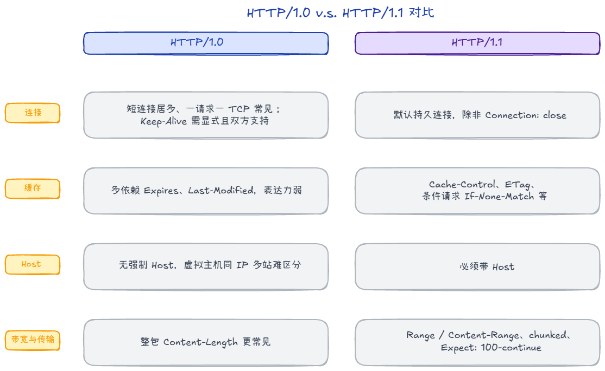
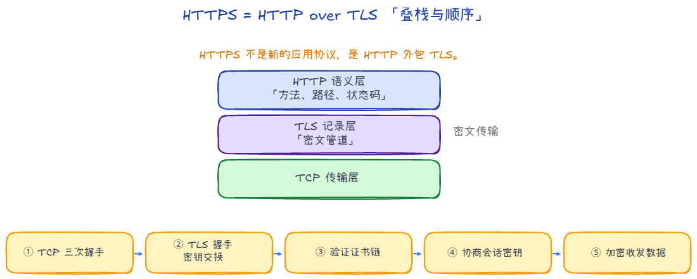
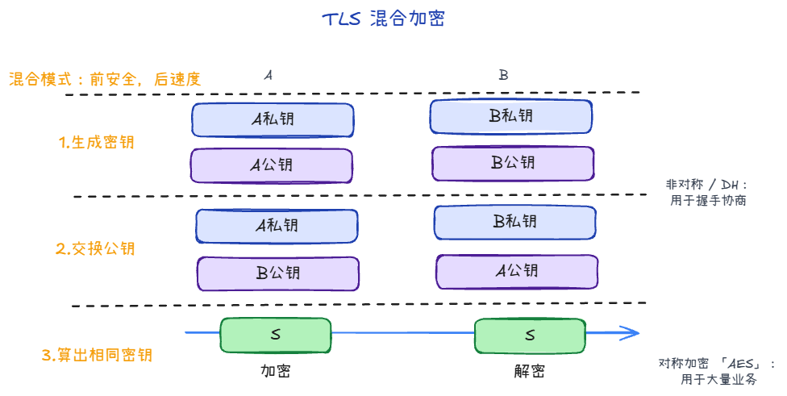
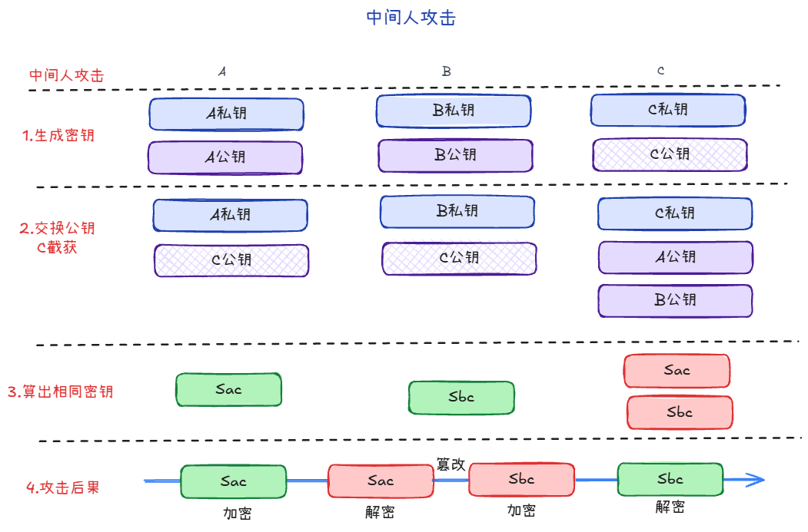
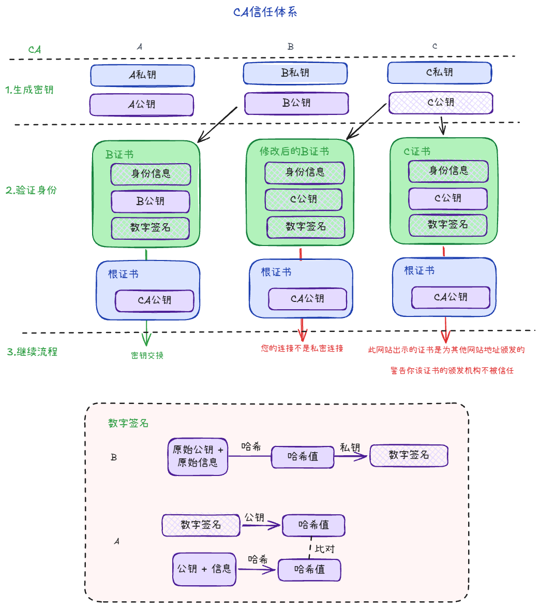

# HTTP 与 HTTPS：核心语义、首部、缓存、连接与版本演进

**HTTP** 规定请求与响应长什么样；**HTTPS** 在同样语义外包一层 **TLS**，解决传输上的机密性与完整性。本篇把「日常接口与抓包够用」的 HTTP 核心，与「1.0→3、何时 TLS」的版本线放在一起。

---

## 应用层常见协议一览

应用层直接面向具体业务，下列是日常最常碰见的名字，后面正文重点展开 **HTTP/HTTPS**：

| 协议 | 做什么 |
|------|--------------------|
| **HTTP / HTTPS** | 网页与绝大多数 API 的请求/响应语义；HTTPS 在 HTTP 外加 **TLS** 加密与完整性。 |
| **DNS** | 把**域名**解析成 **IP**（等记录）。 |
| **WebSocket** | 在 TCP/TLS 上建**全双工长连接**，常用于实时推送。 |
| **FTP / SFTP** | 文件传输（传统 FTP 与基于 SSH 的 SFTP 不是一回事，只是同归「传文件」需求）。 |
| **SMTP / IMAP / POP3** | 发信、收信、邮箱同步等邮件场景。 |
| **SSH** | 安全远程登录与隧道。 |
| **MQTT** | 轻量发布/订阅，常见于物联网与消息中间件。 |

还有很多（如 NTP、SNMP、LDAP 等），用到再查即可。

---

## HTTP 协议是什么

**HTTP**（Hypertext Transfer Protocol，**超文本传输协议**）用来**约定超文本在网络上的传输方式**；这里的**超文本**不单指文字，而是泛指网页里常见的各类资源与消息。

HTTP 是一个**无状态**（stateless）协议：**服务器不维护任何有关客户端过去所发请求的消息**。**有状态**协议往往更复杂，要持久维护状态（历史信息），而且一旦客户端或服务端失效，还容易出现**状态不一致**，把不一致修回去的代价通常更高。于是在协议层保持无状态，需要会话时在 HTTP 之上用 **Cookie、Session、Token** 等机制补齐，是常见做法。

---

### 1. 请求、响应与语义

一次 HTTP 交换由**请求**与**响应**组成。请求至少包含：**方法**、**目标 URI**（含路径与查询串）、**协议版本**；响应至少包含：**状态码**、**说明短语**（可省略语义）、**首部**与可选**正文**。

#### 1.1 方法（Method）

| 方法 | 直觉 |
|------|------|
| **GET** | 获取资源，**不应**在规范语义上产生副作用；可被缓存、可带查询参数。 |
| **POST** | 提交数据、触发处理，**可能**改变服务端状态；通常不缓存响应本体。 |
| **PUT / PATCH** | 整体或部分替换/更新资源（具体语义依 API 约定）。 |
| **DELETE** | 删除资源。 |
| **HEAD** | 与 GET 同，但**不要正文**，只要头（用于探测存在性、长度等）。 |
| **OPTIONS** | 探测服务器支持的方法或 CORS 预检。 |

#### 1.2 状态码区间

记**百位**即可：**2xx** 成功，**3xx** 重定向（看 `Location`），**4xx** 客户端问题，**5xx** 服务端问题。

---

### 2. HTTP/1.0 与 HTTP/1.1

#### 响应状态码

**HTTP/1.1** 在规格里**补充并细化**了一批状态码及使用场景，例如 **100 Continue**（可先应答再继续发大正文）、**409 Conflict**（资源冲突）、**416 Range Not Satisfiable**（请求的字节范围不合法）等。**HTTP/1.0** 时代很多实现只常用 **2xx/3xx/4xx/5xx** 的子集，能表达的「细分错误 / 中间状态」较少。

#### 缓存处理

**HTTP/1.0** 多依赖 **Expires**、**Last-Modified** 等，能表达的缓存规则也比较粗。

**HTTP/1.1** 用 **`Cache-Control`** 把策略说细（如 **`max-age`** 定「多久内可本地直接用」、**`no-store`**「不落盘」、**`no-cache`**「用前须向源校验」等）；用 **`ETag`** 给内容一个**版本指纹**，配合 **`If-None-Match`** 做协商；**`If-Modified-Since`** 仍可与 **`Last-Modified`** 搭配。没变时常回 **304**，少传正文，浏览器与 CDN 都按同一套语义实现。

#### 连接方式

**HTTP/1.0** 常见实现是**短连接**：一个请求开一条 TCP、响应结束就关的情况很多；若要复用连接，通常要 **`Connection: Keep-Alive`** 且双方支持。

**HTTP/1.1** **默认持久连接**（除非请求或响应里显式 **`Connection: close`**），减少反复握手。同一连接上多个请求/响应仍是**顺序**交付，队头阻塞问题后来由 **HTTP/2** 的多路复用缓解。

#### Host 头处理

**HTTP/1.0** 并无强制要求带 **Host**，在**同一 IP 托管多站点（虚拟主机）**时难以区分访问谁。**HTTP/1.1** 规定请求**必须带 `Host`**，否则在规范意义上是坏的请求；这是现代托管与 CDN 的常见基础。

**用处**：TCP 只到「IP + 端口」，服务器不知道你要的是哪个域名；请求里的 **`Host: 域名`** 用来在同一台机器上选中**哪一个站点 / 哪套虚拟主机配置**（含 TLS 时也与证书域名匹配有关）。一句话：**IP 找到机器，`Host` 找到站名。**

#### 带宽优化

**HTTP/1.1** 支持 **Range / Content-Range**，便于**断点续传**、分段下载；支持 **`Transfer-Encoding: chunked`**，正文可**边生成边传**（长度事先不知道时很有用）。大体积上传还可配合 **`Expect: 100-continue`**，服务端先返回 **100 Continue** 再收正文，少传无效数据。**HTTP/1.0** 对此类能力支持弱，整包 **Content-Length** 更常见。

### 3. HTTP 版本线：各自解决什么

**HTTP/1.0** 
一请求一连接居多；无默认持久连接。 

**HTTP/1.1** 
默认持久连接、分块传输、更丰富的缓存控制；同一 TCP 上响应仍**按序**，易队头阻塞。 

**HTTP/2**
*   **二进制分帧**：不再像 1.1 那样一口气发一段长文本，而是把数据切成一个个带编号的**小货柜（帧）**。机器读这些规则的小货柜比读长文本要快得多。
*   **多路复用**：以前一条 TCP 路上只能跑一辆货车，现在可以在同一条路上**混着跑**。可以同时跑很多个「请求—响应流」（多个 stream）
*   **HPACK**：以前每个包都要贴详细的地址（首部），现在只传变动的部分，重复的地址查表即得。

**底层：** HTTP/2 解决的是**应用层**的排队。但底层还是一条单向 TCP 管道。想象一下，如果路上有一个货柜（包）丢了，**整条路都要停下来等待这个包补发**。哪怕后面的货柜是别的请求的，也得一起等着。这就是「TCP 层的队头阻塞」。

**HTTP/3**
*   **QUIC 跑在 UDP 上**：既然 TCP 管道出问题会卡死全球，那就换个思路。在 UDP 这种“只管发货”的快递员身上，自己封装一套更聪明的可靠传输协议（QUIC）。
*   **流的解耦**：在 HTTP/3 里，每一个请求都是一条**独立的虚拟车道**。A 车道爆胎了（丢包），B 车道依然可以全速前进，不需要停下来等 A。
*   **弱网神器**：用手机过隧道，信号闪断一下时，HTTP/3 的网页可能只是缺个图，而 HTTP/2 的网页可能整个都在转圈。

---

## HTTPS 与 TLS

HTTPS 协议（Hyper Text Transfer Protocol Secure），是 HTTP 的加强安全版本

**HTTPS = HTTP + TLS**。TLS 在 **TCP 建立之后**先做握手，再在同一连接上传 **HTTP 语义**（线路上是密文）。**方法、路径、状态码**仍是 HTTP；变的是**通道是否加密与完整**。

> 常把 HTTPS 中的核心加密协议混称为SSL/TLS。然而，TLS是基于SSL之上的，目前 SSL 已完全废弃

### 典型顺序

浏览器访问 `https://` 站点时，链路大致按这个顺序走：

1. 先完成 **TCP 三次握手**。
2. 发起 **TLS 握手**：协商协议版本、密码套件、交换密钥参数。
3. 服务端返回**证书链**，客户端验证证书是否可信、域名是否匹配、是否过期。
4. 双方基于握手材料导出**会话密钥**。
5. 后续 HTTP 请求/响应都放进 TLS 记录层里传输（外部看到的是密文）。

### 加密

**对称加密**

对称加密是「同一把钥匙加密、同一把钥匙解密」，典型算法是 **AES**。

- 优点：速度快，适合加密大量业务数据。
- 难点：双方如何在不安全网络里**安全共享同一把密钥**。

**非对称加密**

非对称加密有一对密钥：**公钥**和**私钥**。用公钥加密的数据，通常只能由对应私钥解开。RSA和DH/ECDHE是两种常见的非对称加密算法。

RSA 是常用的非对称加密算法：
1. A 先自己生成一对钥匙（公钥/私钥）。
2. A 把公钥发给 B（可公开）。
3. B 用 A 的公钥加密数据发回去。
4. A 用自己手里的私钥解密。

DH/ECDHE是一种密钥交换算法，用于在客户端和服务端之间安全地交换密钥，而不需要直接传输密钥:
1. A生成一个随机数作为私钥，然后生成一个公钥。
2. A将公钥发送给B。
3. B生成一个随机数作为私钥，然后生成一个公钥。
4. B将公钥发送给A。
5. 然后：
    1. A 用 A私钥 + B公钥 算出一个值 S
    2. B 用 B私钥 + A公钥 也算出同一个值 S
这个 S 就是“共享秘密”（会再派生出会话密钥），后续 HTTP 数据就用它做对称加密。

- 优点：公钥可公开，分发相对容易。
- 缺点：计算开销大，不适合直接加密大量业务数据。

### SSL/TLS 的工作原理

TLS 实际采用的是**混合加密**：

为什么要这样做：

- 只用对称加密：传得快，但「同一把钥匙怎么安全给对方」是难题。
- 只用非对称加密：分发钥匙容易，但每条业务数据都这样加密会很慢。
- 所以 TLS 折中：**握手阶段**用非对称体系确认身份并协商密钥，**传数据阶段**用对称加密跑满性能。

把它想成 3 步小故事：

1. **先验明身份**：浏览器先确认“你真的是这个网站”（看证书链与域名）。
2. **再谈一把临时会话钥匙**：双方通过握手算出同一把会话密钥（上文的S）。
3. **最后高速传输**：后续 HTTP 内容都用这把会话密钥对称加密。

这就是“混合加密”的核心：**前面保安全，后面保速度**。

### 公钥传输的信赖性

DH/ECDHE有一个安全隐患：这个公钥到底是不是你要访问的网站的？

如果中间人截获公钥，然后自己生成一对公钥/私钥，用公钥加密数据发给客户端，然后用私钥解密数据发给服务器，接着分别与客户端、服务端建立两条独立加密会话，再做转发/解密/重加密。

TLS 通过 **CA 证书体系**解决信任问题：

- 网站把公钥放在证书里，证书由受信 CA 签发。
- 浏览器/系统预置了受信根证书。
- 客户端会校验证书链、域名（SAN/CN）、有效期、吊销状态等。

中间人可以拦截流量，也可以自己生成公私钥，但他做不到让受信 CA 给他的假公钥签一个“属于目标域名”的合法证书。

如果校验失败（如证书过期、域名不匹配、自签且不受信），浏览器会告警。

#### 数字签名

数字签名用于证明两件事：

1. **消息来自谁**（身份可验证）。
2. **消息是否被篡改**（完整性可验证）。

简化理解：

- 签名方先对消息做哈希，再用私钥对哈希值签名。
- 验证方用公钥验签，并重新计算哈希比对。
- 两边一致则说明「来源可信且内容未改」。

在 TLS 里，证书签发和握手中的关键步骤都依赖签名与验签机制。

#### 一段流程串起来（从输入网址到建立信任）

把你在地址栏输入 `www.baidu.com` 后的关键动作，压成 4 步就够理解 TLS 的核心：

1. **服务端先亮证件**  
   站点先返回证书。证书里至少有两类关键信息：  
   - 站点身份信息（域名、有效期等）；  
   - 站点公钥，以及 CA 对证书内容做的数字签名。

2. **浏览器验证“你真是你”**  
   浏览器会用系统/浏览器内置的受信根证书去验证证书链，并同时检查：  
   - 访问域名是否匹配证书里的域名；  
   - 证书是否在有效期内、是否已吊销等。  
   只有这些检查都通过，浏览器才会继续握手；否则就弹出风险告警。

3. **中间人为什么难以掉包**  
   假设中间人把证书里的公钥换成自己的，原证书签名会立刻失效。 
   - 数字签名是 CA 机构用自己的私钥对百度信息进行哈希加密后的结果。C 没有 CA 的私钥，他写不出合法的签名。
   他如果改发一张“自己域名”的合法证书，也过不了域名匹配（你访问的是 `baidu.com`）。  

4. **验证通过后再协商会话密钥**  
   身份确认后，客户端与服务端通过 ECDHE 等密钥交换协商出会话密钥。旁路即使看到了交换过程中的公开参数，也拿不到双方私钥，因此无法推出共享秘密。  
   后续 HTTP 请求/响应都放进 TLS 记录层，用这把会话密钥做对称加密传输。

一句话收束：**先用证书体系解决“你是谁”，再用密钥交换解决“怎么安全通信”。**

