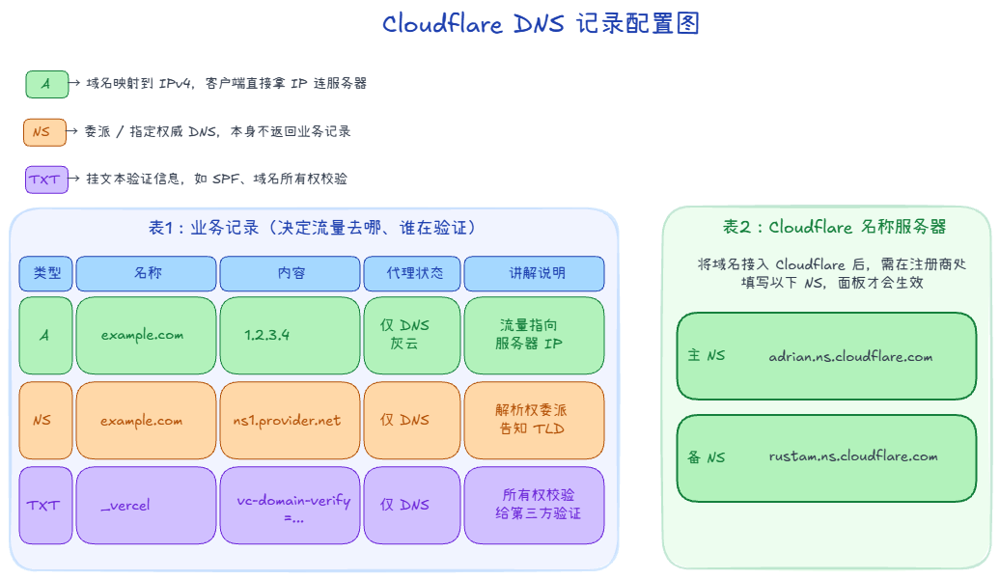
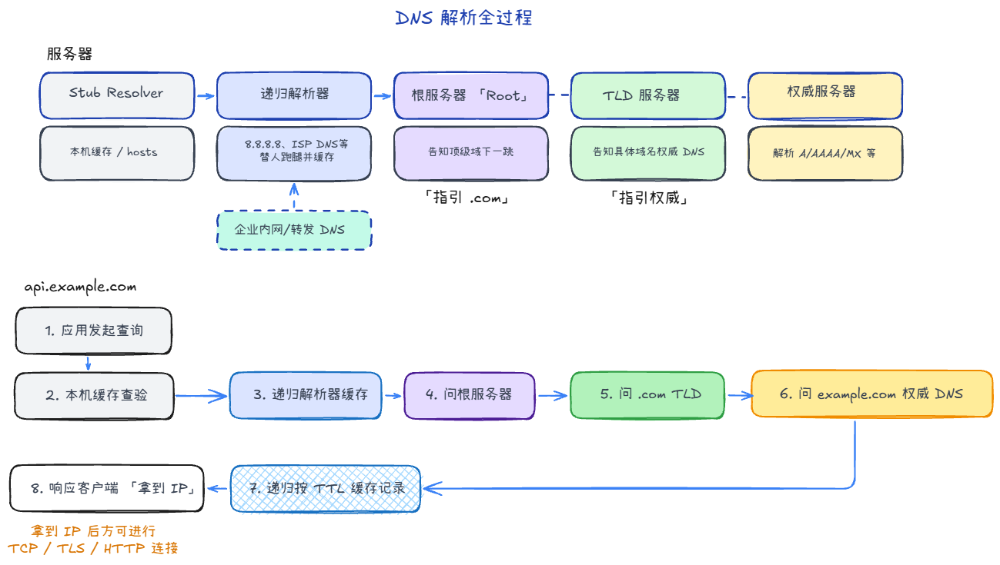
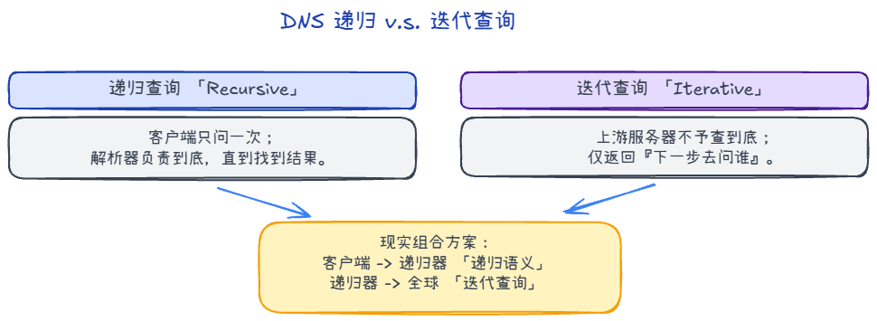

# DNS：查询路径、记录类型与常见场景

## 1. 日常动作

DNS 的概念看起来很抽象，但你在日常里已经多次"摸到"它了，只是没留意。

| 场景 | 你在做什么（直觉侧） | 对应到 DNS 的哪一层 |
|------|----------------------|---------------------|
| **输入网址** | 浏览器发出请求前，会先把域名解析成 IP | 客户端发起 DNS 查询 → 递归解析器 → 权威 DNS 返回 A 记录 |
| **配置电脑 DNS / VPN 改 DNS** | 改的是"我的机器去问谁"，VPN 常把它劫持到自有 DNS 以保证流量路由和防泄漏 | 改的是本地 Stub Resolver 指向的**递归解析器**地址 |
| **在 Cloudflare 里配 DNS 记录** | 给你的域名加/改 A、CNAME、MX 等记录 | 你在操作**权威 DNS**：这条记录最终决定全球递归解析器能拿到什么答案 |

三个场景覆盖了 DNS 整条链路的三端：**用的人（客户端发起）→ 问谁（递归解析器配置）→ 答案在哪（权威 DNS 记录）**。

---

## 2. 常见记录类型与用途

DNS 不只有“域名查 IP”，它还承担了邮件路由、授权委派、验证信息等能力。下面这些记录覆盖了日常 80% 场景。

| 类型 | 用途（直觉版） | 常见场景 |
|------|----------------|----------|
| **A** | 域名 -> IPv4 地址 | 网站/API 指向服务器公网 IPv4 |
| **AAAA** | 域名 -> IPv6 地址 | 支持 IPv6 的站点接入 |
| **CNAME** | 给当前域名起别名，指向另一个域名 | 接 CDN、对象存储、自定义子域名 |
| **MX** | 指定“这个域的邮件该投递到哪台服务器”，可配优先级 | 企业邮箱、邮件系统 |
| **NS** | 指定“这个域/子域由哪些权威 DNS 管理” | 子域名委派（如把 `dev.example.com` 交给另一套 DNS） |
| **TXT** | 挂文本信息（策略/校验） | SPF、DKIM、域名所有权验证 |
| **PTR** | 反向解析：IP -> 域名 | 邮件信誉校验、运维排错 |

> 备注：`CNAME` 是“域名指向域名”，最终仍要继续解析到 A/AAAA。

这些记录（A、AAAA、CNAME、MX 等）**实际保存在权威 DNS 服务器的区域数据（Zone）里**。  
你平时在 Cloudflare、阿里云 DNS、Route53 等控制台新增/修改记录，本质就是在改这份权威记录库；递归 DNS 最终也会来这里取答案。

**TTL（缓存有效期）**

每条 DNS 记录都有 **TTL**（Time To Live），表示“这条结果可以在缓存里保存多久”。

- TTL 短：切流/改记录生效更快，但查询次数会增多。  
- TTL 长：减少查询开销、提高命中率，但变更后全网刷新会更慢。  

实战里，若计划切换 IP，常先把 TTL 调低，完成切换并稳定后再调回合理值。

---

## 3. DNS 服务器（角色拆解）

把 DNS 看成「分工明确的一条服务链」会更好理解，常见有四类角色：

### 3.1 本地 DNS Stub Resolver（系统解析器）

- 在你的设备里（操作系统/运行库），负责把应用发起的域名查询交给上游 DNS。
- 先查本机缓存、`hosts`，再决定是否向配置的 DNS 服务器发包。
- 它通常不负责完整的“全球递归解析”，而是把任务交给递归解析器。

### 3.2 递归解析器（Recursive Resolver）

- 用户最常直接配置的 DNS（如运营商 DNS、`8.8.8.8`、`1.1.1.1`）。
- 职责：替客户端一路问到最终答案，并把结果缓存起来。
- 同一个问题问第二次时，命中缓存可直接返回，速度会快很多。

### 3.3 根 / TLD / 权威服务器（Authoritative Chain）

- **根服务器（Root）**：告诉你 `.com`、`.cn` 这类顶级域该去问谁。
- **TLD 服务器**：告诉你 `example.com` 这个域该去问哪个权威 DNS。
- **权威 DNS**：对某个 zone 有最终解释权，返回 A/AAAA/CNAME/MX 等记录。

> 根和 TLD 多数时候返回的是“下一跳线索（NS + glue）”，不是最终业务记录。

### 3.4 缓存与转发型 DNS（企业常见）

- 企业内网常有一层本地 DNS（转发器/缓存服务器）。
- 它本身可能不做完整递归，只把请求转给上游递归解析器，同时缓存结果。
- 好处是统一策略（审计、劫持防护、内网域名解析）和提升局域网命中率。

### 3.5 实战案例
在配置网络连接或者路由器时，我们需要设置一个DNS服务器地址，以便于我们的设备可以通过该DNS服务器获取域名对应的IP地址。

**常用公共 DNS (Public DNS)**
当本地宽带 DNS 不稳定或被污染时，我们常会手动设置以下地址：

| 提供商 | IP 地址 | 特点 |
|-------|---------|-----|
| **Cloudflare** | `1.1.1.1` | 以隐私保护和全球速度快著称。 |
| **Google** | `8.8.8.8` | 全球最著名，但国内延迟可能略高。 |
| **阿里 DNS** | `223.5.5.5` | 国内首选之一，解析国内域名速度极快。 |
| **腾讯 DNSPod** | `119.29.29.29` | 国内稳定，BGP 节点多。 |
| **114 DNS** | `114.114.114.114` | 国内老牌，各运营商兼容性好。 |

**公司内网 DNS (Corporate DNS)**
比如在公司里的 `192.xxx.yyy.1` 这种配置，公司 DNS 通常有以下几个典型行为：

1.  **解析内网域名**：让你能直接通过比如 `gitlab.company.com` 访问内网服务器。
2.  **配置一致性**：DNS 通常和 **网关 (Gateway)** 地址一致。
3.  **安全合规**：公司通常会禁止你私自修改 DNS。因为通过内网 DNS，公司可以拦截恶意钓鱼网站（劫持），或者审计哪些域名被访问过。

---

## 4. DNS 工作流程（一次查询到底怎么走）

下面以查询 `api.example.com` 的 A 记录为例。

### 4.1 先本地命中

1. 应用发起 DNS 查询。
2. 系统先查浏览器/进程缓存（若有）、OS DNS 缓存、`hosts`。
3. 命中则直接返回，不再出网。

### 4.2 递归解析器接管（常见主路径）

若本地没命中，系统把请求交给配置的递归解析器：

1. 递归解析器先查自己的缓存。
2. 若未命中，去问根服务器：`api.example.com` 该往哪问？
3. 根返回 `.com` 的 TLD 服务器线索。
4. 递归器问 `.com` TLD：`example.com` 的权威 DNS 是谁？
5. TLD 返回 `example.com` 的权威 NS。
6. 递归器问权威 DNS：`api.example.com` 的 A 是多少？
7. 权威返回最终记录（或 CNAME，再跟进一次解析）。
8. 递归器把结果按 TTL 缓存并返回给客户端。

### 4.3 迭代与递归的区别

- **递归**：客户端把“查到底”这件事委托给递归解析器。
- **迭代**：上游服务器不替你查到底，只告诉你“下一步去问谁”。

现实里常见组合是：**客户端 -> 递归（递归请求）**，而递归器向根/TLD/权威发的是**迭代查询**。

### 4.4 结果返回后的行为

- 客户端拿到 IP 后再去建立 TCP/TLS/HTTP 连接。
- 在 TTL 内重复访问通常会走缓存，减少 DNS 往返。
- TTL 到期后会重新查询；若权威记录刚改，生效速度受各层缓存影响。

### 4.5 常见异常点

当缓存、委派或记录配置异常时，会出现以下现象：
- **本地/企业 DNS 缓存旧数据**：域名已切换但仍解析到旧 IP。
- **CNAME 链过长或配置错误**：解析慢或失败。
- **递归解析器故障/污染**：同一域名不同网络结果不一致。
- **只配 A 没配 AAAA（或反之）**：IPv4/IPv6 访问表现不一致。

