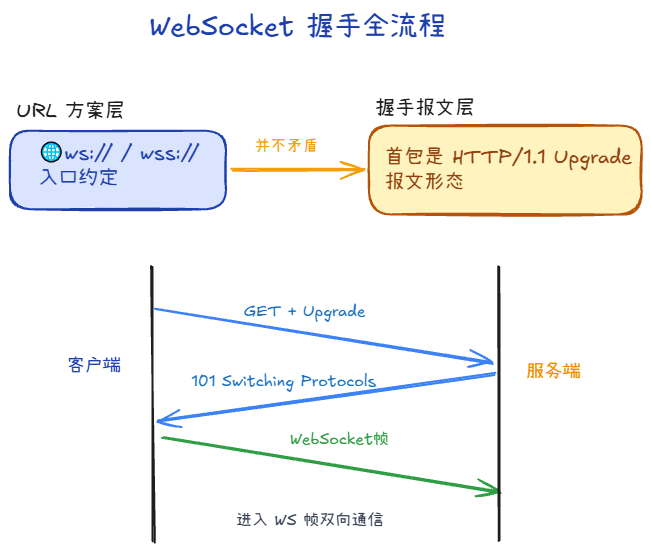
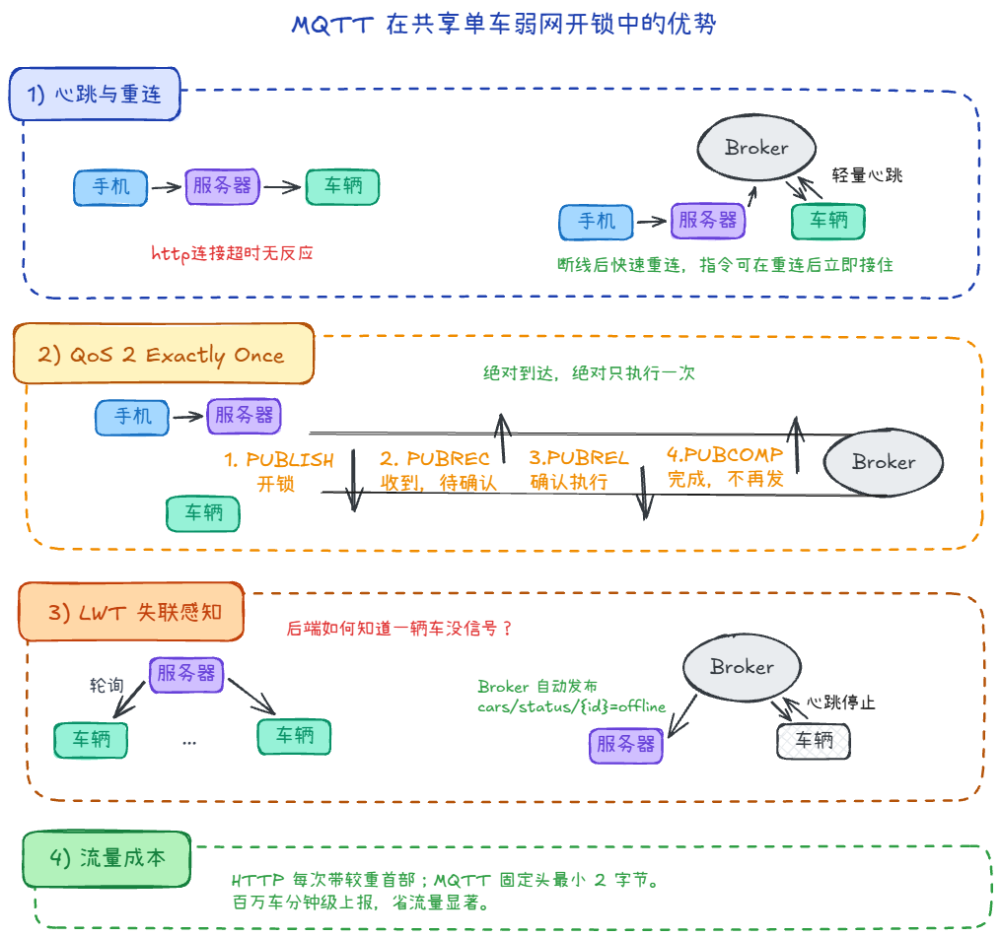
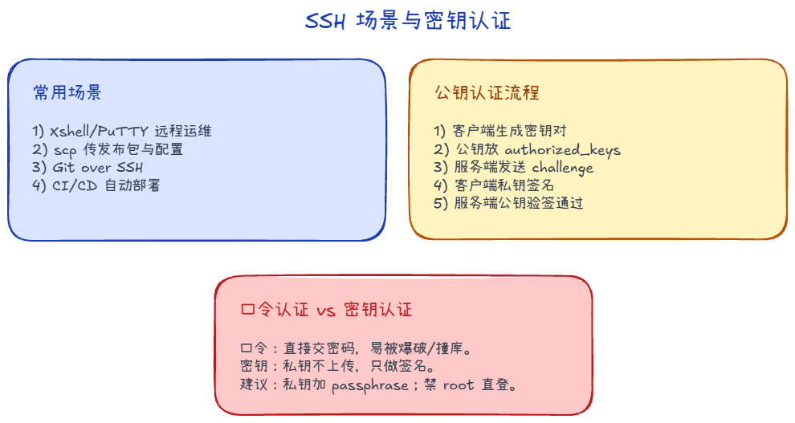

# 长连接与周边协议：WebSocket、MQTT、SSH、FTP/SFTP

本篇把「浏览器里常见的 **WebSocket**」和运维、物联网里常碰的 **MQTT、SSH、FTP/SFTP** 放在同一篇：**各自解决什么问题、和 HTTP 的关系、默认怎么连、容易混的概念**。

---

## WebSocket

**WebSocket** 在**单条 TCP 连接**上提供**全双工、长期保持**的通信，常用于实时通知、协作编辑、游戏等。它**起始于一次看起来像 HTTP 的请求**，通过 **Upgrade** 协商「换协议」。
- **地址**：浏览器里用 **`ws://`**（明文，常走 80）或 **`wss://`**（先 TLS，常走 443）。当前页面是 **HTTPS** 时，一般只能用 **wss://**，否则会被浏览器当作「混合内容」拦截。
- **客户端**：`const ws = new WebSocket('wss://example.com/chat');`，连上后 `ws.send('...')`；收消息用 `ws.onmessage = (e) => { ... }`，还有 `onopen` / `onerror` / `onclose`。

### 「ws 开头」和「仍是 HTTP」分别指什么

两件事不要混为一谈：

- **你写的 `ws://` / `wss://`**：是浏览器 API 里的**资源方案**（告诉客户端走 WebSocket、用哪类端口/是否先 TLS），**不是**在地址栏里写 `http://`。
- **「仍是 HTTP」**：指**同一条 TCP（或 TLS）连接上，握手阶段的第一段字节仍是 HTTP/1.1 形态**——一行请求行、若干首部，用来完成 **Upgrade**；和「URL 用什么 scheme」是两层概念。

为什么握手要长得像 HTTP：同源策略、代理与防火墙对 **80/443** 上的 HTTP(S) 最友好，沿用 **HTTP/1.1 升级**更容易穿透、少踩坑。握手完成后才在同连接上改传 **WebSocket 帧**。

**握手要点**：请求带 **Upgrade: websocket**、**Connection: Upgrade**、**Sec-WebSocket-Key** 等；服务器若同意，返回 **101 Switching Protocols** 与 **Sec-WebSocket-Accept**，之后**同一连接**上传 **WebSocket 帧**。**WSS** 即先 **TLS** 再做上述升级，端口常为 **443**。

### 与长轮询、SSE 的差异

- **长轮询**：仍是反复 HTTP 请求，服务器尽量拖长响应；实现简单，但连接与首部开销大。
- **SSE（Server-Sent Events）**：基于 HTTP，**服务端单向**推流；不适合双向高频场景。
- **WebSocket**：建立后**双向帧**，适合高频双向消息（仍受 TCP 有序、可靠约束）。

### 为何依赖可靠传输

WebSocket 设计在 **TCP** 之上。有序、可靠的字节流便于定义帧边界与重传语义；若用 UDP，要在应用层自己补可靠与排序。

### 调试

调试 WebSocket 可在 **Apifox** 等工具里建项目并添加 WebSocket 接口；浏览器 **DevTools → Network → WS** 可看握手与帧。

---

## MQTT

**MQTT**（Message Queuing Telemetry Transport）是面向 **物联网、弱网、低功耗** 场景的**发布/订阅**消息协议，通常跑在 **TCP** 上，也可加 **TLS**（常称 **MQTTS**），浏览器侧常见 **MQTT over WebSocket** 连 Broker。

### 常用场景

在物联网（IoT）里，设备多、网络差、功耗紧，MQTT 往往比“每次都发 HTTP 请求”更省。

- **智能家居**：灯、传感器经常休眠，IP 也不固定；通过 Broker 做中转，设备上线就能被 App 发现和控制。
- **车联网 / 共享单车**：设备在移动中频繁断网；MQTT 的会话保持与重连机制更适合这类抖动链路。
- **低功耗采集**：野外监测、电池供电设备希望“少发、快发、轻报头”；MQTT 固定报头很小（最小 2 字节）。

### 核心概念

- **Topic（主题）**：类似分层路径（如 `home/living-room/temp`）。发布者往 Topic 发消息，订阅者按 Topic 收消息。
- **QoS（服务质量）**：
  - **QoS 0**：至多一次（发了不重传）。
  - **QoS 1**：至少一次（会重传，可能重复）。
  - **QoS 2**：恰好一次（流程最重，开销最大）。
- **LWT（Last Will）**：客户端连上时预留“遗嘱消息”；若异常掉线，Broker 会代发，便于其他系统感知离线事件。

### 和 WebSocket 的关系

- **WebSocket**：应用层协议，提供浏览器友好的全双工长连接“通道”。
- **MQTT**：应用层协议，定义 Topic、QoS、会话等消息语义。
- **为什么常叠用**：浏览器不直接提供原生 MQTT/TCP API，所以常用 **MQTT over WebSocket**（在 WebSocket 帧里承载 MQTT 报文）。

可把它理解成：**WebSocket 提供管道，MQTT 规定消息规则**。

### 与「消息队列」的区别

| 维度 | MQTT | 消息队列（如 Kafka/RabbitMQ） |
|------|------|-------------------------------|
| 位置 | 网络边缘，连接大量设备端点 | 数据中心内部，连接服务与服务 |
| 侧重点 | 设备连接管理、弱网传输、在线状态 | 吞吐、持久化、削峰、回放、复杂路由 |
| 复杂度 | 轻量，端侧实现成本低 | 能力更重，部署与运维复杂度更高 |
| 关系 | 常作为设备侧入口 | 常作为后端处理管道 |

一句话：**MQTT 偏「链路与设备侧的轻消息总线」**；**消息队列偏「数据中心侧的任务与事件管道」**。二者可并存，不是互相替代关系。

---

## SSH

**SSH**（Secure Shell）用于**加密远程登录**、**安全传文件**（**SFTP/SCP**）、以及**端口转发/隧道**。
它在你的本地电脑和远程服务器之间，建立一条强加密、身份验证且防篡改的通道。有了它，你就像坐在机房里直接操作服务器一样

### 常用场景：你每天都在用

1. **远程运维**：用 Xshell、PuTTY、MobaXterm、Termius 等工具连 Linux 服务器改配置、看日志、重启服务。  
2. **文件分发**：用 `scp` 在本机和服务器间传包（如发布包、证书、配置）；图形化工具常见 WinSCP（底层走 SFTP/SSH）。  
3. **CI/CD 自动化**：GitHub Actions、Jenkins 等通过 SSH 密钥登录服务器执行部署脚本。  
4. **Git 操作**：`git@github.com:...` 本质走 SSH，用密钥证明身份后再拉取/推送。  

### SSH 密钥：为什么“免密登录”更安全？
**口令验证登录**
1. 服务器生成公钥和私钥。
2. 客户端发起连接请求，服务器将公钥发给客户端。
3. 客户端生成口令（服务器密码），并用服务器发来的公钥加密，发送给服务器。
4. 服务器通过私钥解密，拿到口令（服务器密码），如果正确则认证成功。

**密钥验证登录**
1. 客户端生成公钥和私钥，将公钥提前部署在服务器上。
2. 客户端发起连接请求。
3. 服务器随机生成一个字符串，用本地的公钥加密，发送给客户端。
4. 客户端通过私钥解密，将解密后的字符串发送给服务器。
5. 服务器验证本地字符串和客户端发来的字符串的一致性，如果通过，则认证成功

新手往往觉得输密码方便，但 SSH 密钥（Key-based Auth）才是职业选手的标配：
- 私钥（Identity）：相当于你的“印章”，留在你自己电脑里。
- 公钥（Authorized_keys）：相当于你的“印章凹槽”，丢到服务器上。
- 安全性：密码会被暴力破解（Brute Force），但 4096 位的 RSA 密钥在当前算力下几乎不可撼动。而且，私钥永远不经过网络传输，只用来“签名”。

---

## FTP/SFTP

**FTP**（File Transfer Protocol）是经典**文件传输**协议：**控制连接**（常见 **21**）与**数据连接**分离；有**主动/被动（PASV）**模式，被动模式常在防火墙、NAT 上需要**放行数据端口范围**，这是排错高频点。传目录列表、批量传文件等传统场景多；现在很多产品改用 **HTTP(S) 对象存储** 或 **SFTP**。

**SFTP**（SSH File Transfer Protocol）：**不是「FTP + 某层壳」的同一协议**，而是跑在 **SSH** 上的**文件子协议**，通常与 SSH 共用 **22**、同一套认证与加密。名字易混：**FTPS** 才是「**FTP over TLS**」，仍是 FTP 语义加 TLS；**SFTP** 走的是 SSH 栈。

**对比记忆**：

| 名称 | 大致是什么 | 典型端口 | 易混点 |
|------|------------|----------|--------|
| **FTP** | 控制+数据双连接，可明文 | 21 + 数据端口 | 与 SFTP 名字像，协议不同 |
| **FTPS** | FTP + TLS | 990 等 | 仍是 FTP，不是 SFTP |
| **SFTP** | SSH 上的传文件 | 常 22 | 与 FTPS 拼写接近，别写反 |

