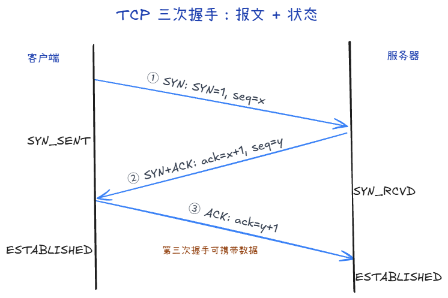
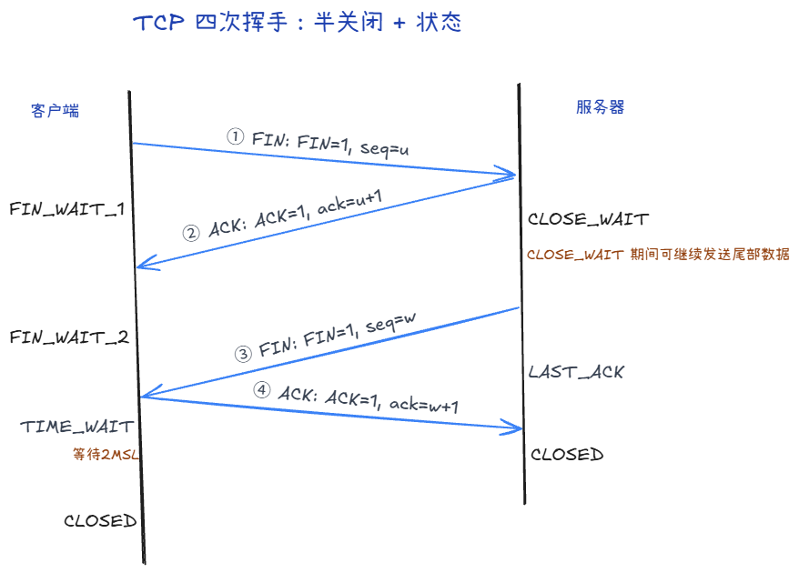
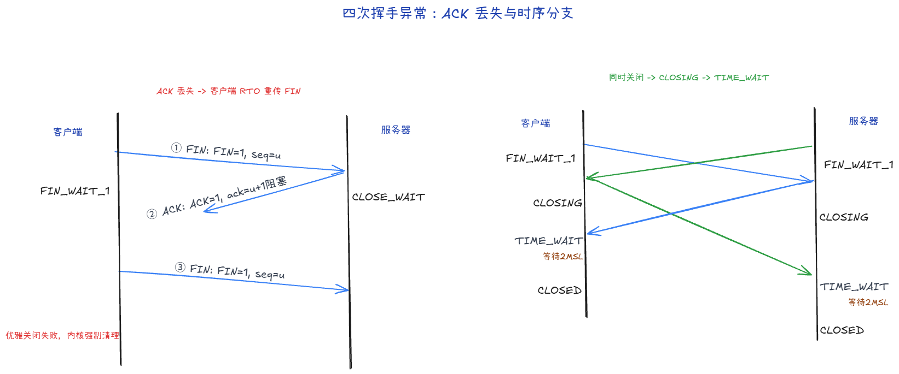

# 3.1 TCP 连接：三次握手、四次挥手与状态机

在网络传输中，TCP（Transmission Control Protocol，传输控制协议）是最重要的一面基石。它为上层应用提供了一种**面向连接的、可靠的、基于字节流**的传输服务。

本篇我们将拆解 TCP 生命中最核心的三个阶段：建立连接（握手）、数据传输中的连接状态、以及断开连接（挥手）。

## 1. 三次握手：建立连接

TCP 的连接过程被称为“三次握手”（Three-way Handshake）。其核心目的是**确认双方的接收和发送能力都正常**，并同步初始序列号（Sequence Number）。

你可以把三次握手想象成两个人用对讲机建立通信的过程：

1. **第一次握手（SYN）**
   - 客户端 发送：`SYN=1, seq=x`
   - 客户端 进入 SYN_SEND 状态
   - 对白：“服务器你好，我想建立连接，我的初始通话序号是 x。”
   - 目的：客户端测试自己的**发送**能力和服务器的**接收**能力。
2. **第二次握手（SYN + ACK）**
   - 服务器 发送：`SYN=1, ACK=1, ack=x+1, seq=y`
   - 服务器 进入 SYN_RECV 状态
   - 对白：“收到你的请求（ack=x+1）。我也想和你建立连接，我的初始序号是 y。”
   - 目的：服务器测试自己的**发送和接收**能力，同时让客户端知道它的接收和发送都正常。
3. **第三次握手（ACK）**
   - 客户端 发送：`ACK=1, ack=y+1`
   - 客户端 进入 ESTABLISHED 状态，服务端 接收到ACK后 也进入 ESTABLISHED 状态
   - 对白：“收到你的确认。我们开始通信吧！”
   - 目的：客户端向服务器证明自己的**接收**能力也正常。

**为什么不是两次？**
如果只有两次，服务器在回答“收到”之后，并不知道客户端是否真正听到了这句话。如果此时网络延迟导致一个早期的废弃连接请求突然到达，服务器会直接建立连接并傻等数据，白白浪费资源。

**三次握手过程中可以携带数据吗？**
标准的 TCP 握手中，前两次由于安全和防止洪水攻击的考虑不能带数据，而第三次握手时连接对客户端已建立，可以合法携带数据

**如果第三次握手的包丢失，但客户端已经开始传数据包，能成功吗？**
可以。TCP 报文头中有一个 ACK 控制位。除了第一次握手的 SYN 包外，后续几乎所有的 TCP 报文都会将该位置为 1。
即使纯 ACK 确认包丢了，客户端紧接着发送的数据包中同样包含了 ACK=1 和正确的确认号。服务端接收到这个数据包后，发现确认号正是自己期待的，就会直接从 SYN_RCVD 切换到 ESTABLISHED 状态。

## 2. 四次挥手：断开连接

与建立连接不同，断开连接需要“四次挥手”。这是因为 TCP 是**全双工**的（双方都可以同时收发数据），断开时必须允许**半关闭（Half-Close）**状态：一方说“我不发了”，但还可以继续“听”对方说完。

四次挥手的经典对白如下：

1. **第一次挥手（FIN）**
   - 客户端 发送：`FIN=1, seq=u`（可带最后一段数据）
   - 客户端 进入 FIN_WAIT_1 状态
   - 对白：“我的数据发完了，请求关闭我这一侧的发送方向。”
   - 目的：发起**半关闭**：本端不再发新数据，但仍可收对方数据。
2. **第二次挥手（ACK）**
   - 服务器 发送：`ACK=1, ack=u+1`
   - 服务器 进入 CLOSE_WAIT 状态；客户端 收到后进入 FIN_WAIT_2
   - 对白：“收到你的 FIN，我知道你要关发送了。”
   - **注意**：服务器可能还有数据没发完，所以先 ACK「稳住」，把剩余数据发完，再准备自己的 FIN。
3. **第三次挥手（FIN）**
   - 服务器 发送：`FIN=1, seq=w`（数据发完后）
   - 服务器 进入 LAST_ACK 状态
   - 对白：“我也发完了，请求关闭我这一侧的发送方向。”
4. **第四次挥手（ACK）**
   - 客户端 发送：`ACK=1, ack=w+1`
   - 客户端 进入 TIME_WAIT 等待 2MSL 后进入 CLOSED；服务器 收到后进入 CLOSED
   - 对白：“收到你的 FIN，连接可以彻底收尾了。”
   - 目的：对被动关闭方而言，收到最后 ACK 后本端关闭；主动关闭方还要经历 **TIME_WAIT**

### 如果第二次挥手的 ACK 没到客户端，会怎样？

1. 客户端等 ACK、按 RTO 重传 FIN

- 状态：**FIN_WAIT_1**（对「自己的 FIN 是否被对方确认」心里没底）。
- 行为：超时后按 **RTO** 认为「FIN 或对端 ACK 可能丢了」，会**重传同一条 FIN**（对端若已收过，会当重复 FIN 处理）。
- 退出：重传与等待不是无限的；若长期得不到有效回应，连接会由内核会强制清理该连接状态。

2. 和「服务端先发自己的 FIN」别混

- 服务端在 **CLOSE_WAIT** 里把数据发完后，会发 **自己的 FIN**（第三次挥手），进入 **LAST_ACK**（这是**服务端**状态，不是客户端状态）。
- 客户端若在 **FIN_WAIT_2** 收到对端 FIN：应 **ACK** 后进入 **TIME_WAIT**。
- 若在 **FIN_WAIT_1** 就收到对端 FIN（双方几乎同时关）：会走**同时关闭**路径，可能进入 **CLOSING** 等状态；这是另一类时序，不要和「单纯第二次 ACK 丢了」绑死成一句话。

**收束**：第二次挥手的 ACK 丢了，不等于关不上；常见结局是 **客户端重传 FIN + 服务端再 ACK**，或后续 **FIN/ACK** 把状态机继续往前推。

## 3. 常见状态机提要

在整个握手、数据传输和挥手过程中，TCP 连接会经历不同的状态。作为开发者，通过 `netstat` 或 `ss` 命令定位问题时，最常看到以下几种状态：

- **LISTEN**：服务器正在监听某个端口，等待客户端的连接请求。
- **ESTABLISHED**：连接已成功建立，双方正在愉快地互传数据。这是最正常、最期望的状态。
- **CLOSE_WAIT**：被动关闭方（通常是收到报文后）的状态。意思是“我已经收到对方的关闭请求了，等我上层应用处理完当前事务后，我就会发送关闭请求”。如果服务器出现大量 `CLOSE_WAIT`，通常是**代码里忘记显式调用 `close()` 关闭连接**。
- **TIME_WAIT**：主动关闭方（发送了最后一个 ACK 的那一方）最后会进入的状态。它必须在这个状态停留 **2MSL（Maximum Segment Lifetime，报文最大生存时间，通常是 1-2 分钟）** 后才真正消失。

> **经典面试题：为什么需要 TIME_WAIT 等待 2MSL？**
> 1. **保证最后的 ACK 成功到达**：如果客户端发的最后一条 ACK 丢了，服务器会重传 FIN。停留在 TIME_WAIT 状态可以让客户端有时间从容应对，重发 ACK，确保服务器能够正常关闭。
> 2. **防止旧连接的报文混淆新连接**：经历 2MSL 的时间后，网络中该连接产生的所有旧报文都会自然消亡（因为寿命耗尽），这就保证了在下次使用相同端口建立新连接时，不会收到上一次连接残留的幽灵数据。
