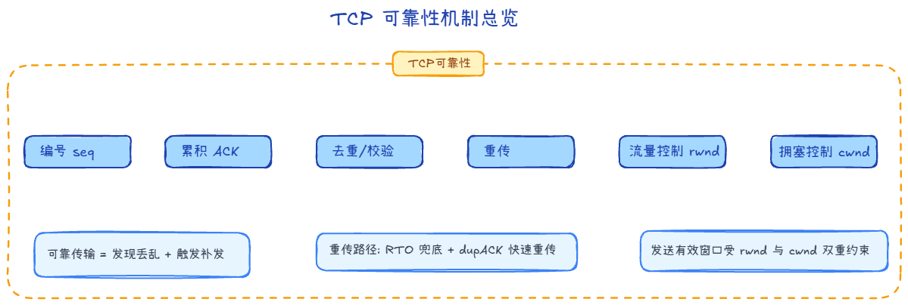
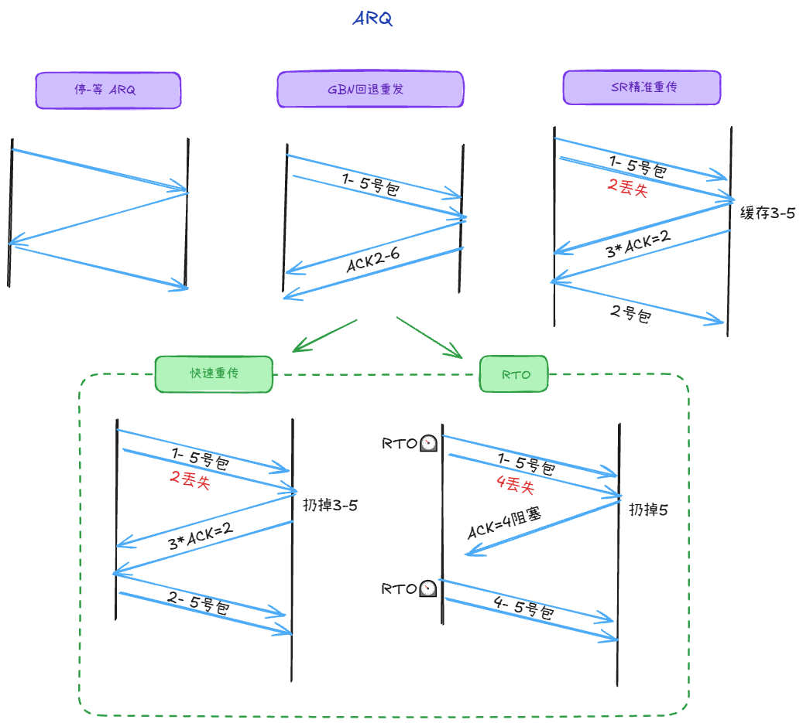
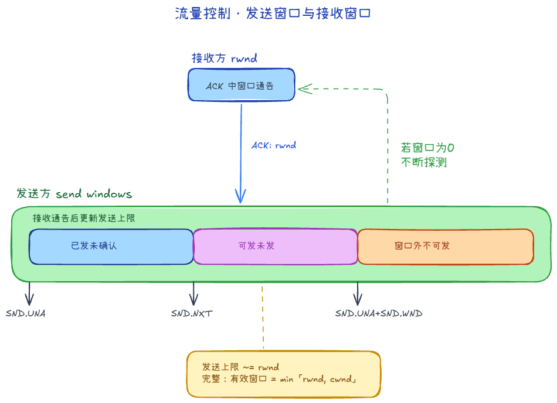
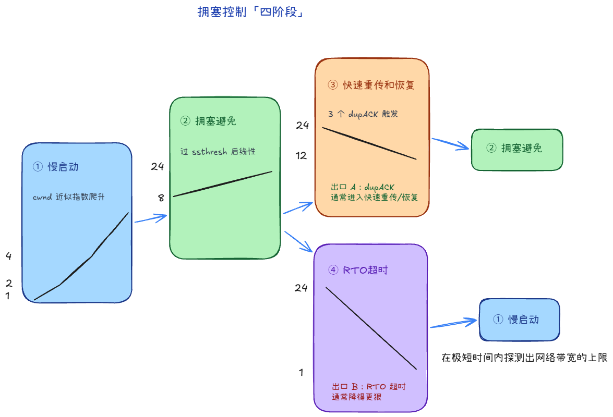

# 3.2 TCP 可靠性与拥塞控制

TCP 最引以为傲的特性就是**可靠传输**。它甚至被称为“把不靠谱的网络（IP 层）变成了靠谱的网络”。为了做到这一点，TCP 在底层默默做了大量脏活累活。

本篇侧重直觉和概念，解释 TCP 是如何保障数据有序到达，如何防止发得太快撑爆接收方，以及如何避免把整张网络堵死的。

## 1. TCP 如何保证「传输可靠」？

IP 层只管尽力投递，不保证不丢、不乱、不坏。**TCP 在端到端上**用一套机制把字节流变得可靠，核心可以概括成几条：

- **编号**：每个字节有**序列号**，接收方能判断缺了谁、谁重复了。
- **确认**：接收方用 **ACK** 告诉发送方「我连续收到哪里了」（**累积确认**）。
- **差错与去重**：靠序号发现重复或乱序，丢弃重复、缓存乱序等待拼齐（实现上还有校验和等）。
- **重传**：收不到期望的确认时，发送方**再发**——这就是 **ARQ** 的路子；TCP 里主要靠 **超时重传** 和后面的 **快速重传**配合。
- **流量控制**：发送方不会发送速度太快，导致接收方缓冲区溢出。
- **拥塞控制**：发送方不会发送速度太快，导致网络拥塞。

一句话：**先能发现丢/乱，再能要求对方重发或自己补发**，可靠性才站得住。

## 2. 数据不丢不乱的基础

### 2.1 序号与确认号
TCP 把应用层交给它的数据打断成一个个的数据段（Segment）。为了保证到达后能拼回原样，TCP 给每一个字节都编上了号，这是**序列号（Sequence Number）**。

接收方收到数据后，会回复一个**确认号（Acknowledgment Number）**，它的意思是：“我期望收到的下一个字节序号是这个”。这被称为**累积确认**。
*举例*：接收方回复 `ACK=1001`，隐含的意思是：“序号 1000 及之前的所有数据我都安全无误地收到了。”

### 2.2 校验和与去重
- **校验和**：接收方收到数据后，会计算校验和，如果校验和不正确，则丢弃数据。
- **去重**：如果网络只是延迟，导致发送方误判重传了数据，接收方最后收到了两份一样的数据。接收方会根据“序号”一眼识破，把多余的丢弃。

## 3. ARQ 协议

**ARQ（Automatic Repeat reQuest，自动重传请求）** 通过**确认（Acknowledgment, ACK）和超时（Timeout）**这两个机制，在检测到错误或丢失时自动重新发送数据的策略

1. 停止-等待 ARQ (Stop-and-Wait)这是最原始、最简单的模式。
- **逻辑**：发送方发一个包，然后停下来等 ACK。收到 ACK 后，再发下一个包。
- **缺点**：极度低效。如果往返时延（RTT）很大，大部分时间管道都是空的。就像你在 B 站发一条动态，非要等到第一个粉丝点赞才发第二条，更新效率太低。

2. 后退 N 帧 ARQ (Go-Back-N, GBN)为了提高效率，引入了滑动窗口的概念。
- **逻辑**：允许发送方连续发送 N 个包而无需立刻等待确认。
- **丢包处理**：如果中间第 3 个包丢了，即便后面的 4、5 号包安全到达，接收方也会丢弃它们，并要求发送方从 3 号包开始全部重传。

3. 选择性重传 ARQ (Selective Repeat, SR)这是目前最主流的实现方式（也是 TCP 的核心思路）。
- **逻辑**：接收方会缓存乱序到达的包（比如收到了 4、5，但没收到 3）。
- **精准重传**：发送方只重传那个真正丢失的第 3 号包，而不是把后面的全都重发一遍。
- **优势**：极大地提高了带宽利用率，特别是在链路抖动频繁的物联网（MQTT）或移动网络环境中。

### 3.1 超时重传（RTO）

RTO 是 ARQ 里的一种“触发重传”的手段

发送方发出一段数据后，会维护**重传定时器**。若在 **RTO（Retransmission Timeout，重传超时时间）** 内没收到对这段数据的**有效确认**，就认为**可能丢了**（也可能是 ACK 丢了，发送方无法区分，往往只能重传）。

要点：

- **RTO 不是固定值**：它会根据往返时间 **RTT** 的测量结果**动态估算**，网络快则更短，网络慢则更长，避免过早重传或傻等太久（具体算法如 **Jacobson/Karels** 等，实现因系统而异）。
- **与重复 ACK**：若只是**个别包**丢了，接收方会发**重复 ACK**相同的确认号，触发**快速重传**，往往比等 RTO 更快；RTO 更像是「兜底」的最后手段。

## 4. 流量控制：别撑爆接收方 (滑动窗口)

**流量控制（Flow Control）** 解决的是**发送方和接收方处理能力不匹配**的问题。  
如果发送方发得太快，接收方来不及把数据从 TCP 缓冲区交给应用层，缓冲区就会被打满，最终导致丢包和无效重传。

为了解决这个问题，TCP 引入了滑动窗口机制。要顺畅理解它，我们需要分三步走：先了解发送方怎么知道还能发多少（接收窗口与发送窗口），再看发数据的过程中窗口是如何动态变化的（滑动机制），最后看看极端情况如何处理（零窗口）。

### 4.1 接收窗口与发送窗口的概念

首先，如何将“接收方的剩余接收能力”告诉“发送方”呢？

- **接收窗口（`rwnd`：Receive Window）**：由接收方给出。它会在回复的 ACK 报文里附带一个值，告诉对端：“我的缓冲区现在最多还能接收这么多字节”。此值会随着缓冲区被应用层读取或逐渐填满而动态变化。
- **发送窗口（Send Window）**：由发送方自己维护。它表示“我现在最多还能再发多少未被确认的数据额度”。

**这俩是什么关系？** 发送方的能力上限受制于接收方。所以：
`发送窗口上限 ≈ rwnd` 
*(注：如果后续结合拥塞控制，真正的发送窗口上限是 `min(rwnd, cwnd)`，也就是同时受限于接收方和网络当前状况。)*

### 4.2 滑动机制：窗口是怎么“滑”的？

SND.WND：发送窗口大小。
SND.UNA：Send Unacknowledged 指针，指向发送窗口的第一个字节。
SND.NXT：Send Next 指针，指向可用窗口的第一个字节。

了解了上限后，发送方就可以在这个额度内发数据了。我们可以建立一个“账本”视角：

假设当前发送窗口上限是 `8000` 字节。
发送窗口内部其实框住了两部分数据：**已发送但还未收到确认的数据** + **允许发送但目前还没有发送的数据**。
它的左右边界是动态变化的：
- **左边界**：指向最早未被确认的数据序号（如 `SND.UNA`）。
- **右边界**：指向目前允许发送的最高序号（`SND.UNA + SND.WND`）。

**滑动的过程本质上是推进：**
1. **消耗额度**：发送方发了 `5000` 字节出去，虽然还没收到 ACK，但它知道自己当前还可以再连着发 `3000` 字节。
2. **左边界右移**：随后收到了其中 `2000` 字节的 ACK 确认，这意味着这部分数据正式安全抵达。发送窗口的左边界立刻向右滑动，释放掉这部分空间。
3. **右边界右移**：通过最新收到的 ACK，接收方可能通告了新的 `rwnd` 大小。发送方重新计算上限，将窗口右边界也随之右移。
于是，额度恢复并持续更新，发送方又可以继续把后续的字节排队发出去。这就是窗口不断往前“滑动”的画面。

### 4.3 极端情况：零窗口与窗口探测

如果接收方的应用层因为太忙（比如在处理高密度计算），一直没有从操作系统缓冲区读数据，会导致缓冲区逐渐填满。此时接收方回传的 ACK 里会赫然写着：`rwnd = 0`。

此时发送窗口的发送额度也会收缩为 0，发送方必须停止发送一切普通数据，陷入**零窗口等待**。

打破这个死锁僵局的方法是：当发送方发现窗口为 0 后，会启动一个定时器，开始周期性地发送**窗口探测报文（Zero Window Probe）**，去“敲门”询问接收方：“你那边腾出位置了吗？”如果接收方终于有了空间，就会回复一份非零窗口的通告，原本冻结的滑动窗口就能重新运转起来了。

一句话：流量控制关注的是**对端接收能力**，目标是“不把接收方撑爆”。

## 5. 拥塞控制：别撑爆全网 (四大算法)

流量控制只看“对端主机”，而**拥塞控制（Congestion Control）**看的是“整条网络路径”。  
即使接收方很强，如果中间路由器队列已经爆满，继续猛发也会造成排队、丢包、重传风暴，吞吐反而下降。

TCP 用拥塞窗口 `cwnd` 来约束发送速率，并遵循一个核心规则：

`实际可发送窗口 = min(rwnd, cwnd)`

也就是说，发送方同时受接收方能力（`rwnd`）和网络承载能力（`cwnd`）双重限制。

### 5.1 慢启动（Slow Start）

新连接刚建立时，发送方并不知道网络容量。  
所以先从较小的 `cwnd` 起步，每收到一轮 ACK 就快速增大（近似指数增长），尽快探到“可用带宽区间”。

### 5.2 拥塞避免（Congestion Avoidance）

当 `cwnd` 增长到阈值 `ssthresh` 附近后，继续指数增长风险太高，就改为线性增长（每个 RTT 大约 +1 MSS），更谨慎地逼近网络极限。

### 5.3 快重传与快恢复（fast retransmit and recovery，FRR）

接收方若连续收到乱序数据，会回同一个确认号的**重复 ACK**。  
发送方通常在收到 3 个重复 ACK 后，不再等待 RTO，直接重传疑似丢失的那段数据，从而显著缩短恢复时间。

发生快速重传后，TCP 通常不会把 `cwnd` 直接打回最小值（那样太激进），而是“减速但不停摆”：降低到一个更保守的水平，然后进入拥塞避免，继续传输。

### 5.5 超时与拥塞信号的区别

- **3 个重复 ACK**：通常表示“有丢包，但网络仍在转”，可以快速重传并温和降速。
- **RTO 超时**：通常表示“拥塞更严重或路径异常”，需要更强烈地收缩发送窗口，再重新试探。

一句话：拥塞控制关注的是**网络整体健康**，目标是“不把公路堵死”。

