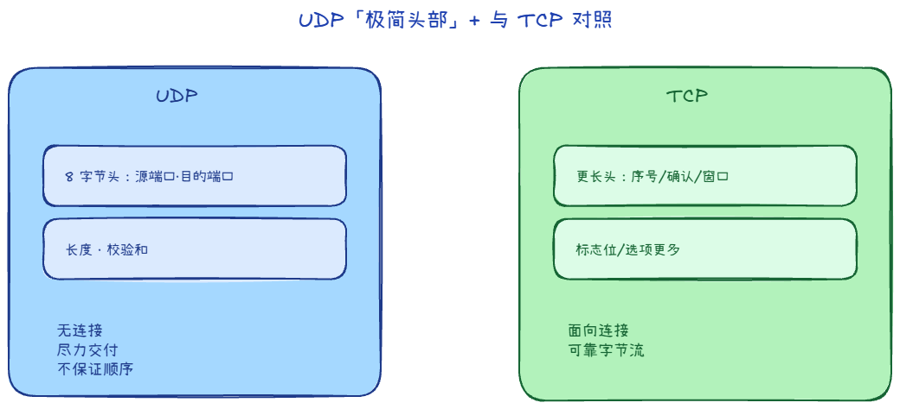
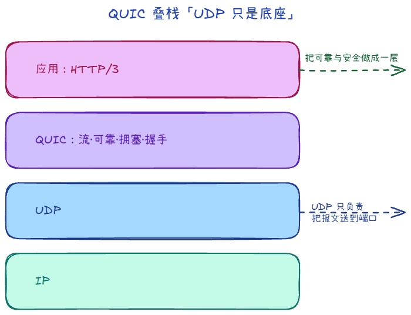
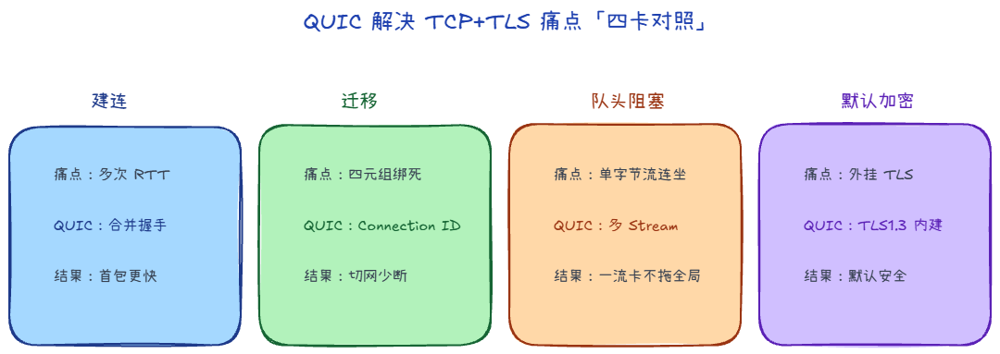

# 3.3 UDP 与 QUIC

在传输层，如果说 TCP 是个细心、事必躬亲的管家，那 **UDP（User Datagram Protocol，用户数据报协议）** 就是一个极简主义的快递员——收件、发件，然后头也不回地离开。

## UDP 长什么样：极简之美

相比于 TCP 复杂的握手、确认、窗口和拥塞控制，UDP 崇尚无连接和尽力交付。

- **无连接**：UDP 不需要什么三次握手。只要知道对方的 IP 和端口，抓起数据就往外扔。
- **尽力交付**：发送方不管数据丢没丢、乱没乱序，收到什么就是什么。
- **头部极其单薄**：TCP 的头部通常要 20 个字节起步，而 UDP 的头部只有区区 **8 个字节**（源端口、目的端口、长度、校验和）。

既然 UDP 不保证可靠性，那万一数据必须要可靠怎么办？答案是：**把活交给应用层自己干**。

### 1. 典型用途：为什么大家都爱用 UDP？

在一些特定场景下，UDP 的“简陋”反而成了它最大的优势——**快、没有包袱、实时性高**。

常见选用 UDP 的主要场景：

1. **DNS 查询**：
   向 DNS 服务器询问域名 IP 时，一问一答，数据量极小。如果用 TCP，还得先三次握手，太浪费时间了。丢包了大不了几百毫秒后再查一次。
2. **实时音视频（WebRTC / 直播会议）**：
   在视频通话时，实时性大于绝对可靠性。偶尔丢一两帧数据，画面卡顿一瞬或者飘过一点马赛克，人眼是可以容忍的。但如果用 TCP 卡在重传上，画面会停滞几秒钟，这就是灾难体验了。
3. **在线竞技游戏**：
   FPS 射击游戏和 MOBA 游戏对延迟极其敏感。玩家的位置和操作每秒都在高频更新，当前帧丢了无所谓，因为下一帧立马就发过来了。重传旧帧反而没有任何意义。

### 2. 选型：何时倾向 TCP、何时 UDP？

作为开发者在做架构设计时，网络选型的直觉常常如下：

- **选 TCP**：
  当你需要数据**百分之百、按顺序到达**，且对偶尔的高延迟（网络突发抖动引入重传）不那么敏感时。绝大多数日常应用（网页浏览 HTTP、文件传输 FTP、邮件通信 SMTP、数据库连接）均使用 TCP。
- **选 UDP**：
  当你需要**最低的延迟**，且应用自己能够容忍少量丢包（或者应用层自己实现重传机制）时。如多媒体流、物联网小数据高频上报、广播分发。

## QUIC 的上位

如果把 TCP 比作“内核里内置的一整套可靠传输机器”，那 **QUIC** 可以理解为：  
**把这套机器搬到用户态，并跑在 UDP 之上**。

很多人第一次听到会困惑：既然 UDP 不可靠，为什么 QUIC 还要基于 UDP？  
核心原因是：**为了绕开 TCP 在内核协议栈里的历史包袱，更快迭代传输层能力**。

### 1. 为什么弃用 TCP 拥抱 UDP？

- 队头阻塞（Head-of-Line Blocking, HOLB）：这是 TCP 多路复用的致命伤。在同一个 TCP 连接中，如果一个数据包丢失，后续所有包都必须在缓冲区等待重传，即便它们属于不同的流。QUIC 通过在 UDP 上实现独立的流（Stream），做到一个流丢包不影响其他流。
- 僵化的三次握手：TCP + TLS 1.3 至少需要 1-3 个 RTT 才能开始传数据。QUIC 结合了加密与传输握手，在 0-RTT 或 1-RTT 下即可发送业务报文。
- 网络切换断连：TCP 靠「四元组」（源IP、源端口、目的IP、目的端口）识别连接。当你从 Wi-Fi 切换到 5G 时，IP 变了，TCP 连接必须断开重连。

### 2. QUIC 解决了 TCP+TLS 的哪些痛点

1. **更快建连（低握手时延）**  
   - **痛点**：`HTTP/2(TCP+TLS)` 建连要走两套流程：先 TCP 三次握手，再 TLS 握手。首次访问通常要多个 RTT，弱网下首包等待明显。  
   - **QUIC 做法**：把传输握手和加密握手合并。首次连接通常 `1-RTT`，会话恢复时可 `0-RTT` 发送早期数据。  
   - **结果**：首包更快、页面和接口冷启动更短；RTT 越高，体感收益越明显。

2. **连接迁移（Connection Migration）**  
   - **痛点**：TCP 连接绑定四元组（源/目的 IP+端口），Wi-Fi 切 4G 时常常需要断开重连。  
   - **QUIC 做法**：连接用 `Connection ID` 标识，不死绑底层 IP/端口。网络路径变化后，逻辑会话仍可延续。  
   - **结果**：弱网切换场景下，中断更少，长连接体验更稳。

3. **缓解队头阻塞（Head-of-Line Blocking）**  
   - **痛点**：TCP 是严格有序字节流。前面一个段丢失时，后续数据即使到达也要等待，HTTP/2 多路复用仍会被底层 TCP 连坐。  
   - **QUIC 做法**：同一连接内使用多个独立 `Stream`，按流分别排序和重传。  
   - **结果**：一个流丢包通常只影响该流，不会拖慢整条连接上的所有业务。

4. **默认加密**  
   - **痛点**：TCP 本身不加密，安全能力依赖外挂 TLS。  
   - **QUIC 做法**：与 TLS 1.3 深度集成，连接建立阶段就进入加密语义。  
   - **结果**：默认安全、实现路径更统一，减少“先连通后加密”的历史负担。

