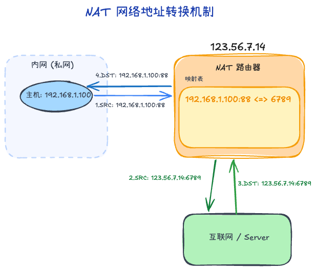
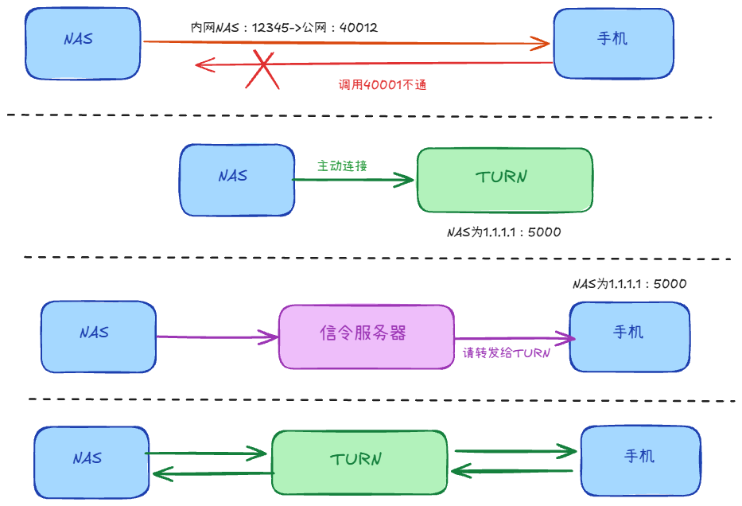

## NAT（网络地址转换）
为缓解 IPv4 地址迅速枯竭的问题，**NAT (Network Address Translation)** 技术应运而生。NAT 的核心原理是让局域网（私网）内的多台设备共享少量公网 IP，甚至是单一个公网 IP 来访问外部网络。

### 1. 核心机制（NAPT 端口复用）
在家用和企业内网最常用的是 **NAPT（网络地址端口转换 / PAT）**：
- **出站规则**：私网主机 `192.168.1.100` 借助端口 `12345` 访问外网。NAT 路由器（如光猫）会拦截该数据包，将其源 IP 和源端口替换为自己的 `公网IP:6789`，并在其内置的 **NAT 映射表**中记录一条映射：`192.168.1.100:12345 -> 8.8.8.8:53，经 NAT 映射为 公网IP:6789`。
- **入站规则**：外网服务器将响应数据发回到 `公网IP:6789`，NAT 路由器查阅刚才登记的映射记录做反向地址转换，极准确地转发回给私网内的 `192.168.1.100:12345`。

这就是一个公网 IP 支持成百上千手机电脑上网的核心秘密。

### 2. 带来的复杂问题：NAT 穿透 (NAT Traversal)
**痛点分析**：NAT 破坏了互联网本来应有的“端到端通信”原则。隐藏在 NAT 后面的主机只对外部发起连接有效。如果外部网络想主动联系 NAT 内的主机是被拒绝的，因为 NAT 映射表中没有记录。这对 P2P 下载、WebRTC 实时音视频通信来说是硬伤。

**NAT 类型**

全锥型（Full Cone）：
  - 所有从同一内网 IP 和端口发出的请求都映射成同一公网 IP 和端口
  - 映射建立后，任何外部主机都可通过这个 IP:Port 与内网通信
  - 打洞**最容易**：映射稳定，且外部来源限制最少；只要映射已建立，任意对端都更容易回包

受限锥型（Restricted Cone）：
  - 只有内网发过请求的外部 IP 才能响应
  - 打洞**较容易**：映射通常稳定，但回包要求“外部 IP 必须先被内网联系过”，需要先做地址交换与探测

端口受限锥型（Port Restricted Cone）：
  - 只有内网发过请求的外部 IP:Port 才能响应
  - 打洞**中等偏难**：限制从 IP 收紧到 IP:Port，双方必须更精准地同时向对端目标端口发包，成功窗口更窄

对称型（Symmetric）：
  - 内网向不同外部 IP/Port 发请求时，会为每个映射一个新的公网 IP:Port；
  - 且只能收到特定目标的返回
  - 打洞**最难**：映射与目标强绑定，目标一变公网映射端口也可能变化，端口不可预测，P2P 打洞成功率最低，常需 TURN 中继

**常见对策（穿透）**

- **STUN（优先尝试 P2P 直连）**  

  主机通过公网 STUN 服务器获取自己当前 NAT 映射后的公网 `IP:Port`，再与对端交换地址并打洞。
  1. NAS 与手机分别向 STUN 注册，获取各自公网 `IP:Port`。
  2. 双方通过信令服务器交换对端地址信息。
  3. 双方几乎同时向对端公网地址发包，在各自 NAT 上建立映射。
  4. 若打洞成功，后续走 P2P 直连；若在同一局域网，可直接内网通信。

- **为什么对称 NAT 下 STUN 容易失败**  

  对称 NAT 的映射与“目标地址”强绑定：同一内网源端口访问不同目标时，公网映射端口可能变化。
  - 连 STUN 时：`内网A:12345 -> 公网A:40001`（目标=STUN）
  - 连对端 B 时：`内网A:12345 -> 公网A:40123`（目标=B）
  因此 A 告诉 B 的 `40001` 往往不是对 B 可用的端口，打洞成功率显著下降。

- **TURN（直连失败的兜底）**  

  TURN 不依赖双方互相命中端口，而是让双方都主动连接同一公网中继。
  1. A、B 分别与 TURN 建连（通常 NAT 允许出站连接）。
  2. TURN 为双方分配中继地址并维护会话。
  3. 数据路径变为 `A -> TURN -> B`（反向同理）。
  即使双方处于对称 NAT，也可稳定通信；代价是增加时延与中继带宽成本。
