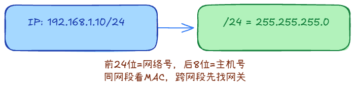
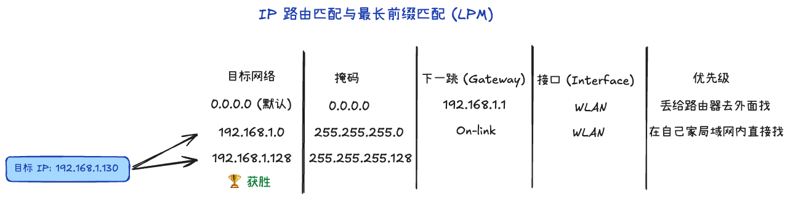
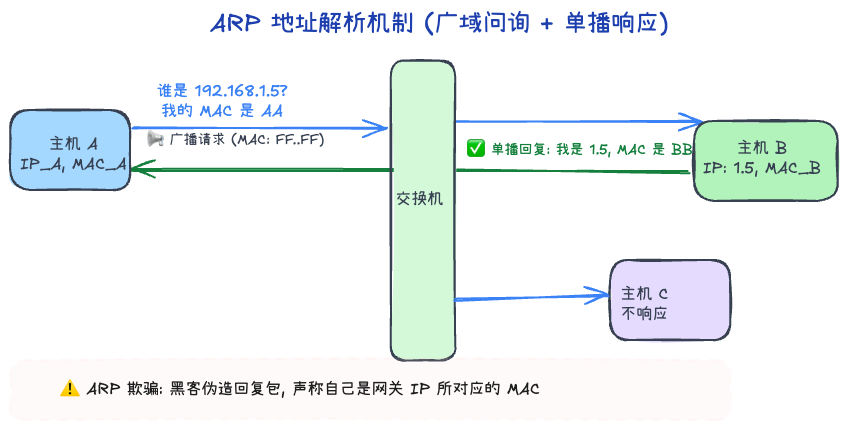
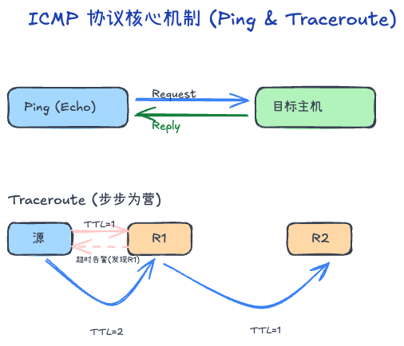

# 4.1 网络层：IP、ARP 与 NAT

## 1. 核心定位：为什么要有网络层？
网络层（Layer 3）解决的核心问题是：**“数据包从源节点到目的节点，应该怎么走？”**
- **数据链路层 (L2)** 关注局域网内的“邻居通信”（依靠 MAC 地址）。
- **网络层 (L3)** 关注跨越多个异构网络的“端到端通信”（依靠 IP 地址）。
- **核心任务**：
  - **路由选择（Routing）**：决定数据包该走哪条路径。
  - **分组转发（Forwarding）**：将数据包从路由器的一个输入接口按路由表转移到合适的输出接口。

#### 扩展：交换机 (L2) vs 路由器 (L3)
| 特性 | 交换机 (Switch) | 路由器 (Router) |
| :--- | :--- | :--- |
| **工作维度** | 局域网内部（同一网段） | 跨网络之间（不同网段） |
| **转发依据** | **MAC 地址表** | **路由表 (IP)** |
| **隔离能力** | 隔绝冲突域，不隔绝广播域 | **隔绝广播域**（抑制广播风暴） |
| **比喻** | 教学楼内的**楼梯/走廊** | 校园大门的**传达室/路标** |

---

## 2. IP 路由与选路机制
网络层最重要的数据结构是路由表，而实现转发的基石是路由选择算法。

### 2.1. IP

如果把互联网比作物流系统，IP 地址就是每个包裹上的收件详细地址。它的核心作用有两个：

1. 标识身份（定位）：在茫茫的互联网设备中，给每一台机器（或接口）一个唯一的逻辑编号。你知道了 IP，就等于知道了个包裹该送到哪座城市的哪条街。
2. 跨网寻址（中转）：数据包不是一下就能飞到目的地的，它需要经过很多中继站。IP 头部包含了原地址和目标地址，中转站（路由器）就是靠看 IP 地址来决定下一步怎么走。

IP分类：

- **IPv4**：32 位（4 字节），点分十进制表示（如 `192.168.1.1`）。地址空间约 43 亿个，已枯竭，目前高度依赖 NAT 转换。
- **IPv6**：128 位（16 字节），冒号十六进制表示（如`2001:0db8:85a3:0000:0000:8a2e:0370:7334`）。地址数量多到可以给地球每粒沙子分配一个 IP。原生支持安全协议且不再需要 NAT，报头更简化。

#### 子网掩码 (Subnet Mask) 与逻辑组成
IP 地址在逻辑上分为 **网络号 (Network ID)** 和 **主机号 (Host ID)**。子网掩码的作用就是：**划出这两者之间的分界线。**

- **计算逻辑（重要）**：
    - **逻辑与（AND）运算**：将目标 IP 与自己的子网掩码进行按位与，结果即为 **网络地址（Network Address）**。
    - **意义**：计算机依靠此结果判断目标是否在“同一家属院”。如果是同网段，直接二层发包；如果不同，则将包丢给**默认网关（路由器）**。
- **比喻**：就像地址里的“省市区”与“门牌号”。掩码告诉路由器，IP 地址中哪些部分是用来找路的（网络路径），哪些部分是用来找人的（具体主机）。
- **CIDR 表示法**：常见的 `/24` 代表掩码前 24 位全是 `1`（即 `255.255.255.0`）。前缀越长，网络范围越小。

### 2.2 路由表
如果 IP 是地址，那么路由表就是路由器手里的地图或者十字路口的路标。

每台路由器（甚至你的电脑）里都存着一张表，当它收到一个数据包时，会去表里查：

- 目的地：我要去 192.168.1.0 网段。
- 出口（接口）：你应该从 ETH0 那个网口出去。
- 下一跳（网关）：你应该交给隔壁那个 IP 为 10.0.0.1 的路由器

**核心属性**
1. 目标网络：目的IP所在的网段
2. 掩码：决定了网段的大小（精度），匹配时遵循最长前缀规则。
3. 下一跳：数据包交给哪台路由器中转，目的地若在本地则为直连。
4. 接口：数据包离开本设备时所通过的物理或逻辑端口（如 eth0, WLAN）。
5. 优先级（Metric）：路径的成本。匹配相同网段时，优先选择度量值更小的路径。

**最长前缀匹配（Longest Prefix Match）**

为了保证网络的灵活性，IP 分配通常有子网划分，这就引入了**最长前缀匹配**规则。

如果路由树中有多个目的网段能够匹配该 IP，路由器会选择**掩码最长（即网络前缀最长、最具体）**的一条路由，因为掩码越长表示目标范围越精确。

#### 直连路由
路由器接口配置 IP 后自动生成的记录。目标就在本地局域网，不需要中转，直接送达。

#### 默认路由
目的网络为 `0.0.0.0/0`，是优先级最低的保底方案。当其他具体路由都不匹配时，数据包将发往此“分拣中心”（默认网关）。

---

## 3. ARP 协议（地址解析协议）

#### IP 与 MAC 的逻辑映射关系
如果说 IP 是**逻辑地址**（收件人姓名/行政区划），那么 MAC 地址就是**物理地址**（工位编号/生而唯一的指纹）。

| 特性 | IP 地址 | MAC 地址 |
| :--- | :--- | :--- |
| **所属层次** | 网络层 (L3) | 数据链路层 (L2) |
| **稳定性** | 逻辑分配，随网络位置变动 | 物理烧录，全球唯一且通常不变 |
| **寻址范围** | 广域网寻址（端到端） | 局域网寻址（点到点） |

在局域网内传送数据包时，仅有 IP 是不够的，因为网卡只认 MAC 地址。就像在一个大办公室里，光喊“找张三”可能不够精准，你得知道“坐在 3 号桌的那个人”是谁。ARP 的作用就是：**根据 IP 地址，找寻对应的 MAC 地址。**

### 3.1. 它怎么“找人”？（广播与单播）
1. **先翻通讯录（查询缓存）**：主机先看自己电脑里的“ARP 缓存表”，有没有记过这个 IP 对应的 MAC。
2. **扩音器广播（请求包）**：如果没记，主机会向全办公室（局域网）大喊一声：“IP 是 `192.168.1.5` 的那位，请告诉我你的 MAC 地址！我的 MAC 地址是 `AA`。”（广播请求，所有人都能听到）。
3. **本人单独回复（响应包）**：只有 IP 匹配的那台设备会站出来，悄悄回你一句：“是我，我的 IP 是 `192.168.1.5`，我的 MAC 地址是 `BB`。”（单播回复，只有发起的电脑能听到）。
4. **记在小本本上（写入缓存）**：你拿到 MAC 后，把它记在缓存里，下次发包就不用再大喊大叫了。

###  3.2. 安全风险：ARP 欺骗 (ARP Spoofing)
ARP 协议设计比较“单纯”，它默认谁回话就信谁，不验证身份。
- **原理**：如果有个坏人（黑客）疯狂跟你发假消息说：“我是网关，我的 MAC 是 `CC`”，你的电脑就会误以为他是出口，把所有上网流量都发给他。
- **后果**：这会导致你的账号密码被窃听（中间人攻击），或者直接导致你无法上网。

---

## 4. ICMP（互联网控制消息协议）

**ICMP** 是网络层的“巡视员”和“质检员”。它不属于传输层，不传输用户真实数据，它的使命仅仅是汇报网络状况和差错信息。

### 4.1. Ping 
利用了最经典的 ICMP `Echo Request`（回显请求）与 `Echo Reply`（回显应答）。一问一答，通过时间戳之差计算出 RTT 延迟。

### 4.2. Traceroute
**原理精要**：巧妙利用了 IP 报文头部的 `TTL` (生存时间) 字段以及 ICMP 超时返回机制。

**执行步骤**：
1. 发起方发送数据包，并将其 `TTL` 设置为 1。第一跳路由器收到后将 TTL 减 1，由于 TTL 变为 0，路由器会丢弃该包，并返回给发送方一个 `ICMP Time Exceeded` 超时报文。借此，发起方便获取了**第 1 跳**路由器的 IP。
2. 发起方继续发送第二个数据包，将 `TTL` 设置为 2。该包在被第二跳路由器阻截丢弃时，同样返回超时报文，发起方借此找出**第 2 跳**路由器的 IP。
3. 如此循环推进，逐次增加 TTL，直到探测包最终抵达目的端（目的端会响应端口不可达或常规应答），至此便探测出数据包途经的完整路由链条。
4. 如果你发现 Traceroute 在某一行突然全是星号（* * *），那就说明那一跳的路由器出故障了，或者是防火墙把探测包拦截了。

**意义**：它是诊断网络连通性断点、排查故障究竟发生在整条链路的哪一跳的常用核心手段。